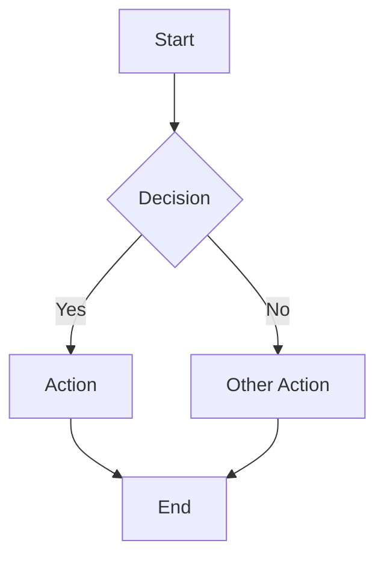

# Search and Diagram Integration for Astro

Adding site search and diagram rendering to Astro static sites.

## Contents

- [Pagefind for Non-Starlight Sites](#pagefind-for-non-starlight-sites)
- [Pagefind via Post-Build Script](#pagefind-via-post-build-script)
- [Pagefind UI Component](#pagefind-ui-component)
- [Granular Indexing Control](#granular-indexing-control)
- [Pagefind vs Fuse.js](#pagefind-vs-fusejs)
- [Fuse.js Lightweight Alternative](#fusejs-lightweight-alternative)
- [Mermaid Diagrams with rehype-mermaid](#mermaid-diagrams-with-rehype-mermaid)
- [Mermaid Rendering Strategies](#mermaid-rendering-strategies)
- [Dark Mode Theming for Diagrams](#dark-mode-theming-for-diagrams)
- [PlantUML](#plantuml)

## Pagefind for Non-Starlight Sites

Starlight includes Pagefind out of the box. For regular Astro sites, use the community `astro-pagefind` integration.

```bash
npm install astro-pagefind
```

```javascript
// astro.config.mjs
import { defineConfig } from 'astro/config';
import pagefind from 'astro-pagefind';

export default defineConfig({
  build: { format: 'file' },
  integrations: [pagefind()],
});
```

The integration runs Pagefind automatically after each build, indexing all rendered HTML output.

## Pagefind via Post-Build Script

For more control, run Pagefind manually as a post-build step instead of using the integration.

```json
{
  "scripts": {
    "build": "astro build",
    "postbuild": "npx pagefind --site dist"
  }
}
```

This generates a `pagefind/` directory inside `dist/` containing the search index and UI assets. The manual approach
is useful when you need custom Pagefind CLI flags or want to integrate with other build tooling.

## Pagefind UI Component

Add the search widget to any Astro page or layout.

```astro
---
// src/components/Search.astro
---

<link href="/pagefind/pagefind-ui.css" rel="stylesheet" />
<script src="/pagefind/pagefind-ui.js" type="text/javascript"></script>
<div id="search"></div>
<script>
  window.addEventListener('DOMContentLoaded', () => {
    new PagefindUI({ element: '#search', showSubResults: true });
  });
</script>
```

During development (`astro dev`), the search index does not exist yet. Run a build first, then the index will be
available for local testing.

## Granular Indexing Control

Pagefind supports HTML attributes to fine-tune what gets indexed and how results are ranked.

| Attribute                   | Purpose                                        |
|-----------------------------|-------------------------------------------------|
| `data-pagefind-body`        | Limit indexing to this element only             |
| `data-pagefind-ignore`      | Exclude this element from the index             |
| `data-pagefind-meta="key"`  | Define a metadata field on this element         |
| `data-pagefind-weight="10"` | Boost relevance of this element (default is 1)  |

```astro
---
// src/layouts/BaseLayout.astro
---

<html>
  <body>
    <nav data-pagefind-ignore>
      <!-- Navigation links excluded from search -->
    </nav>

    <main data-pagefind-body>
      <h1 data-pagefind-meta="title">{title}</h1>
      <p data-pagefind-weight="2" class="summary">{summary}</p>
      <slot />
    </main>

    <footer data-pagefind-ignore>
      <!-- Footer excluded from search -->
    </footer>
  </body>
</html>
```

Without `data-pagefind-body`, Pagefind indexes the entire page. Adding it to `<main>` ensures only content is
searchable, keeping navigation, footers, and boilerplate out of results.

## Pagefind vs Fuse.js

| Feature      | Pagefind                        | Fuse.js                          |
|--------------|---------------------------------|----------------------------------|
| Architecture | Pre-built binary chunks         | Runtime in-memory index          |
| Bandwidth    | Low (loads only needed chunks)  | High (downloads full index)      |
| Scalability  | 10,000+ pages                   | Less than 500 pages              |
| Multilingual | Native stemming per language    | Manual configuration required    |
| Use case     | Global site search              | Small list filtering             |
| Setup        | Build step required             | Import and configure in JS       |

Choose Pagefind for full-site search across many pages. Choose Fuse.js for lightweight, client-side filtering of
small datasets like a blog post list or FAQ page.

## Fuse.js Lightweight Alternative

Fuse.js runs entirely in the browser with no build step. Suitable for filtering small collections.

Important Astro 5.x changes: `post.id` replaces `post.slug`, and `post.body` is no longer directly available via
the Content Layer API. Build the search index from frontmatter fields instead.

```astro
---
import { getCollection } from "astro:content";
const posts = await getCollection('blog');
const searchIndex = JSON.stringify(posts.map(post => ({
  title: post.data.title,
  id: post.id,
  description: post.data.description ?? ''
})));
---

<input type="search" id="search" placeholder="Search..." />
<ul id="results"></ul>

<script define:vars={{ searchIndex }}>
  import Fuse from 'fuse.js';

  const fuse = new Fuse(JSON.parse(searchIndex), {
    keys: ['title', 'description'],
    threshold: 0.3
  });

  document.getElementById('search').addEventListener('input', (e) => {
    const results = fuse.search(e.target.value);
    const resultsEl = document.getElementById('results');
    resultsEl.replaceChildren();

    results.forEach(r => {
      const li = document.createElement('li');
      const link = document.createElement('a');
      link.href = `/blog/${r.item.id}`;
      link.textContent = r.item.title;
      li.appendChild(link);
      resultsEl.appendChild(li);
    });
  });
</script>
```

Install Fuse.js:

```bash
npm install fuse.js
```

## Mermaid Diagrams with rehype-mermaid

Use `rehype-mermaid` to render Mermaid diagrams to SVG at build time. Do not use `astro-mermaid`; it is outdated
and unmaintained.

`rehype-mermaid` requires Playwright's Chromium browser to render diagrams during the build.

```bash
npm install rehype-mermaid
npx playwright install --with-deps chromium
```

```javascript
// astro.config.mjs
import { defineConfig } from 'astro/config';
import rehypeMermaid from 'rehype-mermaid';

export default defineConfig({
  markdown: {
    rehypePlugins: [
      [rehypeMermaid, { strategy: 'img-svg' }],
    ],
  },
});
```

Write diagrams in standard Mermaid syntax inside fenced code blocks:

~~~markdown

~~~

The plugin processes all `mermaid` code blocks during build and replaces them with rendered output. No client-side
JavaScript is required.

## Mermaid Rendering Strategies

The `strategy` option controls how diagrams appear in the final HTML.

| Strategy       | Output                          | Client JS | Notes                                    |
|----------------|---------------------------------|-----------|------------------------------------------|
| `'img-svg'`    | Inline SVG wrapped in img tag   | None      | Default; clean, scalable, no collisions  |
| `'img-png'`    | PNG image                       | None      | Useful for email or RSS feeds            |
| `'pre-mermaid'`| Raw Mermaid code in pre tag     | Required  | Client renders via Mermaid JS library    |

```javascript
// Use img-png for image-based output
[rehypeMermaid, { strategy: 'img-png' }]

// Use pre-mermaid for client-side rendering (SSR or dynamic content)
[rehypeMermaid, { strategy: 'pre-mermaid' }]
```

The `'img-svg'` strategy is recommended for most static sites. It produces crisp, scalable diagrams with zero
runtime cost.

## Dark Mode Theming for Diagrams

Build-time SVG diagrams bake in a fixed color scheme. Three strategies handle dark mode.

### Strategy 1: CSS Variables

Let the browser resolve colors at runtime by overriding SVG fills and strokes with CSS custom properties.

```css
/* src/styles/mermaid-theme.css */
:root {
  --mermaid-bg: #ffffff;
  --mermaid-text: #333333;
  --mermaid-line: #666666;
}

@media (prefers-color-scheme: dark) {
  :root {
    --mermaid-bg: #1e1e1e;
    --mermaid-text: #e0e0e0;
    --mermaid-line: #aaaaaa;
  }
}

.mermaid svg [fill="#ffffff"],
.mermaid svg [fill="white"] {
  fill: var(--mermaid-bg);
}

.mermaid svg text {
  fill: var(--mermaid-text) !important;
}

.mermaid svg .edge-pattern-solid {
  stroke: var(--mermaid-line);
}
```

This approach works well when the Mermaid theme uses predictable colors.

### Strategy 2: Picture Element with Dual Themes

Generate both a light and dark version and swap them with a media query.

```astro
---
// src/components/ThemedDiagram.astro
const { lightSrc, darkSrc, alt } = Astro.props;
---

<picture>
  <source srcset={darkSrc} media="(prefers-color-scheme: dark)" />
  
</picture>
```

This requires building diagrams twice (one per theme) but gives pixel-perfect results for both modes.

### Strategy 3: Inline SVG with CSS Targeting

When using `'img-svg'` strategy, extract the SVG and target its internal classes directly.

```css
/* Target Mermaid's generated SVG classes */
@media (prefers-color-scheme: dark) {
  .node rect,
  .node polygon {
    fill: #2d2d2d !important;
    stroke: #888888 !important;
  }

  .nodeLabel {
    color: #e0e0e0 !important;
  }

  .edgePath path {
    stroke: #aaaaaa !important;
  }

  .edgeLabel {
    background-color: #1e1e1e !important;
    color: #e0e0e0 !important;
  }
}
```

This is the simplest approach but risks style collisions if multiple SVGs share class names on the same page.

## PlantUML

For UML diagrams using PlantUML syntax, add the integration:

```bash
npx astro add plantuml
```

PlantUML requires a PlantUML server for rendering, either a local instance via Docker or the public server at
`plantuml.com`. Configure the server URL in the integration options:

```javascript
// astro.config.mjs
import { defineConfig } from 'astro/config';
import plantuml from 'astro-plantuml';

export default defineConfig({
  integrations: [plantuml({ serverUrl: 'http://localhost:8080' })],
});
```

For most projects, `rehype-mermaid` is the simpler choice since it runs locally without an external server.
