# Real-World Diagram Examples

Complete, tested Mermaid syntax examples for every diagram type supported by beautiful-mermaid.

## Flowchart Examples

### CI/CD Pipeline

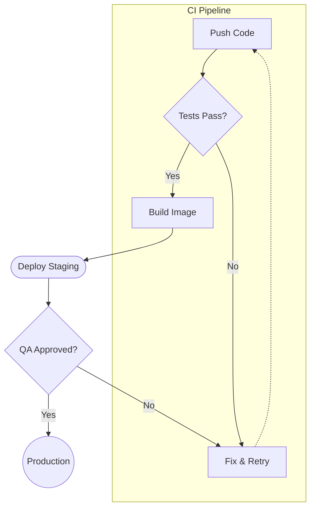

### Microservices Architecture

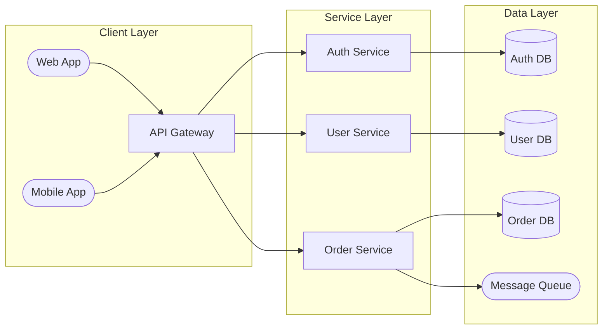

### Decision Tree

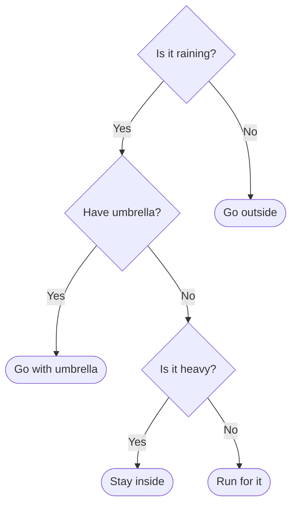

### All 12 Shapes

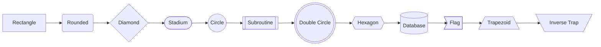

### All Edge Styles

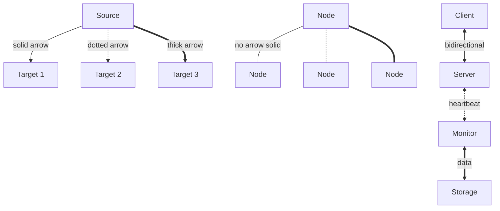

### Subgraph with Direction Override

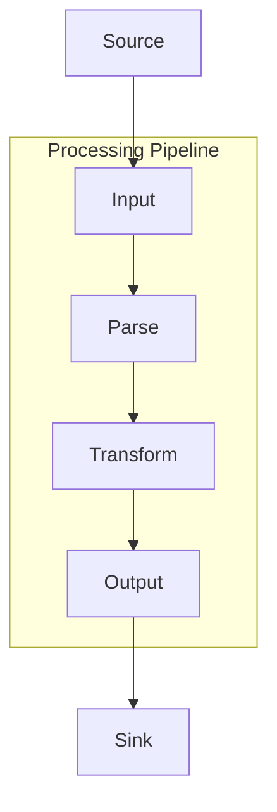

### Parallel Edges with &

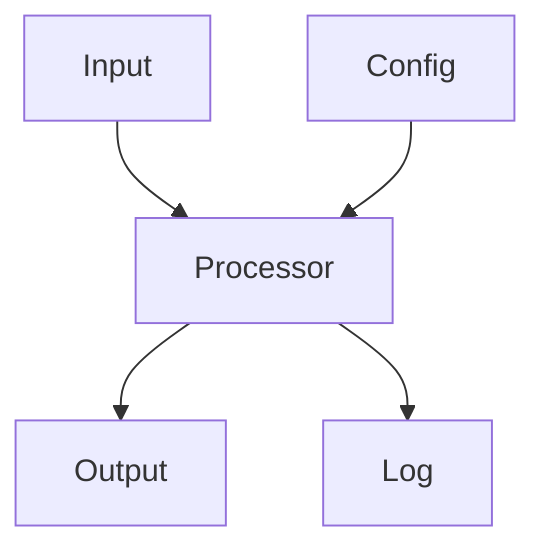

## State Diagram Examples

### Connection Lifecycle

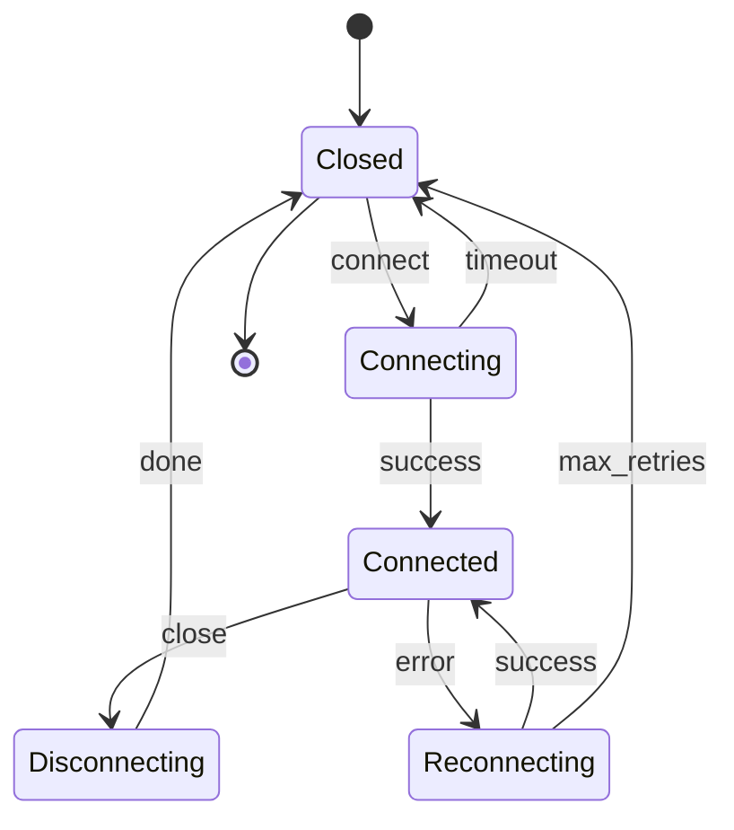

### Composite States

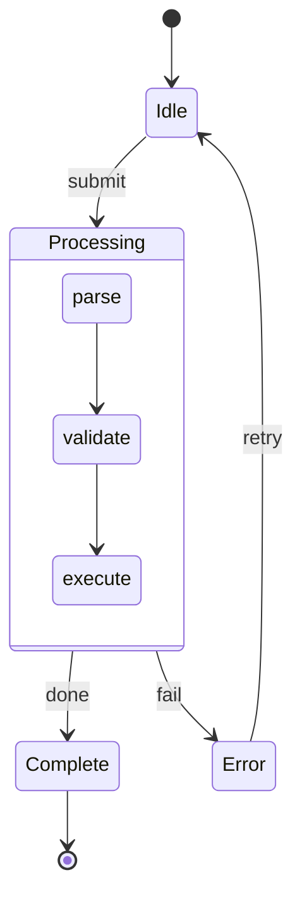

## Sequence Diagram Examples

### OAuth 2.0 Flow

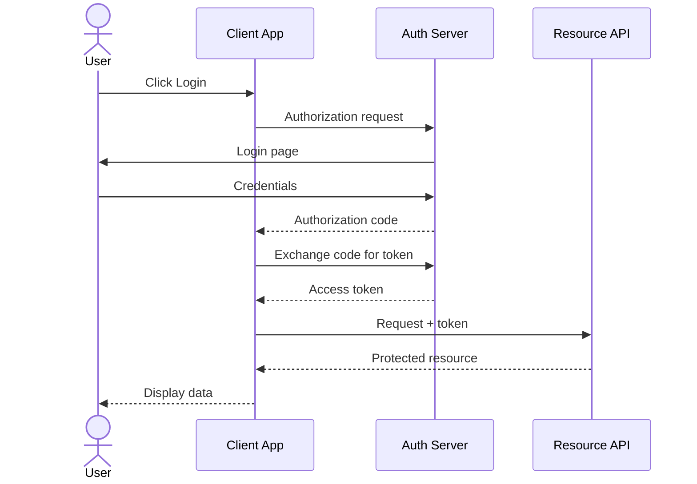

### Database Transaction with Error Handling

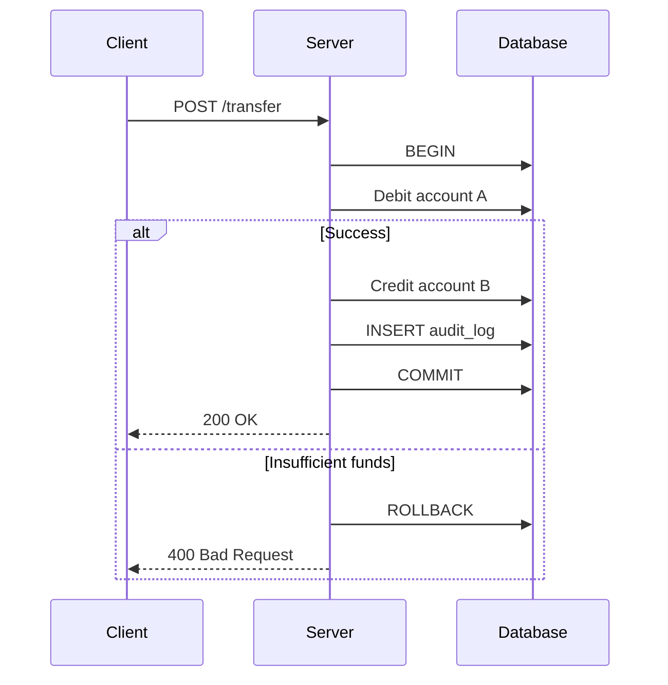

### Microservice Orchestration with Parallel Calls

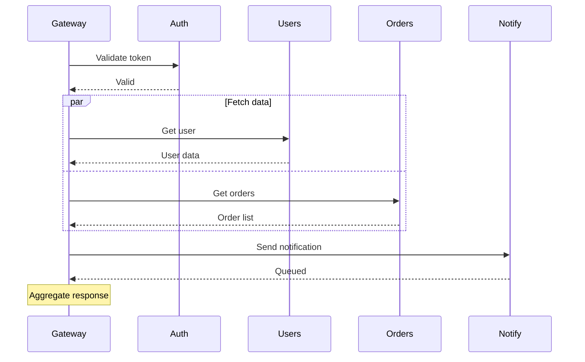

### All Block Types

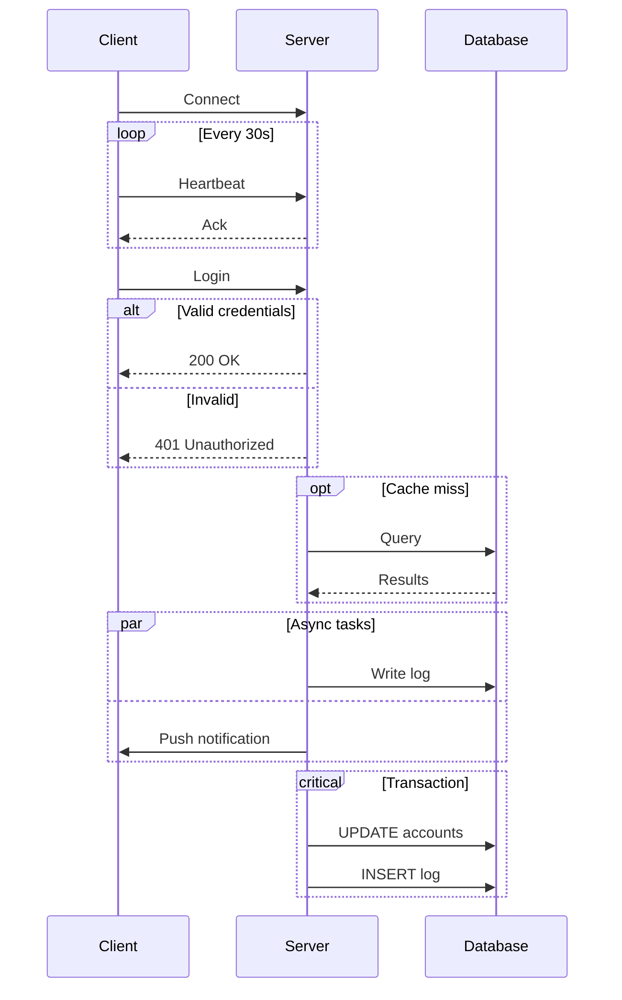

### Notes Positioning

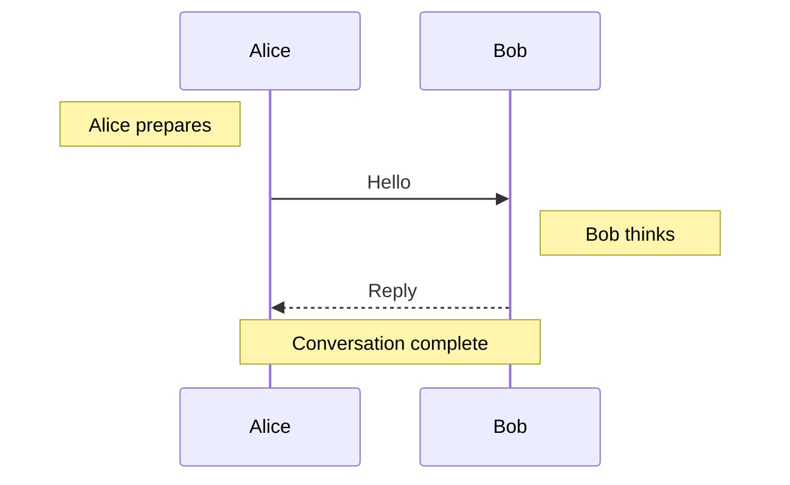

## Class Diagram Examples

### Observer Pattern

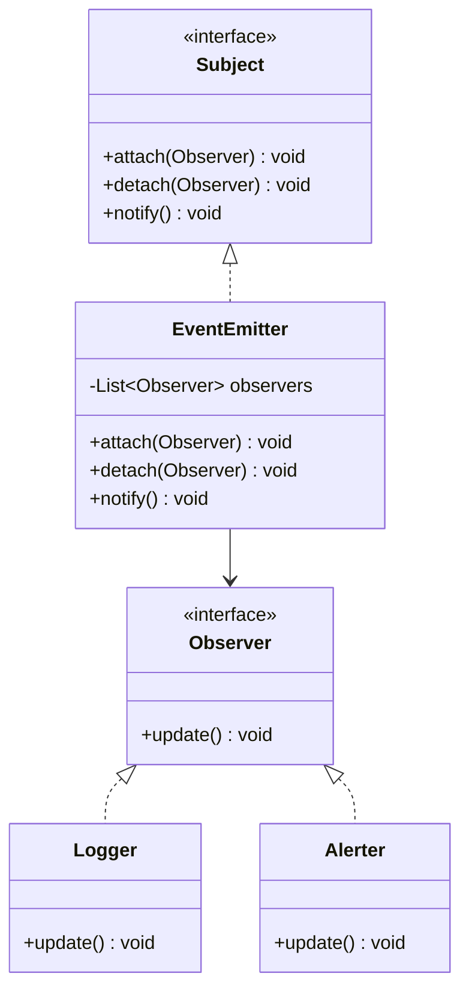

### All 6 Relationship Types

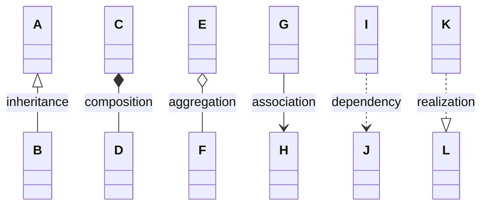

### MVC Architecture

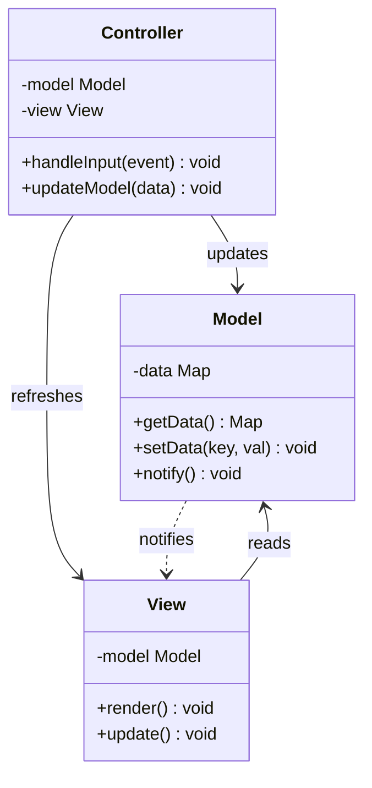

### Visibility and Annotations

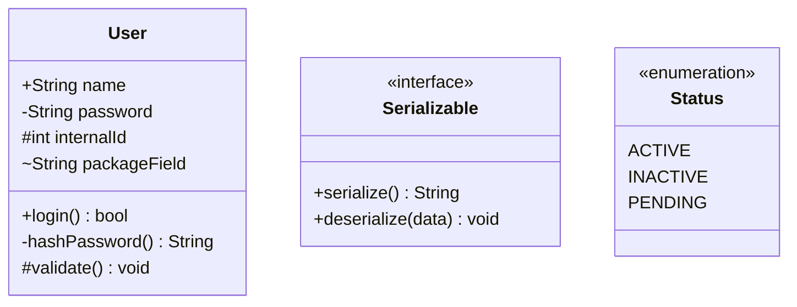

## ER Diagram Examples

### E-Commerce Schema

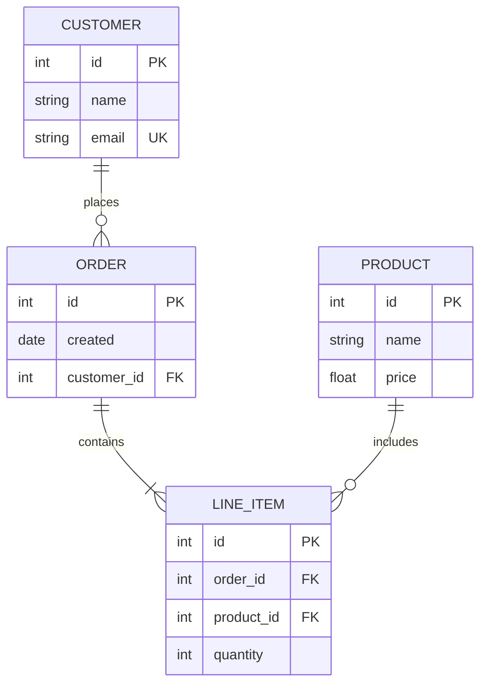

### Blog Platform

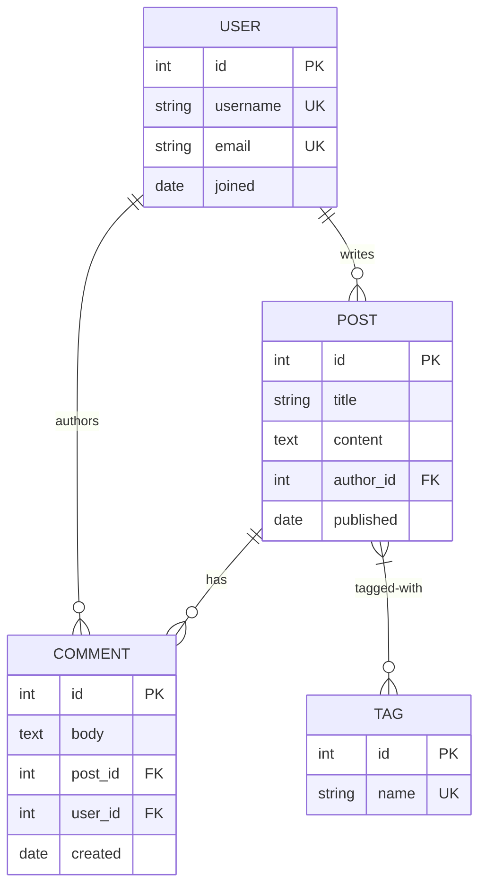

### All Cardinality Types

```mermaid
erDiagram
  A ||--|| B : one-to-one
  C ||--o{ D : one-to-many
  E |o--|{ F : opt-to-many
  G }|--o{ H : many-to-many
```

### Mixed Identifying and Non-Identifying

```mermaid
erDiagram
  ORDER ||--|{ LINE_ITEM : contains
  ORDER ||..o{ SHIPMENT : ships-via
  PRODUCT ||--o{ LINE_ITEM : includes
  PRODUCT ||..o{ REVIEW : receives
```
