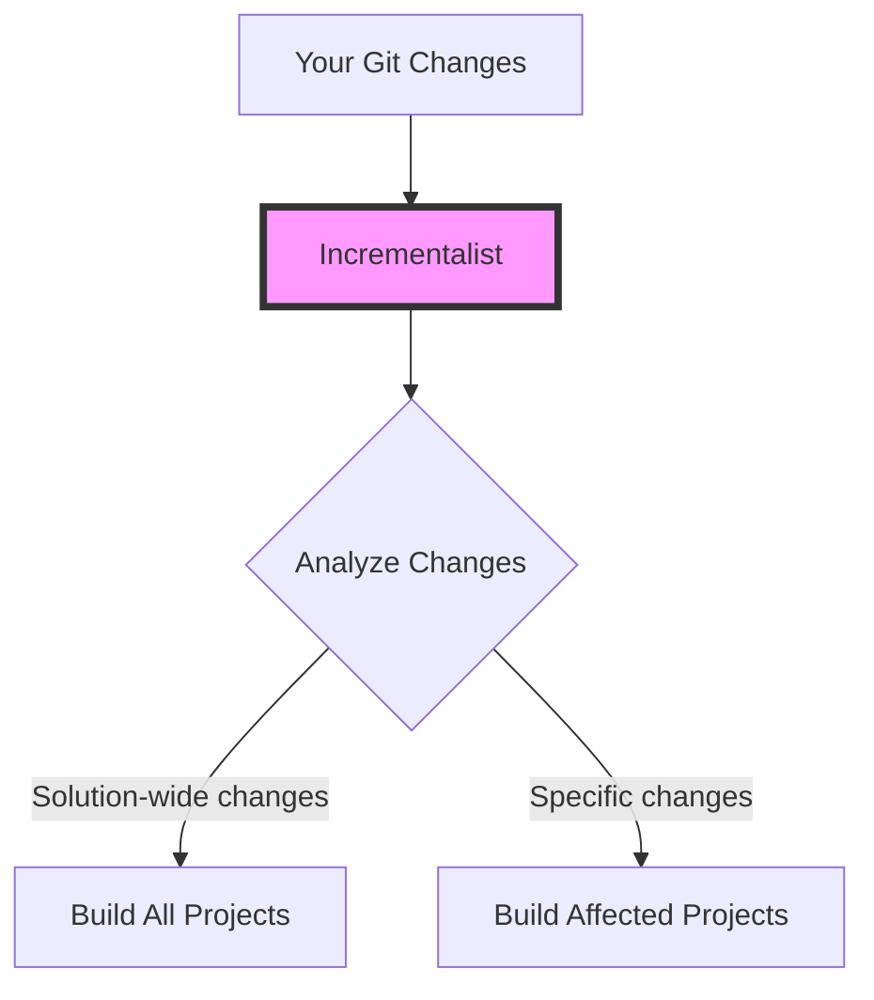
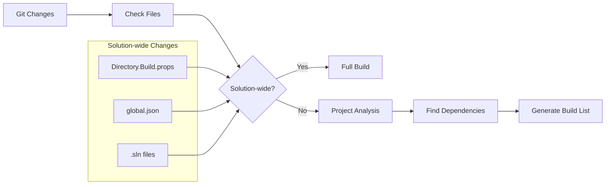
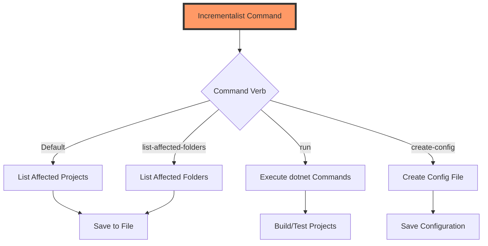

# How Incrementalist Works

Incrementalist is designed to optimize build processes in large .NET solutions by intelligently determining which projects need to be rebuilt based on changes in your Git repository.

## Basic Workflow



## Detailed Analysis Process



## Command Execution Flow



## Core Components

### Git Analysis
- Compares your current changes against a target branch (e.g., `dev` or `master`)
- Identifies all modified files
- Determines if changes require a full solution build

### Solution Analysis
- Understands your project dependencies
- Identifies which projects are affected by your changes
- Ensures all necessary projects are included in the build

### Output Generation

Incrementalist can produce two types of outputs:

1. **Project Lists** (with the `run` verb):
   ```
   D:\src\Project1\Project1.csproj,D:\src\Project2\Project2.csproj
   ```

2. **Folder Lists** (with the `list-affected-folders` verb):
   ```
   D:\src\Project1,D:\src\Project2\SubFolder
   ```

## Command Execution

When running commands against affected projects using the `run` verb, Incrementalist:

1. Analyzes your changes to determine affected projects
2. Executes specified `dotnet` commands against each project
3. Can run commands in parallel for faster processing
4. Provides configurable error handling
5. Supports dry run mode (`--dry`) to preview commands without executing them

## Integration

The output can be integrated with various build systems:
- CI/CD pipelines
- Build scripts (e.g., FAKE, CAKE, etc.)
- Custom build tooling

For detailed build instructions and setup, see [Building Incrementalist](building.md). 