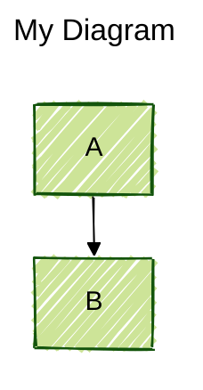
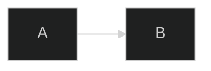
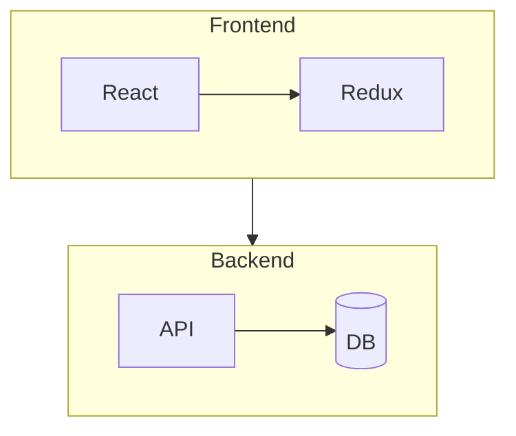
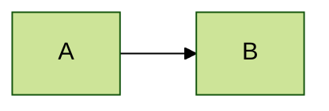
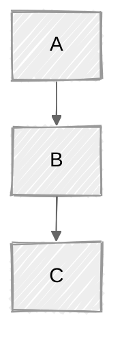

# Mermaid Diagram Syntax

Expert-level reference for writing syntactically correct Mermaid diagrams. Covers all diagram types, configuration, theming, and layout options.

## When to Use

- User asks to "create a diagram", "write mermaid", "diagram this", "visualize"
- User mentions any specific diagram type (flowchart, sequence, class, ER, etc.)
- User needs help with mermaid syntax, configuration, or theming
- User asks about diagram options, layout engines, or styling
- Complements the `beautiful-mermaid` skill (which handles rendering to ASCII/SVG)

## Core Syntax Concepts

### Diagram Declaration

Every diagram starts with a type keyword on its own line:

### Frontmatter Configuration

Add YAML frontmatter before the diagram declaration with `---` delimiters:

### Comments

Use `%%` for line comments:

### Directives

Inline configuration with `%%{init: {...}}%%`:

### Accessibility

Add accessible titles and descriptions:

## Diagram Type Quick Reference

| #  | Type             | Declaration                                                                | Use Case                                   |
|----|------------------|----------------------------------------------------------------------------|--------------------------------------------|
| 1  | **Flowchart**    | `flowchart TD` / `graph LR`                                                | Process flows, decision trees, workflows   |
| 2  | **Sequence**     | `sequenceDiagram`                                                          | API calls, service interactions, protocols |
| 3  | **Class**        | `classDiagram`                                                             | OOP class hierarchies, interfaces          |
| 4  | **State**        | `stateDiagram-v2`                                                          | State machines, lifecycle flows            |
| 5  | **ER**           | `erDiagram`                                                                | Database schemas, entity relationships     |
| 6  | **Gantt**        | `gantt`                                                                    | Project timelines, task scheduling         |
| 7  | **Pie**          | `pie`                                                                      | Proportional data, distributions           |
| 8  | **User Journey** | `journey`                                                                  | UX flows, user experience mapping          |
| 9  | **Git Graph**    | `gitGraph`                                                                 | Branch strategies, merge workflows         |
| 10 | **Mindmap**      | `mindmap`                                                                  | Brainstorming, topic hierarchies           |
| 11 | **Timeline**     | `timeline`                                                                 | Historical events, milestones              |
| 12 | **Quadrant**     | `quadrantChart`                                                            | Priority matrices, 2D categorization       |
| 13 | **Sankey**       | `sankey-beta`                                                              | Flow quantities, resource distribution     |
| 14 | **XY Chart**     | `xychart-beta`                                                             | Bar/line charts, data visualization        |
| 15 | **Block**        | `block-beta`                                                               | System architecture, block layouts         |
| 16 | **Packet**       | `packet-beta`                                                              | Network packet structure, bit fields       |
| 17 | **Kanban**       | `kanban`                                                                   | Task boards, workflow columns              |
| 18 | **Architecture** | `architecture-beta`                                                        | Cloud/infra architecture with icons        |
| 19 | **C4**           | `C4Context` / `C4Container` / `C4Component` / `C4Dynamic` / `C4Deployment` | Software architecture (C4 model)           |
| 20 | **Requirement**  | `requirementDiagram`                                                       | Requirements traceability                  |
| 21 | **ZenUML**       | `zenuml`                                                                   | Sequence diagrams (alternative syntax)     |
| 22 | **Radar**        | `radar-beta`                                                               | Multi-axis comparison charts               |
| 23 | **Treemap**      | `treemap-beta`                                                             | Hierarchical proportional areas            |

## Flowchart Essentials

The most commonly used diagram type. Direction goes after keyword: `TD`/`TB` (top-down), `LR` (left-right), `BT` (bottom-top), `RL` (right-left).

**Node shapes:**

| Shape         | Syntax        | Visual          |
|---------------|---------------|-----------------|
| Rectangle     | `A[text]`     | Box             |
| Rounded       | `A(text)`     | Rounded box     |
| Stadium       | `A([text])`   | Pill shape      |
| Subroutine    | `A[[text]]`   | Double-bordered |
| Cylinder      | `A[(text)]`   | Database        |
| Circle        | `A((text))`   | Circle          |
| Double Circle | `A(((text)))` | Double circle   |
| Diamond       | `A{text}`     | Decision        |
| Hexagon       | `A{{text}}`   | Hexagon         |
| Parallelogram | `A[/text/]`   | Slanted         |
| Trapezoid     | `A[/text\]`   | Wider bottom    |
| Asymmetric    | `A>text]`     | Flag/ribbon     |

**Edge styles:**

| Style         | Syntax | With Label      |
|---------------|--------|-----------------|
| Solid arrow   | `-->`  | `-->\|label\|`  |
| Dotted arrow  | `-.->` | `-.->\|label\|` |
| Thick arrow   | `==>`  | `==>\|label\|`  |
| No arrow      | `---`  | `---\|label\|`  |
| Bidirectional | `<-->` |                 |

**Subgraphs:**

**Styling:**

## Sequence Diagram Essentials

**Arrow types:**

| Arrow  | Meaning                      |
|--------|------------------------------|
| `->>`  | Solid (synchronous)          |
| `-->>` | Dashed (response/async)      |
| `-)`   | Open arrow (fire-and-forget) |
| `--)`  | Dashed open arrow            |
| `-x`   | Cross (lost message)         |
| `--x`  | Dashed cross                 |

**Participants:** `participant A as Alice` (box) or `actor U as User` (stick figure)

**Activation:** `A->>+B: Request` / `B-->>-A: Response`

**Blocks:** `loop`, `alt/else`, `opt`, `par/and`, `critical/break`, `rect rgb(...)` for highlighting

**Notes:** `Note left of A: text`, `Note right of B: text`, `Note over A,B: text`

## Configuration & Theming

**Built-in themes:** `default`, `forest`, `dark`, `neutral`, `base`

Apply via frontmatter:

**Layout engines:** `dagre` (default), `elk` (advanced, better for complex diagrams)

**Looks:** `classic` (default), `handDrawn` (sketch style)

## Common Gotchas

1. **`end` keyword** - The word "end" breaks flowcharts and sequence diagrams. Wrap in quotes: `A["End Process"]`
2. **Special characters** - Characters like `()`, `{}`, `[]` in node text must be quoted or will be interpreted as shape syntax
3. **Semicolons** - Optional line terminators, but mixing styles can cause issues
4. **Case sensitivity** - Keywords like `flowchart`, `sequenceDiagram` are case-sensitive
5. **Direction keyword** - Must be on the same line as `flowchart`/`graph`: `flowchart LR` (not on separate line)
6. **Misspellings** - Unknown keywords silently fail; parameters are case-sensitive
7. **Nested shapes** - Nodes inside nodes confuse the parser; use quotes for complex text
8. **`%%{}%%` in comments** - Curly braces in comments are parsed as directives; avoid them

## Detailed References

Each diagram type has a comprehensive reference with complete syntax, all options, and practical examples:

### Core Diagrams
- [Flowchart](references/flowchart.md) - Node shapes, edges, subgraphs, styling, interactions
- [Sequence Diagram](references/sequence-diagram.md) - Arrows, participants, blocks, notes, activation
- [Class Diagram](references/class-diagram.md) - Classes, relationships, generics, annotations
- [State Diagram](references/state-diagram.md) - States, transitions, composite states, forks/joins

### Data & Relationships
- [ER Diagram](references/er-diagram.md) - Entities, attributes, cardinality, keys
- [Requirement Diagram](references/requirement-diagram.md) - Requirements, elements, risk/verification

### Project & Timeline
- [Gantt Chart](references/gantt.md) - Tasks, sections, milestones, date formats, exclusions
- [Timeline](references/timeline.md) - Events, periods, sections
- [Kanban Board](references/kanban.md) - Columns, cards, metadata

### Visualization & Charts
- [Pie Chart](references/pie-chart.md) - Slices, labels, values
- [XY Chart](references/xy-chart.md) - Bar/line charts, axes, data series
- [Quadrant Chart](references/quadrant-chart.md) - Axes, quadrant labels, data points
- [Sankey Diagram](references/sankey.md) - Flows, nodes, CSV-like data format
- [Radar Chart](references/radar-chart.md) - Multi-axis comparison data
- [Treemap](references/treemap.md) - Hierarchical proportional areas

### Architecture & Systems
- [Architecture Diagram](references/architecture.md) - Groups, services, edges, icon integration
- [C4 Diagram](references/c4-diagram.md) - Context, container, component, deployment views
- [Block Diagram](references/block-diagram.md) - Columns, blocks, spacing, arrows

### Version Control & UX
- [Git Graph](references/gitgraph.md) - Branches, commits, merges, cherry-picks, tags
- [Mindmap](references/mindmap.md) - Root, branches, shapes, icons, indentation-based
- [User Journey](references/user-journey.md) - Sections, tasks, scores, actors

### Alternative & Specialized
- [ZenUML](references/zenuml.md) - Alternative sequence diagram syntax
- [Packet Diagram](references/packet-diagram.md) - Bit fields, protocol headers

### Configuration
- [Configuration](references/configuration.md) - Init, frontmatter, directives, security, layout engines
- [Theming](references/theming.md) - Themes, theme variables, customization per diagram type
