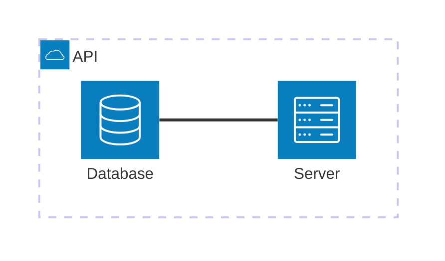
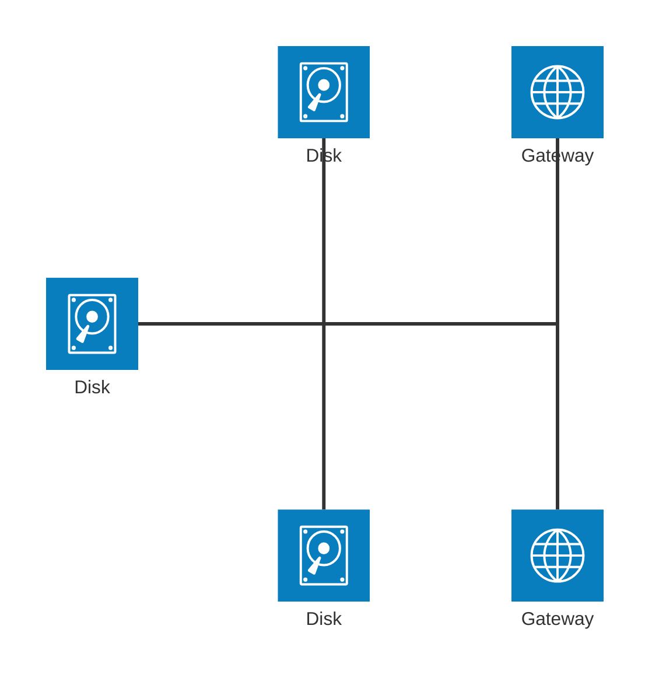
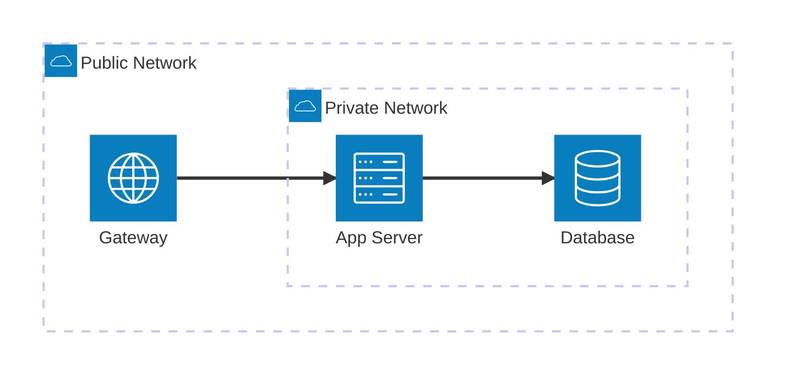

# Architecture Diagram

## Declaration

Use the keyword `architecture-beta` to start an architecture diagram. This diagram type is available in Mermaid v11.1.0+.

```
architecture-beta
```

## Complete Syntax Reference

Architecture diagrams visualize relationships between services and resources in cloud or CI/CD deployments. The building blocks are **groups**, **services**, **edges**, and **junctions**.

| Concept  | Purpose                                     |
|----------|---------------------------------------------|
| Group    | Container that organizes related services   |
| Service  | A node representing a resource or service   |
| Edge     | A connection between two services            |
| Junction | A 4-way split point for routing edges       |

Supporting syntax elements:

| Syntax     | Purpose                        | Example           |
|------------|--------------------------------|--------------------|
| `(icon)`   | Declare an icon                | `(database)`       |
| `[label]`  | Declare a label                | `[My Database]`    |
| `in id`    | Place inside a parent group    | `in api`           |

## Components / Elements

### Groups

```
group {id}({icon})[{label}] (in {parent_id})?
```

| Part         | Required | Description                              |
|--------------|----------|------------------------------------------|
| `group`      | Yes      | Keyword                                  |
| `{id}`       | Yes      | Unique identifier for the group          |
| `({icon})`   | Yes      | Icon name wrapped in parentheses         |
| `[{label}]`  | Yes      | Display label wrapped in brackets        |
| `in {parent}` | No     | Nest inside another group                |

### Services

```
service {id}({icon})[{label}] (in {parent_id})?
```

| Part          | Required | Description                              |
|---------------|----------|------------------------------------------|
| `service`     | Yes      | Keyword                                  |
| `{id}`        | Yes      | Unique identifier for the service        |
| `({icon})`    | Yes      | Icon name wrapped in parentheses         |
| `[{label}]`   | Yes      | Display label wrapped in brackets        |
| `in {parent}` | No       | Place inside a group                     |

### Junctions

```
junction {id} (in {parent_id})?
```

Junctions are invisible nodes that act as a 4-way split between edges. They have no icon or label.

| Part          | Required | Description                              |
|---------------|----------|------------------------------------------|
| `junction`    | Yes      | Keyword                                  |
| `{id}`        | Yes      | Unique identifier                        |
| `in {parent}` | No       | Place inside a group                     |

## Connections / Relationships

### Edge Syntax

```
{serviceId}{group}?:{side} {<}?--{>}? {side}:{serviceId}{group}?
```

### Edge Sides

| Value | Meaning |
|-------|---------|
| `T`   | Top     |
| `B`   | Bottom  |
| `L`   | Left    |
| `R`   | Right   |

### Edge Variants

| Syntax                   | Description                                    |
|--------------------------|------------------------------------------------|
| `db:R -- L:server`       | Plain edge, right of db to left of server      |
| `db:T -- L:server`       | 90-degree edge, top of db to left of server    |
| `subnet:R --> L:gateway` | Arrow pointing into gateway                    |
| `subnet:R <-- L:gateway` | Arrow pointing into subnet                     |
| `subnet:R <--> L:gateway`| Arrows on both sides                           |

### Edges from Groups

Append `{group}` after the service ID to route the edge out of the service's parent group:

```
server{group}:B --> T:subnet{group}
```

This creates an edge going out of the group containing `server` and into the group containing `subnet`. Note: group IDs cannot be used directly in edge definitions; only services with the `{group}` modifier.

## Icons

### Built-in Icons

| Icon Name  | Description       |
|------------|-------------------|
| `cloud`    | Cloud shape       |
| `database` | Database cylinder |
| `disk`     | Disk/storage      |
| `internet` | Internet/globe    |
| `server`   | Server            |

### Custom Icons (Iconify)

After registering an icon pack, use the format `packname:icon-name`:

```
service db(logos:aws-aurora)[Database]
service server(logos:aws-ec2)[Server]
```

Over 200,000 icons from iconify.design are available once registered.

## Styling & Configuration

Architecture diagrams use the registered icons for visual styling. Custom CSS and theming are applied through Mermaid's global theme configuration. No diagram-specific theme variables are documented for this type.

## Practical Examples

### Example 1: Simple API Architecture



### Example 2: Multi-Service with Storage


### Example 3: Junction-Based Routing



### Example 4: Nested Groups with Arrows



### Example 5: AWS-Style with Custom Icons

```mermaid
architecture-beta
    group api(logos:aws-lambda)[API]

    service db(logos:aws-aurora)[Database] in api
    service disk1(logos:aws-glacier)[Storage] in api
    service disk2(logos:aws-s3)[Storage] in api
    service server(logos:aws-ec2)[Server] in api

    db:L -- R:server
    disk1:T -- B:server
    disk2:T -- B:db
```



## Common Gotchas

- **Identifier order matters**: A service or group must be declared before it is referenced in an edge or `in` clause.
- **Group IDs cannot be used in edges**: You cannot write `groupId:R -- L:other`. Use a service inside the group with the `{group}` modifier instead.
- **The `{group}` modifier only works on services inside a group**: Applying it to a service not inside a group will fail.
- **Edge sides determine layout**: Using the same side (e.g., `R -- R`) or mixing sides (e.g., `T -- L`) produces 90-degree bends. Plan edge directions carefully.
- **Custom icons require registration**: Icons beyond the five built-in ones need an icon pack registered before use.
- **Beta status**: The keyword is `architecture-beta`, indicating the syntax may change in future releases.
