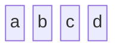
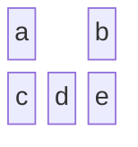
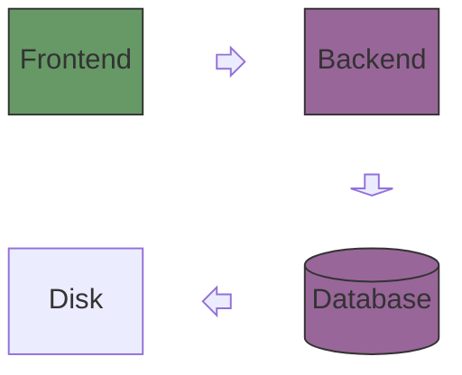
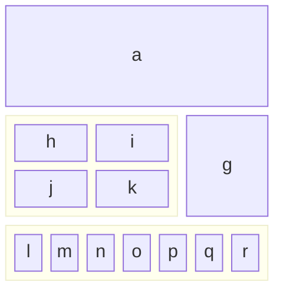
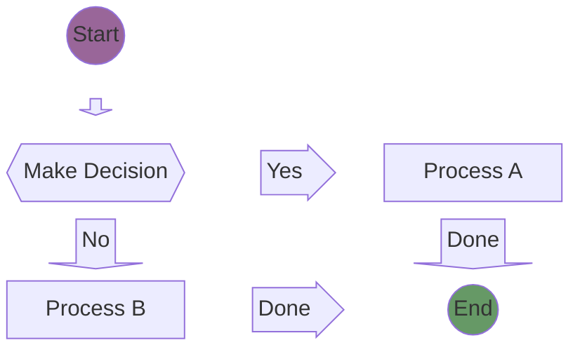

# Block Diagram

## Declaration

The diagram begins with the `block` keyword. Blocks are laid out in a grid controlled by column count.

```
block
  columns 3
  a b c
```

## Complete Syntax Reference

### Grid Layout

| Syntax | Description |
|--------|-------------|
| `columns N` | Set the number of columns in the current block scope (default: auto) |
| `columns 1` | Stack blocks vertically |
| `columns auto` | Let Mermaid decide column count (default behavior) |

Blocks fill left-to-right, wrapping to the next row when the column limit is reached.

### Block Definitions

Blocks are defined by an identifier, optionally followed by a shape with label text.

| Syntax | Shape | Use Case |
|--------|-------|----------|
| `id` | Rectangle (default) | Generic component |
| `id["Label"]` | Rectangle with label | Labeled component |
| `id("Label")` | Round-edged rectangle | Softer/flexible component |
| `id(["Label"])` | Stadium shape | Process-oriented component |
| `id[["Label"]]` | Subroutine (double vertical lines) | Contained process |
| `id[("Label")]` | Cylinder | Database or storage |
| `id(("Label"))` | Circle | Central/pivotal component |
| `id((("Label")))` | Double circle | Critical/high-priority component |
| `id{"Label"}` | Rhombus (diamond) | Decision point |
| `id{{"Label"}}` | Hexagon | Specialized process |
| `id>"Label"]` | Asymmetric | Flag/unique marker |
| `id[/"Label"/]` | Parallelogram (leaning right) | Input/output |
| `id[\"Label"\]` | Parallelogram (leaning left) | Input/output (alternate) |
| `id[/"Label"\]` | Trapezoid | Transitional process |
| `id[\"Label"/]` | Inverted trapezoid | Transitional process (alternate) |

### Block Width (Column Span)

A block can span multiple columns using the `:N` suffix.

| Syntax | Description |
|--------|-------------|
| `id` | Spans 1 column (default) |
| `id:2` | Spans 2 columns |
| `id:3` | Spans 3 columns |
| `a["Label"]:2` | Labeled block spanning 2 columns |

### Space Blocks

Space blocks create intentional empty cells in the grid.

| Syntax | Description |
|--------|-------------|
| `space` | Empty block spanning 1 column |
| `space:2` | Empty block spanning 2 columns |
| `space:N` | Empty block spanning N columns |

### Block Arrows

Block arrows are directional arrow-shaped blocks with optional labels.

```
blockArrowId<["Label"]>(direction)
```

| Direction | Description |
|-----------|-------------|
| `right` | Arrow pointing right |
| `left` | Arrow pointing left |
| `up` | Arrow pointing up |
| `down` | Arrow pointing down |
| `x` | Arrow along x-axis |
| `y` | Arrow along y-axis |
| `x, down` | Combined direction |

### Composite (Nested) Blocks

Blocks can contain other blocks using `block` ... `end` syntax. Composite blocks can have an optional ID and column span.

```
block:ID
  columns 2
  A B C D
end
```

| Syntax | Description |
|--------|-------------|
| `block` ... `end` | Anonymous composite block |
| `block:ID` ... `end` | Named composite block (can be referenced in edges) |
| `block:ID:2` ... `end` | Named composite block spanning 2 columns |

Nested blocks can have their own `columns` setting independent of the parent.

### Edges (Connections)

Edges connect blocks after all blocks have been defined in the grid layout.

| Syntax | Description |
|--------|-------------|
| `A-->B` | Arrow from A to B |
| `A --> B` | Arrow from A to B (with spaces) |
| `A---B` | Line without arrow |
| `A-- "text" -->B` | Arrow with label text |

Edges are declared after block positions. The author controls block placement; edges are drawn between existing blocks.

### Comments

```
%% This is a comment
```

## Styling & Configuration

### Individual Block Styling

Use the `style` keyword after block definitions.

```
style blockId fill:#636,stroke:#333,stroke-width:4px
```

Supported CSS properties:

| Property | Example | Description |
|----------|---------|-------------|
| `fill` | `#636`, `#bbf` | Background fill color |
| `stroke` | `#333`, `#f66` | Border color |
| `stroke-width` | `4px`, `2px` | Border thickness |
| `color` | `#fff` | Text color |
| `stroke-dasharray` | `5 5` | Dashed border pattern |

### Class-Based Styling

Define reusable style classes and apply them to blocks.

```
classDef className fill:#6e6ce6,stroke:#333,stroke-width:4px;
class blockId className
```

Multiple blocks can share a class:

```
class A,B,C className
```

## Practical Examples

### Example 1 -- Simple Linear Blocks



### Example 2 -- Multi-Column Grid with Spacing



### Example 3 -- System Architecture



### Example 4 -- Nested Blocks with Column Spanning



### Example 5 -- Business Process Flow with Styling



## Common Gotchas

| Issue | Cause | Fix |
|-------|-------|-----|
| Blocks overlap | No `space` blocks between connected blocks | Add `space` or `space:N` between blocks that need visual separation |
| Edge not rendering | Using `A - B` instead of proper arrow syntax | Use `A-->B` or `A---B` with proper arrow notation |
| Style not applied | Missing colon in CSS property (`fill#969`) | Use proper CSS syntax: `fill:#969` with colon |
| Blocks not wrapping | `columns` not set | Add `columns N` to control grid layout |
| Composite block invisible | Missing `end` keyword | Every `block` must be closed with `end` |
| Block arrow not rendering | Missing angle brackets or direction | Use full syntax: `id<["Label"]>(direction)` |
| Layout unexpected | Blocks placed on same line without columns set | Declare `columns N` before listing blocks; use one logical row per line |
| Style properties not separated | Missing comma between CSS properties | Separate with commas: `fill:#636,stroke:#333,stroke-width:4px` |
