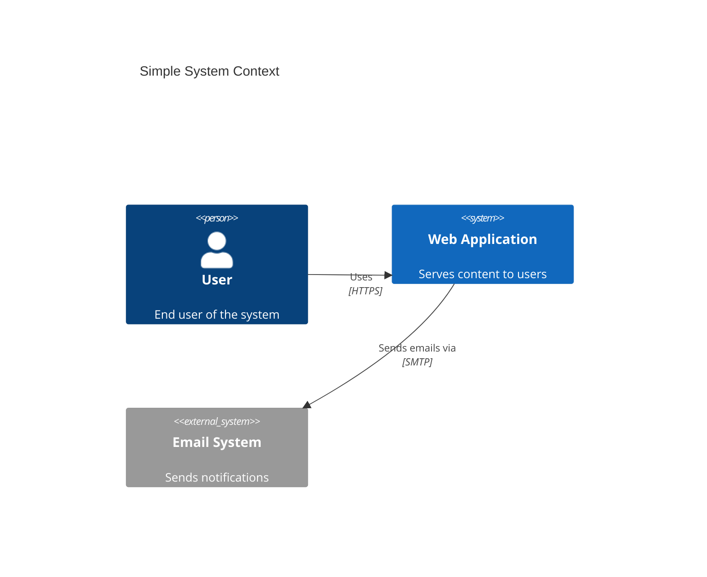
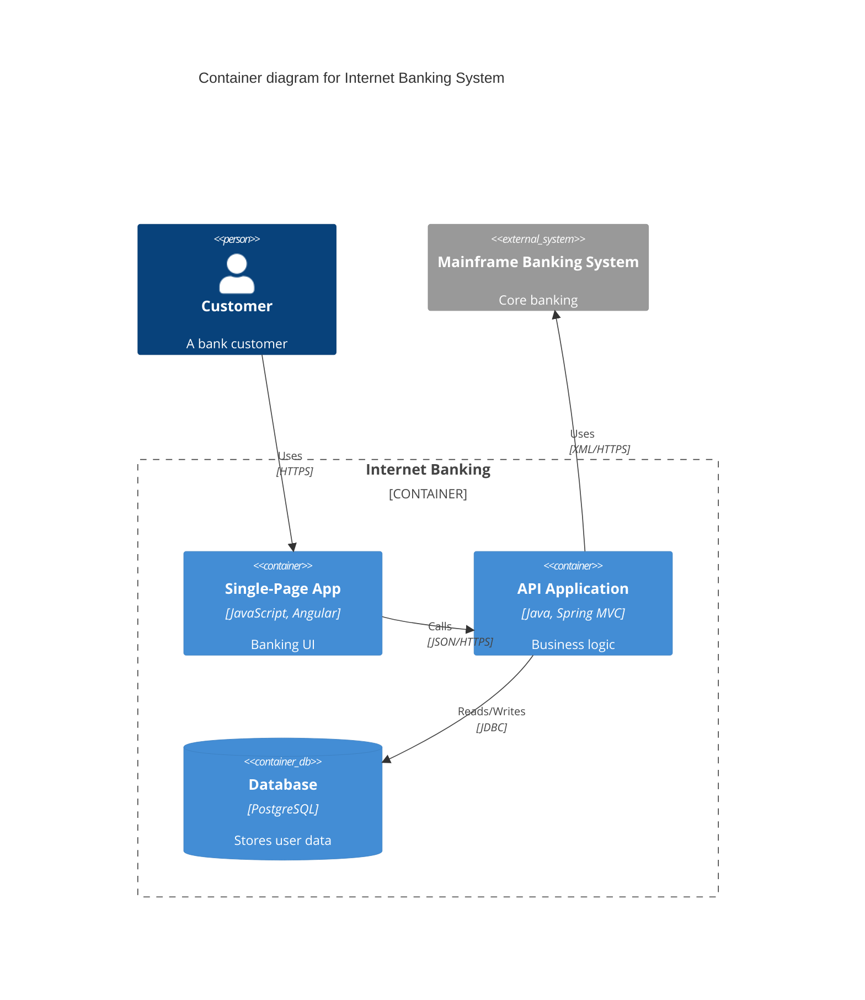
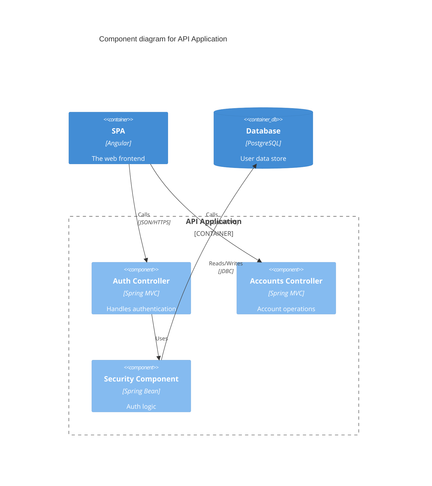
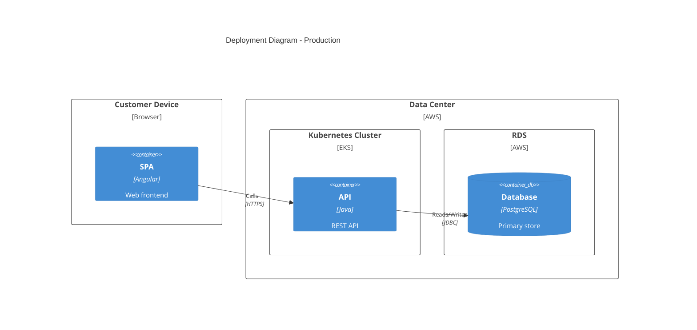
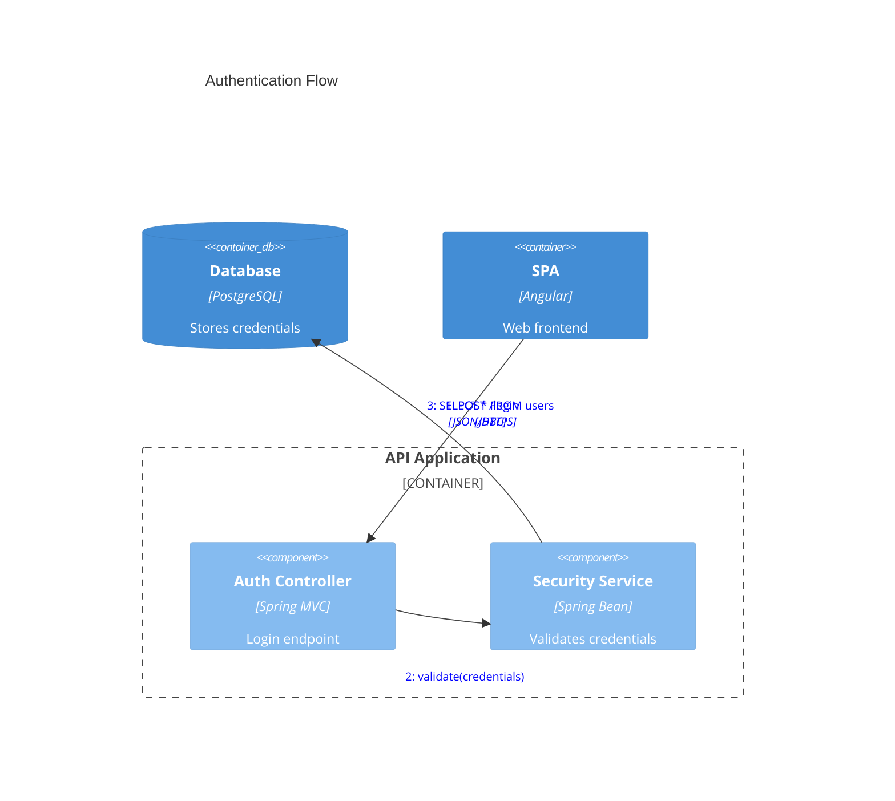

# C4 Diagram

## Declaration

C4 diagrams support five diagram types, each started by its own keyword:

| Keyword        | Diagram Type            |
|----------------|-------------------------|
| `C4Context`    | System Context diagram  |
| `C4Container`  | Container diagram       |
| `C4Component`  | Component diagram       |
| `C4Dynamic`    | Dynamic diagram         |
| `C4Deployment` | Deployment diagram      |

Add `title` immediately after the keyword to set the diagram title.

## Complete Syntax Reference

The syntax is compatible with C4-PlantUML. Parameters with `?` are optional. Parameters can be passed positionally or by name using `$` prefix (e.g., `$bgColor="red"`).

### Parameter Assignment

Two styles are supported:

```
UpdateRelStyle(customerA, bankA, "red", "blue", "-40", "60")
UpdateRelStyle(customerA, bankA, $offsetX="-40", $offsetY="60", $lineColor="blue", $textColor="red")
UpdateRelStyle(customerA, bankA, $offsetY="60")
```

## Components / Elements

### System Context Elements (C4Context)

| Element             | Syntax                                                    | Description               |
|---------------------|-----------------------------------------------------------|---------------------------|
| `Person`            | `Person(alias, label, ?descr, ?sprite, ?tags, $link)`     | Internal person           |
| `Person_Ext`        | `Person_Ext(alias, label, ?descr, ?sprite, ?tags, $link)` | External person           |
| `System`            | `System(alias, label, ?descr, ?sprite, ?tags, $link)`     | Internal system           |
| `System_Ext`        | `System_Ext(alias, label, ?descr, ?sprite, ?tags, $link)` | External system           |
| `SystemDb`          | `SystemDb(alias, label, ?descr, ?sprite, ?tags, $link)`   | Internal system database  |
| `SystemDb_Ext`      | `SystemDb_Ext(alias, label, ?descr, ?sprite, ?tags, $link)` | External system database |
| `SystemQueue`       | `SystemQueue(alias, label, ?descr, ?sprite, ?tags, $link)` | Internal system queue    |
| `SystemQueue_Ext`   | `SystemQueue_Ext(alias, label, ?descr, ?sprite, ?tags, $link)` | External system queue |

### Boundaries (All Diagram Types)

| Element                | Syntax                                                   | Description         |
|------------------------|----------------------------------------------------------|---------------------|
| `Boundary`             | `Boundary(alias, label, ?type, ?tags, $link) { ... }`   | Generic boundary    |
| `Enterprise_Boundary`  | `Enterprise_Boundary(alias, label, ?tags, $link) { ... }` | Enterprise boundary |
| `System_Boundary`      | `System_Boundary(alias, label, ?tags, $link) { ... }`   | System boundary     |
| `Container_Boundary`   | `Container_Boundary(alias, label, ?tags, $link) { ... }` | Container boundary  |

### Container Elements (C4Container)

| Element              | Syntax                                                        | Description             |
|----------------------|---------------------------------------------------------------|-------------------------|
| `Container`          | `Container(alias, label, ?techn, ?descr, ?sprite, ?tags, $link)` | Internal container   |
| `Container_Ext`      | `Container_Ext(alias, label, ?techn, ?descr, ?sprite, ?tags, $link)` | External container |
| `ContainerDb`        | `ContainerDb(alias, label, ?techn, ?descr, ?sprite, ?tags, $link)` | Container database  |
| `ContainerDb_Ext`    | `ContainerDb_Ext(alias, label, ?techn, ?descr, ?sprite, ?tags, $link)` | External container DB |
| `ContainerQueue`     | `ContainerQueue(alias, label, ?techn, ?descr, ?sprite, ?tags, $link)` | Container queue    |
| `ContainerQueue_Ext` | `ContainerQueue_Ext(alias, label, ?techn, ?descr, ?sprite, ?tags, $link)` | External container queue |

### Component Elements (C4Component)

| Element              | Syntax                                                        | Description             |
|----------------------|---------------------------------------------------------------|-------------------------|
| `Component`          | `Component(alias, label, ?techn, ?descr, ?sprite, ?tags, $link)` | Internal component   |
| `Component_Ext`      | `Component_Ext(alias, label, ?techn, ?descr, ?sprite, ?tags, $link)` | External component |
| `ComponentDb`        | `ComponentDb(alias, label, ?techn, ?descr, ?sprite, ?tags, $link)` | Component database  |
| `ComponentDb_Ext`    | `ComponentDb_Ext(alias, label, ?techn, ?descr, ?sprite, ?tags, $link)` | External component DB |
| `ComponentQueue`     | `ComponentQueue(alias, label, ?techn, ?descr, ?sprite, ?tags, $link)` | Component queue    |
| `ComponentQueue_Ext` | `ComponentQueue_Ext(alias, label, ?techn, ?descr, ?sprite, ?tags, $link)` | External component queue |

### Deployment Elements (C4Deployment)

| Element           | Syntax                                                             | Description                  |
|-------------------|--------------------------------------------------------------------|------------------------------|
| `Deployment_Node` | `Deployment_Node(alias, label, ?type, ?descr, ?sprite, ?tags, $link) { ... }` | Deployment node   |
| `Node`            | `Node(alias, label, ?type, ?descr, ?sprite, ?tags, $link) { ... }` | Short name for Deployment_Node |
| `Node_L`          | `Node_L(alias, label, ?type, ?descr, ?sprite, ?tags, $link) { ... }` | Left-aligned node           |
| `Node_R`          | `Node_R(alias, label, ?type, ?descr, ?sprite, ?tags, $link) { ... }` | Right-aligned node          |

### Dynamic Diagram Elements (C4Dynamic)

| Element    | Syntax                                           | Description                          |
|------------|--------------------------------------------------|--------------------------------------|
| `RelIndex` | `RelIndex(index, from, to, label, ?tags, $link)` | Indexed relationship (index ignored, order determined by statement order) |

## Connections / Relationships

| Relationship | Syntax                                                     | Description               |
|--------------|------------------------------------------------------------|---------------------------|
| `Rel`        | `Rel(from, to, label, ?techn, ?descr, ?sprite, ?tags, $link)` | Relationship           |
| `BiRel`      | `BiRel(from, to, label, ?techn, ?descr, ?sprite, ?tags, $link)` | Bidirectional          |
| `Rel_U`      | `Rel_U(from, to, label, ?techn, ?descr, ?sprite, ?tags, $link)` | Upward relationship    |
| `Rel_Up`     | Same as `Rel_U`                                            | Alias                     |
| `Rel_D`      | `Rel_D(from, to, label, ?techn, ?descr, ?sprite, ?tags, $link)` | Downward relationship  |
| `Rel_Down`   | Same as `Rel_D`                                            | Alias                     |
| `Rel_L`      | `Rel_L(from, to, label, ?techn, ?descr, ?sprite, ?tags, $link)` | Left relationship      |
| `Rel_Left`   | Same as `Rel_L`                                            | Alias                     |
| `Rel_R`      | `Rel_R(from, to, label, ?techn, ?descr, ?sprite, ?tags, $link)` | Right relationship     |
| `Rel_Right`  | Same as `Rel_R`                                            | Alias                     |
| `Rel_Back`   | `Rel_Back(from, to, label, ?techn, ?descr, ?sprite, ?tags, $link)` | Reverse relationship |

## Styling & Configuration

### UpdateElementStyle

```
UpdateElementStyle(elementName, ?bgColor, ?fontColor, ?borderColor, ?shadowing, ?shape, ?sprite, ?techn, ?legendText, ?legendSprite)
```

Updates the visual style of a single element. Use named parameters with `$` prefix.

### UpdateRelStyle

```
UpdateRelStyle(from, to, ?textColor, ?lineColor, ?offsetX, ?offsetY)
```

Updates relationship line color, text color, and label position offsets.

### UpdateLayoutConfig

```
UpdateLayoutConfig(?c4ShapeInRow, ?c4BoundaryInRow)
```

| Parameter          | Default | Description                     |
|--------------------|---------|---------------------------------|
| `$c4ShapeInRow`    | `"4"`   | Number of shapes per row        |
| `$c4BoundaryInRow` | `"2"`   | Number of boundaries per row    |

### Notes on Layout

- Layout is **not** fully automatic; shape positioning depends on the order of statements.
- `Lay_U`, `Lay_D`, `Lay_L`, `Lay_R` layout directives are **not supported**.
- CSS colors are fixed style and do not change with different skins.

## Practical Examples

### Example 1: Simple System Context



### Example 2: Container Diagram



### Example 3: Component Diagram



### Example 4: Deployment Diagram



### Example 5: Dynamic Diagram with Styled Relationships



## Common Gotchas

- **Experimental status**: C4 diagram syntax and properties may change in future Mermaid releases.
- **Layout is order-dependent**: Shapes are positioned based on the order they appear in the source. Rearrange statements to adjust layout rather than relying on layout directives.
- **`Lay_*` directives are not supported**: `Lay_U`, `Lay_D`, `Lay_L`, `Lay_R` from C4-PlantUML are ignored.
- **Unsupported features**: `sprite`, `tags`, `link`, `Legend`, `AddElementTag`, `AddRelTag`, `RoundedBoxShape`, `EightSidedShape`, `DashedLine`, `DottedLine`, `BoldLine` are not implemented.
- **RelIndex index is ignored**: The sequence number is determined by statement order, not the index parameter.
- **Style calls go at the end**: `UpdateElementStyle` and `UpdateRelStyle` must be placed after all element and relationship declarations.
- **Fixed CSS styling**: C4 diagrams use fixed colors that do not change with different Mermaid skins/themes.
- **HTML in descriptions**: Use `<br/>` for line breaks within description strings.
- **Named parameters require `$` prefix**: When using named parameters, always prefix with `$` (e.g., `$offsetX="-40"`).
