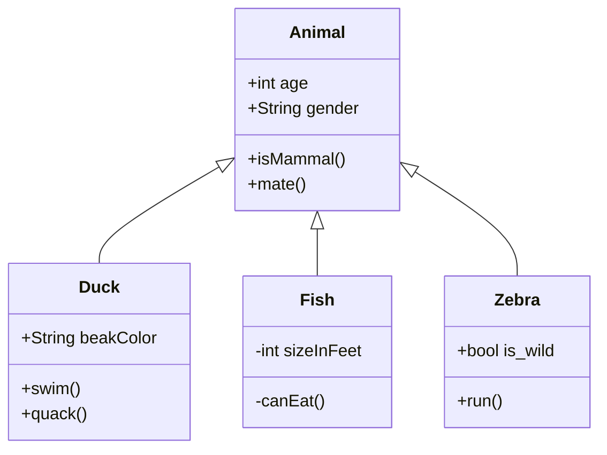
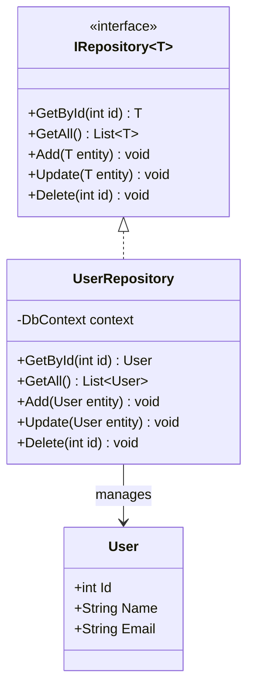
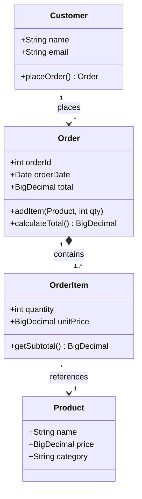
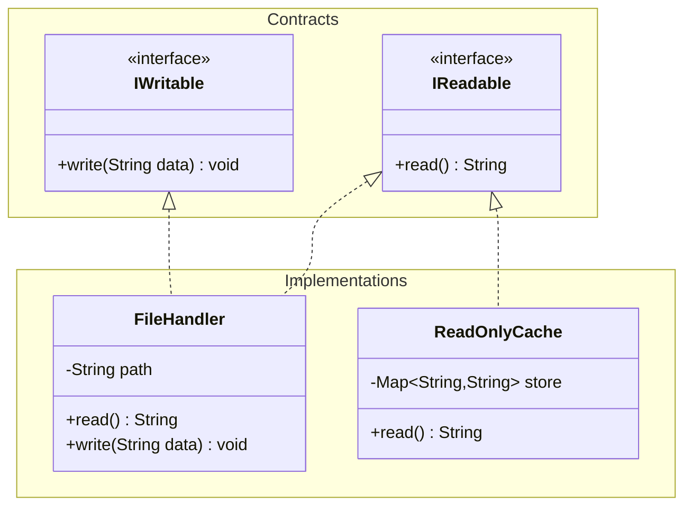
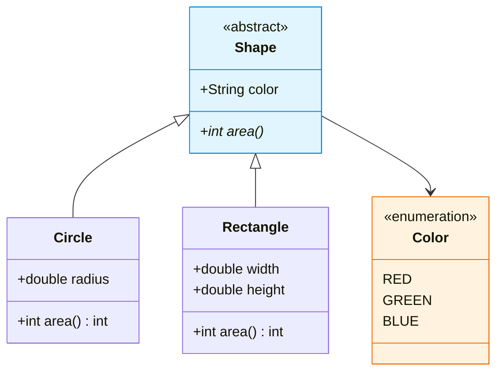

# Class Diagram

## Declaration

```
classDiagram
```

## Direction

Set rendering direction with the `direction` statement:

```
classDiagram
    direction RL
```

| Keyword | Direction |
|---------|-----------|
| `TB` | Top to bottom |
| `TD` | Top-down |
| `BT` | Bottom to top |
| `RL` | Right to left |
| `LR` | Left to right |

## Complete Syntax Reference

### Defining a Class

Two ways to define a class:

1. **Explicit keyword**: `class Animal`
2. **Via relationship**: `Vehicle <|-- Car` (defines both classes)

### Class Labels

```
class Animal["Animal with a label"]
class Car["Car with *! symbols"]
```

Backtick escaping for special characters:

```
class `Animal Class!`
class `Car Class`
`Animal Class!` --> `Car Class`
```

### Naming Convention

Class names: alphanumeric characters (including unicode), underscores, and dashes only.

### Title

```
---
title: Animal example
---
classDiagram
    ...
```

## Defining Members

Mermaid distinguishes attributes from methods based on the presence of `()`.

### Colon Syntax (one member per line)

```
BankAccount : +String owner
BankAccount : +BigDecimal balance
BankAccount : +deposit(amount)
BankAccount : +withdrawal(amount)
```

### Curly Brace Syntax (grouped)

```
class BankAccount{
    +String owner
    +BigDecimal balance
    +deposit(amount)
    +withdrawal(amount)
}
```

### Return Types

Add a space after `)` then the return type:

```
class BankAccount{
    +deposit(amount) bool
    +withdrawal(amount) int
}
```

### Generic Types

Enclose generics in `~` (tilde):

```
class Square~Shape~{
    int id
    List~int~ position
    setPoints(List~int~ points)
    getPoints() List~int~
}
```

Nested generics are supported: `List~List~int~~`. Generics with commas (e.g. `Map~K, V~`) are not supported.

The generic type is NOT part of the class name for reference purposes.

### Visibility Modifiers

| Symbol | Visibility |
|--------|------------|
| `+` | Public |
| `-` | Private |
| `#` | Protected |
| `~` | Package / Internal |

### Member Classifiers

| Symbol | Meaning | Position |
|--------|---------|----------|
| `*` | Abstract | After `()` or return type: `someMethod()*` |
| `$` | Static | After `()` or return type: `someMethod()$` |

Static fields: `String someField$`

## Relationships

### Relationship Types

| Syntax | Description |
|--------|-------------|
| `<\|--` | Inheritance |
| `*--` | Composition |
| `o--` | Aggregation |
| `-->` | Association |
| `--` | Link (Solid) |
| `..>` | Dependency |
| `..\|>` | Realization |
| `..` | Link (Dashed) |

All arrows can be reversed: `classA --|> classB` is equivalent to `classB <|-- classA`.

### Labels on Relationships

```
classA <|-- classB : implements
classC *-- classD : composition
```

Format: `[classA][Arrow][ClassB]:LabelText`

### Two-Way Relations

```
Animal <|--|> Zebra
```

Format: `[Relation Type][Link][Relation Type]`

Relation types for two-way: `<|`, `*`, `o`, `>`, `<`, `|>`

Link types: `--` (solid), `..` (dashed)

### Lollipop Interfaces

```
bar ()-- foo
foo --() bar
```

Each lollipop interface is unique and not shared between classes.

## Cardinality / Multiplicity

Place cardinality text in quotes before/after the arrow:

```
[classA] "cardinality1" [Arrow] "cardinality2" [ClassB]:LabelText
```

| Notation | Meaning |
|----------|---------|
| `1` | Only 1 |
| `0..1` | Zero or one |
| `1..*` | One or more |
| `*` | Many |
| `n` | n (where n>1) |
| `0..n` | Zero to n |
| `1..n` | One to n |

Example:

```
Customer "1" --> "*" Ticket
Student "1" --> "1..*" Course
Galaxy --> "many" Star : Contains
```

## Annotations

| Annotation | Description |
|------------|-------------|
| `<<Interface>>` | Interface class |
| `<<Abstract>>` | Abstract class |
| `<<Service>>` | Service class |
| `<<Enumeration>>` | Enum |

### Inline Annotation (recommended)

```
class Shape <<interface>>
```

### Separate Line Annotation

```
class Shape
<<interface>> Shape
```

### Nested Annotation

```
class Shape{
    <<interface>>
    noOfVertices
    draw()
}
```

## Namespaces

Group classes with `namespace`:

```
namespace BaseShapes {
    class Triangle
    class Rectangle {
        double width
        double height
    }
}
```

## Notes

```
note "This is a general note"
note for MyClass "This is a note for a class"
```

Use `<br>` for line breaks: `note for MyClass "line1<br>line2"`.

## Comments

```
%% This whole line is a comment
```

## Interaction & Click Events

Requires `securityLevel='loose'`.

### URL Links

```
link Shape "https://www.github.com" "Tooltip text"
click Shape2 href "https://www.github.com" "Tooltip text"
```

### Callbacks

```
callback Shape "callbackFunction" "Tooltip text"
click Shape2 call callbackFunction() "Tooltip text"
```

## Styling & Customization

### Inline Style

```
style Animal fill:#f9f,stroke:#333,stroke-width:4px
style Mineral fill:#bbf,stroke:#f66,stroke-width:2px,color:#fff,stroke-dasharray: 5 5
```

Notes and namespaces cannot be styled individually but support themes.

### classDef / class

```
classDef className fill:#f9f,stroke:#333,stroke-width:4px;
classDef first,second font-size:12pt;
```

Apply with `cssClass`:

```
cssClass "nodeId1" className;
cssClass "nodeId1,nodeId2" className;
```

### Shorthand `:::` Operator

```
class Animal:::someclass
classDef someclass fill:#f96

class Animal:::someclass {
    -int sizeInFeet
    -canEat()
}
```

Cannot be used at the same time as a relation statement.

### Default Class

Applied to all nodes without a specific class:

```
classDef default fill:#f9f,stroke:#333,stroke-width:4px;
```

### CSS Classes

```html
<style>
  .styleClass > * > g {
    fill: #ff0000;
    stroke: #ffff00;
    stroke-width: 4px;
  }
</style>
```

```
classDiagram
    class Animal:::styleClass
```

## Configuration

### Hide Empty Members Box

```
---
config:
  class:
    hideEmptyMembersBox: true
---
classDiagram
    class Duck
```

## Practical Examples

### Basic Inheritance



### Design Patterns - Repository Pattern



### E-Commerce Domain Model



### Interface Segregation with Namespaces



### Styled Diagram with Annotations



## Common Gotchas

- **Parentheses distinguish methods from attributes**: `name` is an attribute, `name()` is a method.
- **Generic type is NOT part of the class name**: When referencing `Square~Shape~`, use just `Square`.
- **Generics with commas are not supported**: `Map~K, V~` will not work.
- **`:::` shorthand cannot be combined with relation statements** in the same line.
- **Lollipop interfaces are unique** and should not have multiple edges connecting to them.
- **Notes and namespaces** cannot be individually styled (only via themes).
- **`cssClass` uses quotes** around node IDs: `cssClass "nodeId" className;`.
