# Configuration Reference

## Overview

Mermaid configuration controls diagram rendering behavior, layout, security, and appearance. Configuration is resolved from three sources in priority order:

1. **Frontmatter** (highest priority) - per-diagram YAML config block
2. **Site-level `initialize` call** - applied once by the site integrator
3. **Built-in defaults** (lowest priority)

Before each diagram render, Mermaid calls `configApi.reset()` to restore site-level config, then applies frontmatter on top. This means frontmatter always wins over site defaults.

## Frontmatter Configuration (v10.5.0+)

Frontmatter is the recommended way to configure individual diagrams. It uses a YAML block delimited by `---` at the very top of the diagram definition.

### Syntax Rules

- The opening `---` **must be the very first line** of the diagram text. No whitespace or characters before it.
- The closing `---` must also be on its own line.
- YAML is **indentation-sensitive** - use consistent spaces (not tabs).
- All config keys are **case-sensitive**. Misspelled keys are silently ignored.
- Badly formed YAML will break the diagram entirely.

### Structure

```mermaid
---
title: Optional Diagram Title
config:
  <top-level-key>: <value>
  <diagram-type>:
    <diagram-specific-key>: <value>
---
<diagram-type-declaration>
  <diagram content>
```

### Basic Example

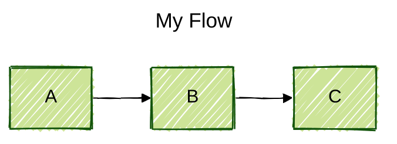

### Nested Diagram-Specific Example

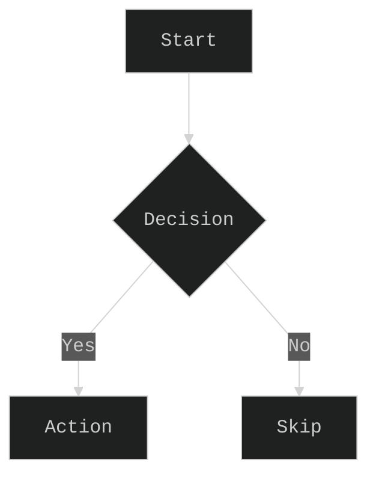

### What Cannot Be Set via Frontmatter

Keys listed in the `secure` array are protected and can only be set via `mermaid.initialize()`. By default, these are:

```json
["secure", "securityLevel", "startOnLoad", "maxTextSize", "suppressErrorRendering", "maxEdges"]
```

Attempting to override secure keys in frontmatter has no effect - they are silently ignored.

## Complete Top-Level Configuration Keys

Every key below can be set under `config:` in frontmatter (except secure keys).

### Appearance

| Key              | Type    | Default     | Description                                                                                                                                                                       |
|------------------|---------|-------------|-----------------------------------------------------------------------------------------------------------------------------------------------------------------------------------|
| `theme`          | string  | `"default"` | Theme name: `default`, `neutral`, `dark`, `forest`, `base`. Use `base` for custom theming via `themeVariables`. Use `"null"` to disable theming entirely.                         |
| `themeVariables` | object  | `{}`        | Override theme CSS variables. **Only works with `theme: base`**. Using it with any other theme has no effect.                                                                     |
| `themeCSS`       | string  | `""`        | Raw CSS string injected into the diagram SVG. Overrides theme styles.                                                                                                             |
| `look`           | string  | `"classic"` | Visual rendering style: `classic` (clean vector graphics) or `handDrawn` (sketchy rough.js style).                                                                                |
| `handDrawnSeed`  | number  | `0`         | Seed for the hand-drawn renderer's randomization. `0` = random seed each render. Set to a fixed number for reproducible hand-drawn output (useful for tests and version control). |
| `darkMode`       | boolean | `false`     | Enable dark mode rendering. Adjusts background and text colors.                                                                                                                   |

### Typography

| Key                | Type    | Default                                      | Description                                                                                                                                                                                                                  |
|--------------------|---------|----------------------------------------------|------------------------------------------------------------------------------------------------------------------------------------------------------------------------------------------------------------------------------|
| `fontFamily`       | string  | `"trebuchet ms, verdana, arial, sans-serif"` | CSS `font-family` for all diagram text. Any valid CSS font stack.                                                                                                                                                            |
| `altFontFamily`    | string  | `""`                                         | Alternative font family used as fallback.                                                                                                                                                                                    |
| `fontSize`         | number  | `16`                                         | Base font size in pixels.                                                                                                                                                                                                    |
| `htmlLabels`       | boolean | `true`                                       | Use HTML rendering for labels on nodes and edges. Enables richer formatting (bold, italic, line breaks). Diagram-specific `htmlLabels` settings (e.g., `flowchart.htmlLabels`) are deprecated - use this root-level setting. |
| `markdownAutoWrap` | boolean | `true`                                       | Automatically wrap markdown text content.                                                                                                                                                                                    |
| `wrap`             | boolean | `false`                                      | Enable text wrapping globally.                                                                                                                                                                                               |

### Layout

| Key      | Type   | Default   | Description                                                                                           |
|----------|--------|-----------|-------------------------------------------------------------------------------------------------------|
| `layout` | string | `"dagre"` | Layout algorithm: `dagre`, `elk`, `tidy-tree`, `cose-bilkent`. See [Layout Engines](#layout-engines). |
| `elk`    | object | —         | ELK-specific layout configuration. See [ELK Configuration](#elk-configuration).                       |

### Security & Rendering

| Key                      | Type     | Default                                                                                           | Description                                                                                                                             |
|--------------------------|----------|---------------------------------------------------------------------------------------------------|-----------------------------------------------------------------------------------------------------------------------------------------|
| `securityLevel`          | string   | `"strict"`                                                                                        | Trust level for parsed diagrams. See [Security Levels](#security-levels). **Secure key** - only settable via `initialize()`.            |
| `startOnLoad`            | boolean  | `true`                                                                                            | Auto-render all `class="mermaid"` elements when the page loads. **Secure key**.                                                         |
| `maxTextSize`            | number   | `50000`                                                                                           | Maximum character count for user diagram text. Diagrams exceeding this are rejected. **Secure key**.                                    |
| `maxEdges`               | number   | `500`                                                                                             | Maximum number of edges allowed in a graph. Prevents performance issues with very large diagrams. Minimum: `0`. **Secure key**.         |
| `suppressErrorRendering` | boolean  | `false`                                                                                           | Prevent inserting "Syntax error" placeholder diagrams into the DOM. Useful when your application handles errors itself. **Secure key**. |
| `secure`                 | string[] | `["secure", "securityLevel", "startOnLoad", "maxTextSize", "suppressErrorRendering", "maxEdges"]` | List of config keys that cannot be overridden via frontmatter or directives. Only settable via `initialize()`.                          |
| `dompurifyConfig`        | object   | —                                                                                                 | Pass-through configuration for DOMPurify HTML sanitization.                                                                             |

### Logging

| Key        | Type             | Default | Description                                                                                                                                                          |
|------------|------------------|---------|----------------------------------------------------------------------------------------------------------------------------------------------------------------------|
| `logLevel` | number or string | `5`     | Logging verbosity. Numbers: `0`=trace, `1`=debug, `2`=info, `3`=warn, `4`=error, `5`=fatal. Strings: `"trace"`, `"debug"`, `"info"`, `"warn"`, `"error"`, `"fatal"`. |

### SVG & ID Generation

| Key                   | Type    | Default     | Description                                                                                                                                                                                                                                      |
|-----------------------|---------|-------------|--------------------------------------------------------------------------------------------------------------------------------------------------------------------------------------------------------------------------------------------------|
| `arrowMarkerAbsolute` | boolean | `false`     | Use absolute paths for arrow markers in SVG. Needed when using HTML `<base>` tags that change relative URL resolution.                                                                                                                           |
| `deterministicIds`    | boolean | `false`     | Generate node IDs based on a seed instead of randomly. When `false` (default), IDs are based on the current timestamp and change every render. Set to `true` for source-control-friendly output where SVG doesn't change unless content changes. |
| `deterministicIDSeed` | string  | `undefined` | Static string seed for deterministic IDs. Only used when `deterministicIds: true`. If `undefined`, a simple incrementing counter is used.                                                                                                        |

### Math Rendering

| Key                 | Type    | Default | Description                                                                                                                                                                                 |
|---------------------|---------|---------|---------------------------------------------------------------------------------------------------------------------------------------------------------------------------------------------|
| `legacyMathML`      | boolean | `false` | If MathML is not supported by the browser, fall back to KaTeX legacy rendering. If disabled, math equations show a warning instead.                                                         |
| `forceLegacyMathML` | boolean | `false` | Force KaTeX's own stylesheet for all math rendering, regardless of browser MathML support. Overrides `legacyMathML`. Recommended when consistent cross-browser math rendering is important. |

## Security Levels

| Level        | HTML Tags                   | Click Events | Use Case                                                                   |
|--------------|-----------------------------|--------------|----------------------------------------------------------------------------|
| `strict`     | Encoded                     | Disabled     | Default. Safe for untrusted diagram input.                                 |
| `loose`      | Allowed                     | Enabled      | Trusted environments where click handlers are needed.                      |
| `antiscript` | Allowed (except `<script>`) | Disabled     | Allow formatting HTML but block scripts.                                   |
| `sandbox`    | N/A (iframe)                | N/A          | Maximum isolation. Renders in a sandboxed iframe. May limit some features. |


Note: `securityLevel` is a secure key and can only be set via `mermaid.initialize()`, not via frontmatter.

## Layout Engines

### dagre (Default)

The classic layout engine. Best for general-purpose layered/hierarchical graphs. Produces reliable results for most diagram sizes.

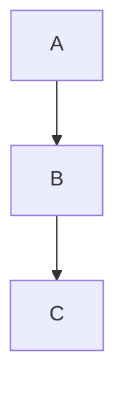

### elk (Eclipse Layout Kernel)

Advanced layout engine producing cleaner results for complex diagrams with many crossing edges. Requires the `@mermaid-js/layout-elk` package to be installed and registered by the site.

```javascript
import mermaid from 'mermaid';
import elkLayouts from '@mermaid-js/layout-elk';
mermaid.registerLayoutLoaders(elkLayouts);
```

If ELK is not available, Mermaid silently falls back to dagre.

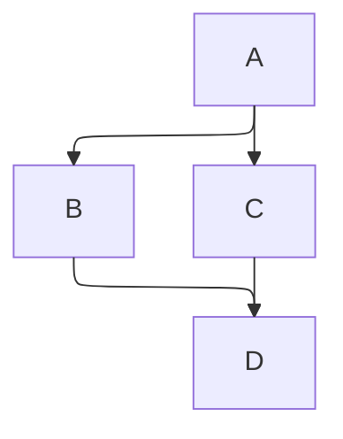

### tidy-tree

Optimized for hierarchical tree structures with even spacing. Produces balanced trees with consistent node positioning.

### cose-bilkent

Force-directed layout from the Cytoscape ecosystem. Best for undirected or loosely structured graphs where hierarchical layout doesn't apply.

## ELK Configuration

The `elk` object provides fine-grained control over the ELK layout engine. All properties are optional.

| Key                     | Type    | Values           | Description                                                                                                                                                                                           |
|-------------------------|---------|------------------|-------------------------------------------------------------------------------------------------------------------------------------------------------------------------------------------------------|
| `mergeEdges`            | boolean | `true` / `false` | Allow edges to share path segments where convenient. Produces cleaner diagrams but can reduce readability when many edges are merged.                                                                 |
| `nodePlacementStrategy` | string  | See below        | Algorithm for placing nodes within layers.                                                                                                                                                            |
| `cycleBreakingStrategy` | string  | See below        | Algorithm for finding and breaking cycles in the graph.                                                                                                                                               |
| `considerModelOrder`    | string  | See below        | Whether to preserve the order of nodes/edges as written in the diagram source.                                                                                                                        |
| `forceNodeModelOrder`   | boolean | `true` / `false` | Lock node order to the model order. Prevents crossing minimization from reordering nodes. Assumes model order is already respected (achievable by setting `considerModelOrder` to `NODES_AND_EDGES`). |

### nodePlacementStrategy Values

| Value             | Description                                                      |
|-------------------|------------------------------------------------------------------|
| `SIMPLE`          | Basic placement without optimization.                            |
| `NETWORK_SIMPLEX` | Uses network simplex algorithm. Generally produces good results. |
| `LINEAR_SEGMENTS` | Aims to keep long edge segments linear. Good for readability.    |
| `BRANDES_KOEPF`   | Fast placement algorithm. Good balance of quality and speed.     |

### cycleBreakingStrategy Values

| Value                | Description                                                 |
|----------------------|-------------------------------------------------------------|
| `GREEDY`             | Fast greedy heuristic. Default choice for most graphs.      |
| `DEPTH_FIRST`        | Uses depth-first search.                                    |
| `INTERACTIVE`        | Preserves existing edge directions where possible.          |
| `MODEL_ORDER`        | Breaks cycles based on the order edges appear in the model. |
| `GREEDY_MODEL_ORDER` | Greedy approach that also considers model order.            |

### considerModelOrder Values

| Value             | Description                                                     |
|-------------------|-----------------------------------------------------------------|
| `NONE`            | No model order preservation. Layout algorithm has full freedom. |
| `NODES_AND_EDGES` | Preserve both node and edge order from the source.              |
| `PREFER_EDGES`    | Prioritize edge order preservation over node order.             |
| `PREFER_NODES`    | Prioritize node order preservation over edge order.             |

### ELK Frontmatter Example

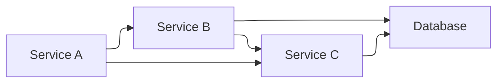

## Looks

| Look        | Description                                                    |
|-------------|----------------------------------------------------------------|
| `classic`   | Default clean vector-graphic style with solid lines and fills. |
| `handDrawn` | Sketchy, hand-drawn appearance using rough.js rendering.       |

The `handDrawnSeed` key controls reproducibility. With seed `0` (default), each render looks slightly different. Set a fixed seed for consistent output:

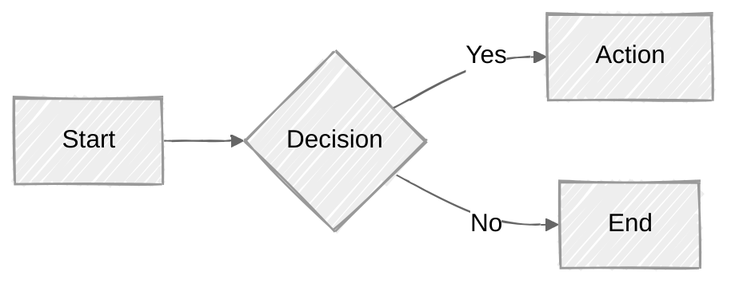

## Diagram-Specific Configuration

Diagram-specific options are nested under their diagram type key in frontmatter. All diagram configs inherit from `BaseDiagramConfig` which provides:

| Key           | Type    | Default | Description                                 |
|---------------|---------|---------|---------------------------------------------|
| `useMaxWidth` | boolean | `true`  | Scale diagram to available container width. |
| `useWidth`    | number  | —       | Fixed width override in pixels.             |

### Flowchart

```yaml
config:
  flowchart:
    <key>: <value>
```

| Key               | Type    | Default   | Description                                                                                                                     |
|-------------------|---------|-----------|---------------------------------------------------------------------------------------------------------------------------------|
| `curve`           | string  | `"basis"` | Line curve interpolation: `basis`, `linear`, `cardinal`, `monotoneX`, `monotoneY`, `natural`, `step`, `stepAfter`, `stepBefore` |
| `diagramPadding`  | number  | `8`       | Padding around the diagram in pixels                                                                                            |
| `nodeSpacing`     | number  | `50`      | Horizontal spacing between nodes                                                                                                |
| `rankSpacing`     | number  | `50`      | Vertical spacing between ranks (layers)                                                                                         |
| `useMaxWidth`     | boolean | `true`    | Scale to container width                                                                                                        |
| `defaultRenderer` | string  | `"dagre"` | Default layout renderer: `dagre` or `elk`                                                                                       |

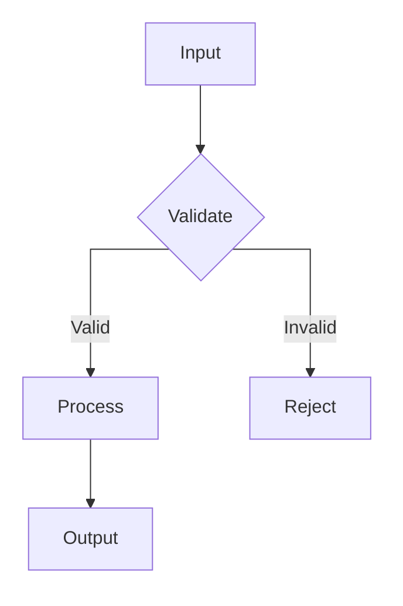

### Sequence Diagram

```yaml
config:
  sequence:
    <key>: <value>
```

| Key                   | Type    | Default                          | Description                                                    |
|-----------------------|---------|----------------------------------|----------------------------------------------------------------|
| `width`               | number  | `150`                            | Actor box width                                                |
| `height`              | number  | `65`                             | Actor box height                                               |
| `messageAlign`        | string  | `"center"`                       | Message text alignment: `left`, `center`, `right`              |
| `mirrorActors`        | boolean | `true`                           | Repeat actor boxes at the bottom of the diagram                |
| `useMaxWidth`         | boolean | `true`                           | Scale to container width                                       |
| `rightAngles`         | boolean | `false`                          | Use right-angled (90-degree) message lines instead of diagonal |
| `showSequenceNumbers` | boolean | `false`                          | Display auto-incrementing message sequence numbers             |
| `wrap`                | boolean | `false`                          | Enable text wrapping on long messages                          |
| `actorFontSize`       | number  | `14`                             | Font size for actor labels                                     |
| `actorFontFamily`     | string  | `"Open Sans, sans-serif"`        | Font family for actor labels                                   |
| `noteFontSize`        | number  | `14`                             | Font size for note text                                        |
| `noteFontFamily`      | string  | `"trebuchet ms, verdana, arial"` | Font family for note text                                      |
| `noteAlign`           | string  | `"center"`                       | Text alignment within notes                                    |
| `messageFontSize`     | number  | `16`                             | Font size for message labels                                   |
| `messageFontFamily`   | string  | `"trebuchet ms, verdana, arial"` | Font family for message labels                                 |

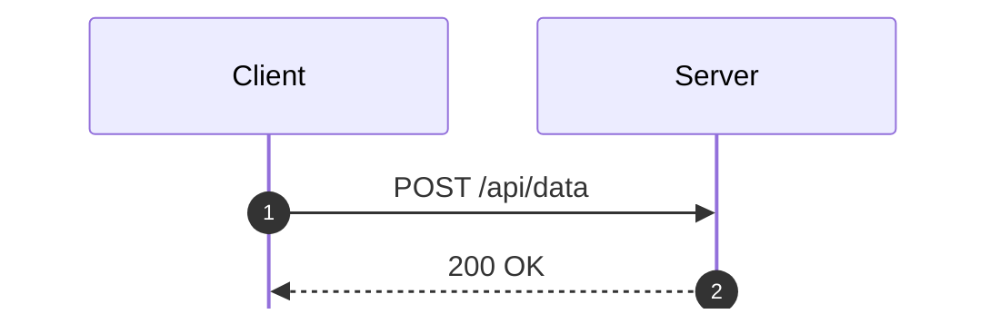

### Gantt Chart

```yaml
config:
  gantt:
    <key>: <value>
```

| Key                    | Type    | Default    | Description                                        |
|------------------------|---------|------------|----------------------------------------------------|
| `titleTopMargin`       | number  | `25`       | Margin above the chart title                       |
| `barHeight`            | number  | `20`       | Height of task bars in pixels                      |
| `barGap`               | number  | `4`        | Gap between task bars in pixels                    |
| `topPadding`           | number  | `75`       | Padding above the chart area                       |
| `rightPadding`         | number  | `75`       | Right padding (space for section names)            |
| `leftPadding`          | number  | `75`       | Left padding (space for section names)             |
| `gridLineStartPadding` | number  | `10`       | Vertical start position for grid lines             |
| `fontSize`             | number  | `12`       | Font size for task labels                          |
| `sectionFontSize`      | number  | `24`       | Font size for section headings                     |
| `numberSectionStyles`  | number  | `1`        | Number of alternating section background styles    |
| `axisFormat`           | string  | `"%d/%m"`  | Date format for axis labels (d3 time format)       |
| `tickInterval`         | string  | `"1week"`  | Tick interval on the time axis                     |
| `topAxis`              | boolean | `true`     | Show date labels at the top of the chart           |
| `displayMode`          | string  | `""`       | Set to `"compact"` to allow multiple tasks per row |
| `weekday`              | string  | `"sunday"` | First day of week for week-based intervals         |

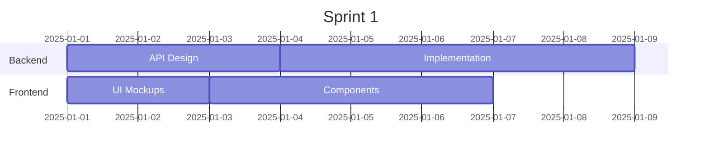

### Class Diagram

```yaml
config:
  class:
    <key>: <value>
```

| Key                   | Type    | Default | Description                                                                  |
|-----------------------|---------|---------|------------------------------------------------------------------------------|
| `hideEmptyMembersBox` | boolean | `false` | Hide the empty members compartment when a class has no attributes or methods |

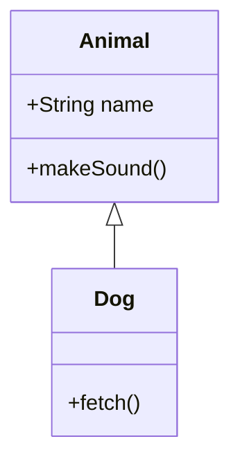

### State Diagram

```yaml
config:
  state:
    <key>: <value>
```

State diagrams primarily use `BaseDiagramConfig` properties (`useMaxWidth`, `useWidth`) and inherit layout/theme settings from top-level config.

### ER Diagram

```yaml
config:
  er:
    <key>: <value>
```

| Key      | Type   | Default   | Description                     |
|----------|--------|-----------|---------------------------------|
| `layout` | string | `"dagre"` | Layout engine: `dagre` or `elk` |

### Pie Chart

```yaml
config:
  pie:
    <key>: <value>
```

| Key            | Type   | Default | Description                                                          |
|----------------|--------|---------|----------------------------------------------------------------------|
| `textPosition` | number | `0.75`  | Radial position of slice labels. `0.0` = center, `1.0` = outer edge. |

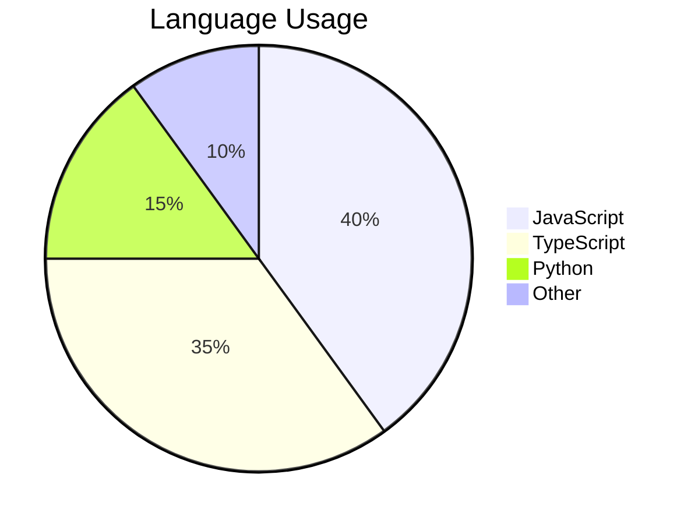

### Git Graph

```yaml
config:
  gitGraph:
    <key>: <value>
```

| Key                 | Type    | Default  | Description                                                              |
|---------------------|---------|----------|--------------------------------------------------------------------------|
| `showBranches`      | boolean | `true`   | Show branch name labels and branch lines                                 |
| `showCommitLabel`   | boolean | `true`   | Show commit ID labels on commits                                         |
| `rotateCommitLabel` | boolean | `true`   | Rotate commit labels 45 degrees (`true`) or display horizontal (`false`) |
| `mainBranchName`    | string  | `"main"` | Name of the root branch                                                  |
| `mainBranchOrder`   | number  | `0`      | Position of the main branch in the visual branch ordering                |
| `parallelCommits`   | boolean | `false`  | Align commits at the same depth to the same vertical level               |

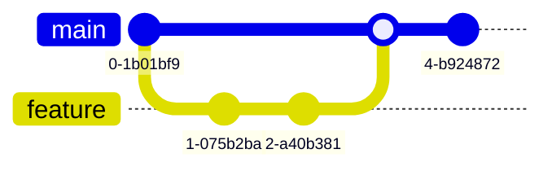

### C4 Diagram

```yaml
config:
  c4:
    <key>: <value>
```

| Key               | Type   | Default | Description                                                                    |
|-------------------|--------|---------|--------------------------------------------------------------------------------|
| `c4ShapeInRow`    | number | `4`     | Maximum number of C4 shapes (persons, systems, containers, components) per row |
| `c4BoundaryInRow` | number | `2`     | Maximum number of C4 boundaries per row                                        |

C4 diagrams also support extensive font/size/color customization for each element type (person, system, container, component, database, queue, boundary, message) through theme variables.

### Quadrant Chart

```yaml
config:
  quadrantChart:
    <key>: <value>
```

| Key                                 | Type   | Default  | Description                                |
|-------------------------------------|--------|----------|--------------------------------------------|
| `chartWidth`                        | number | `500`    | Total chart width in pixels                |
| `chartHeight`                       | number | `500`    | Total chart height in pixels               |
| `titlePadding`                      | number | `10`     | Padding above and below the title          |
| `titleFontSize`                     | number | `20`     | Title font size                            |
| `quadrantPadding`                   | number | `5`      | Padding outside all quadrants              |
| `quadrantTextTopPadding`            | number | `5`      | Top padding for quadrant label text        |
| `quadrantLabelFontSize`             | number | `16`     | Font size for quadrant labels              |
| `quadrantInternalBorderStrokeWidth` | number | `1`      | Stroke width of the internal cross divider |
| `quadrantExternalBorderStrokeWidth` | number | `2`      | Stroke width of the outer border           |
| `xAxisLabelPadding`                 | number | `5`      | Padding around x-axis labels               |
| `xAxisLabelFontSize`                | number | `16`     | Font size for x-axis labels                |
| `xAxisPosition`                     | string | `"top"`  | Position of x-axis: `top` or `bottom`      |
| `yAxisLabelPadding`                 | number | `5`      | Padding around y-axis labels               |
| `yAxisLabelFontSize`                | number | `16`     | Font size for y-axis labels                |
| `yAxisPosition`                     | string | `"left"` | Position of y-axis: `left` or `right`      |
| `pointTextPadding`                  | number | `5`      | Padding between a data point and its label |
| `pointLabelFontSize`                | number | `12`     | Font size for data point labels            |
| `pointRadius`                       | number | `5`      | Default radius of data point circles       |

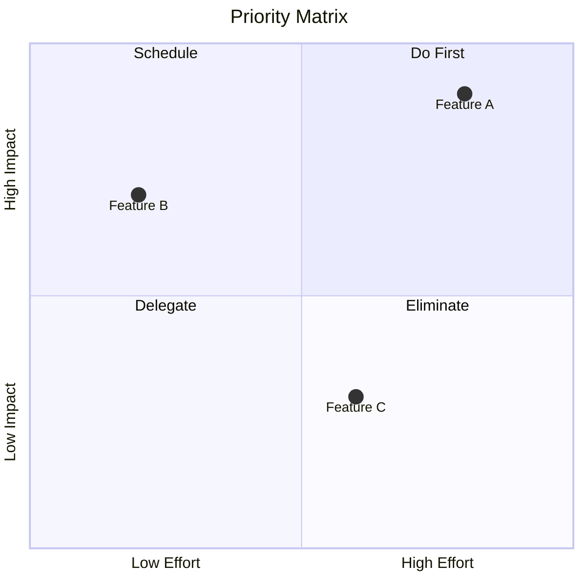

### XY Chart

```yaml
config:
  xyChart:
    <key>: <value>
```

| Key                        | Type    | Default      | Description                                            |
|----------------------------|---------|--------------|--------------------------------------------------------|
| `width`                    | number  | `700`        | Chart width in pixels                                  |
| `height`                   | number  | `500`        | Chart height in pixels                                 |
| `titlePadding`             | number  | `10`         | Padding above/below title                              |
| `titleFontSize`            | number  | `20`         | Title font size                                        |
| `showTitle`                | boolean | `true`       | Whether to display the chart title                     |
| `chartOrientation`         | string  | `"vertical"` | Orientation: `vertical` or `horizontal`                |
| `plotReservedSpacePercent` | number  | `50`         | Minimum percentage of chart area reserved for the plot |
| `showDataLabel`            | boolean | `false`      | Display value labels on bars                           |
| `xAxis`                    | object  | —            | X-axis configuration (see AxisConfig below)            |
| `yAxis`                    | object  | —            | Y-axis configuration (see AxisConfig below)            |

**AxisConfig** (shared by `xAxis` and `yAxis`):

| Key             | Type    | Default | Description                    |
|-----------------|---------|---------|--------------------------------|
| `showLabel`     | boolean | `true`  | Show axis tick labels          |
| `labelFontSize` | number  | `14`    | Font size for tick labels      |
| `labelPadding`  | number  | `5`     | Padding around tick labels     |
| `showTitle`     | boolean | `true`  | Show axis title                |
| `titleFontSize` | number  | `16`    | Font size for axis title       |
| `titlePadding`  | number  | `5`     | Padding around axis title      |
| `showTick`      | boolean | `true`  | Show tick marks                |
| `tickLength`    | number  | `5`     | Length of tick marks in pixels |
| `tickWidth`     | number  | `2`     | Width of tick marks in pixels  |
| `showAxisLine`  | boolean | `true`  | Show the axis line             |
| `axisLineWidth` | number  | `2`     | Thickness of the axis line     |

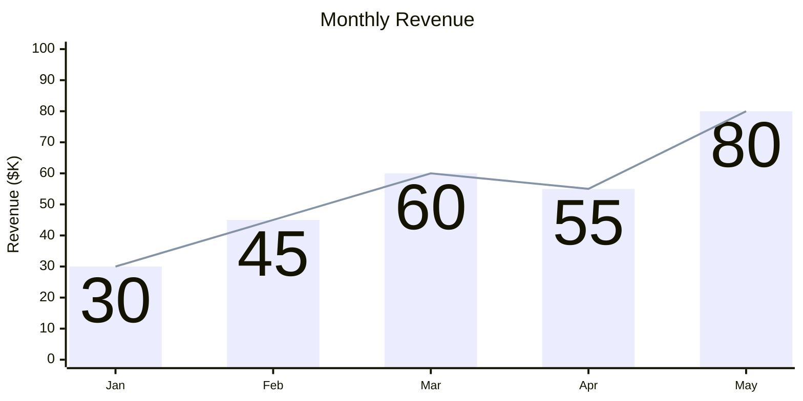

### Sankey Diagram

```yaml
config:
  sankey:
    <key>: <value>
```

| Key             | Type    | Default     | Description                                                                                                                           |
|-----------------|---------|-------------|---------------------------------------------------------------------------------------------------------------------------------------|
| `width`         | number  | `800`       | Diagram width in pixels                                                                                                               |
| `height`        | number  | `400`       | Diagram height in pixels                                                                                                              |
| `linkColor`     | string  | `"source"`  | Link coloring: `source` (match source node), `target` (match target node), `gradient` (blend source to target), or a hex color string |
| `nodeAlignment` | string  | `"justify"` | Node alignment: `justify`, `left`, `right`, `center`                                                                                  |
| `showValues`    | boolean | `true`      | Display numeric values on flow links                                                                                                  |

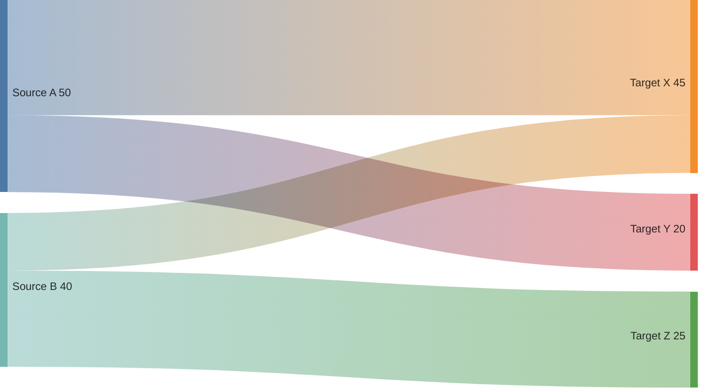

### Mindmap

```yaml
config:
  mindmap:
    <key>: <value>
```

Mindmap primarily uses `BaseDiagramConfig` properties and the top-level `layout` key. The mindmap layout works best with `tidy-tree`.

### Kanban

```yaml
config:
  kanban:
    <key>: <value>
```

| Key             | Type   | Default | Description                                                                          |
|-----------------|--------|---------|--------------------------------------------------------------------------------------|
| `ticketBaseUrl` | string | `""`    | Base URL for external ticket links. Use `#TICKET#` as placeholder for the ticket ID. |

```mermaid
---
config:
  kanban:
    ticketBaseUrl: "https://jira.example.com/browse/#TICKET#"
---
kanban
  column1[To Do]
    task1[Fix login bug]
      @{ ticket: BUG-123 }
  column2[In Progress]
    task2[Add search feature]
      @{ ticket: FEAT-456 }
  column3[Done]
    task3[Update docs]
```

### Packet Diagram

```yaml
config:
  packet:
    <key>: <value>
```

| Key          | Type    | Default | Description                                           |
|--------------|---------|---------|-------------------------------------------------------|
| `showBits`   | boolean | `true`  | Show bit position numbers at field boundaries         |
| `bitsPerRow` | number  | `32`    | Number of bits displayed per row (typical: 8, 16, 32) |
| `paddingX`   | number  | `5`     | Horizontal padding inside field blocks                |
| `paddingY`   | number  | `5`     | Vertical padding inside field blocks                  |

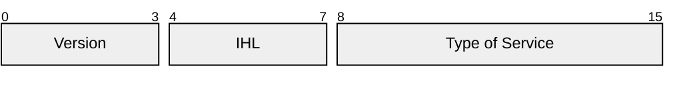

### Radar Chart

```yaml
config:
  radar:
    <key>: <value>
```

| Key               | Type   | Default | Description                                                                |
|-------------------|--------|---------|----------------------------------------------------------------------------|
| `width`           | number | `600`   | Diagram width in pixels                                                    |
| `height`          | number | `600`   | Diagram height in pixels                                                   |
| `marginTop`       | number | `50`    | Top margin                                                                 |
| `marginBottom`    | number | `50`    | Bottom margin                                                              |
| `marginLeft`      | number | `50`    | Left margin                                                                |
| `marginRight`     | number | `50`    | Right margin                                                               |
| `axisScaleFactor` | number | `1`     | Scale factor for axis length                                               |
| `axisLabelFactor` | number | `1.05`  | Factor to adjust axis label distance from center                           |
| `curveTension`    | number | `0.17`  | Tension for smooth curve rendering (0 = straight lines, 1 = maximum curve) |


### Timeline

```yaml
config:
  timeline:
    <key>: <value>
```

| Key                 | Type    | Default | Description                                                                                    |
|---------------------|---------|---------|------------------------------------------------------------------------------------------------|
| `disableMulticolor` | boolean | `false` | When `true`, all unsectioned periods use the same color instead of cycling through the palette |

### Journey, Requirement, Architecture, Block, Treemap, ZenUML

These diagram types primarily use `BaseDiagramConfig` properties (`useMaxWidth`, `useWidth`) and inherit layout/theme/font settings from the top-level config. They do not have extensive diagram-specific config keys.

## Initialize Call (Site-Wide)

The `mermaid.initialize()` call is applied once by the site integrator. It sets the site-level baseline that all diagrams inherit. Frontmatter overrides are applied on top.

```javascript
mermaid.initialize({
  theme: 'dark',
  securityLevel: 'loose',
  logLevel: 'warn',
  startOnLoad: true,
  maxTextSize: 100000,
  maxEdges: 1000,
  fontFamily: 'Inter, sans-serif',
  fontSize: 14,
  darkMode: true,
  deterministicIds: true,
  flowchart: { curve: 'linear', nodeSpacing: 60 },
  sequence: { mirrorActors: false, wrap: true },
  gantt: { barHeight: 24, axisFormat: '%Y-%m-%d' },
});
```

Secure keys (`securityLevel`, `startOnLoad`, `maxTextSize`, `maxEdges`, `suppressErrorRendering`) can **only** be set here - not via frontmatter.

## Directives (Deprecated)

Inline `%%{init: ...}%%` blocks are deprecated since v10.5.0 in favor of frontmatter. They still function but frontmatter is preferred.

```mermaid
%%{init: { "theme": "forest", "logLevel": 2 } }%%
graph TD
  A --> B
```

Both `init` and `initialize` keywords work. Multiple directives in a diagram are merged, with later values overriding earlier ones for the same key.

## Configuration Resolution Chain

Understanding the full resolution order:

```
1. Built-in defaults (hardcoded in Mermaid source)
     |
     v
2. mermaid.initialize({...}) - site-level overrides
     |
     v
3. configApi.reset() - called before each diagram render,
   resets to site-level config (step 2)
     |
     v
4. Frontmatter config: block - per-diagram overrides
   (secure keys filtered out)
     |
     v
5. Final render config used for this diagram
```

Each diagram starts fresh from the site-level config. Frontmatter from one diagram does not affect other diagrams on the same page.

## Icon Packs

Register icon packs for use in architecture diagrams. Icons come from the Iconify ecosystem (browse at [icones.js.org](https://icones.js.org/)).

### Register via CDN

```javascript
import mermaid from 'CDN/mermaid.esm.mjs';
mermaid.registerIconPacks([
  {
    name: 'logos',
    loader: () =>
      fetch('https://unpkg.com/@iconify-json/logos@1/icons.json').then((res) => res.json()),
  },
]);
```

### Register via npm

```javascript
import mermaid from 'mermaid';
mermaid.registerIconPacks([
  {
    name: 'logos',
    loader: () => import('@iconify-json/logos').then((module) => module.icons),
  },
]);
```

## Accessibility

Add accessible titles and descriptions that generate `<title>` and `<desc>` SVG elements with proper ARIA attributes.

```mermaid
flowchart LR
  accTitle: Network Topology
  accDescr: Shows how servers connect to load balancer
  A[Client] --> B[Load Balancer]
  B --> C[Server 1]
  B --> D[Server 2]
```

Multi-line descriptions:

```
accDescr {
  A longer description that spans
  multiple lines for complex diagrams.
}
```

Works in all diagram types.

## Math Rendering (KaTeX)

Wrap math in `$$...$$` for block or `$...$` for inline expressions:

```mermaid
graph LR
  A["$$E = mc^2$$"] --> B["$$\\sum_{i=1}^n x_i$$"]
```

Control math rendering behavior with `legacyMathML` and `forceLegacyMathML` top-level config keys.

## Practical Frontmatter Examples

### Source-Control-Friendly Diagram

```mermaid
---
config:
  deterministicIds: true
  deterministicIDSeed: "my-diagram"
  theme: neutral
---
flowchart LR
  A[Input] --> B[Process] --> C[Output]
```

### Hand-Drawn with ELK Layout

```mermaid
---
title: System Architecture
config:
  look: handDrawn
  handDrawnSeed: 42
  layout: elk
  theme: neutral
  elk:
    mergeEdges: true
    nodePlacementStrategy: LINEAR_SEGMENTS
---
flowchart TB
  subgraph Frontend
    UI[Web App] --> API[API Gateway]
  end
  subgraph Backend
    API --> Auth[Auth Service]
    API --> Data[Data Service]
  end
```

### Custom-Themed Diagram

```mermaid
---
config:
  theme: base
  themeVariables:
    primaryColor: "#4a90d9"
    primaryTextColor: "#ffffff"
    primaryBorderColor: "#2a6cb8"
    lineColor: "#666666"
    secondaryColor: "#f0f4f8"
    tertiaryColor: "#e8f5e9"
---
flowchart LR
  A[Start] --> B{Check}
  B -->|Pass| C[Continue]
  B -->|Fail| D[Retry]
```

### Dark Mode Sequence Diagram

```mermaid
---
config:
  theme: dark
  darkMode: true
  fontFamily: "JetBrains Mono, monospace"
  sequence:
    mirrorActors: false
    showSequenceNumbers: true
    wrap: true
    messageFontSize: 14
    actorFontSize: 16
---
sequenceDiagram
  participant C as Client
  participant G as Gateway
  participant S as Service
  C->>G: Request with long description that should wrap
  G->>S: Forward
  S-->>G: Response
  G-->>C: Forward response
```

### Compact Gantt with Custom Formatting

```mermaid
---
config:
  gantt:
    displayMode: compact
    barHeight: 24
    barGap: 2
    fontSize: 11
    sectionFontSize: 14
    axisFormat: "%b %d"
    tickInterval: 1day
    topAxis: true
---
gantt
  title Development Sprint
  dateFormat YYYY-MM-DD
  section Phase 1
    Research :a1, 2025-03-01, 3d
    Design   :a2, after a1, 2d
  section Phase 2
    Build    :b1, after a2, 5d
    Test     :b2, after b1, 3d
```

## Common Gotchas

- **Frontmatter requires `---` delimiters**: The YAML block must start and end with `---` on their own lines. The opening `---` must be the absolute first line. Missing delimiters silently ignore the config.
- **`base` is the only customizable theme**: Setting `themeVariables` with any theme other than `base` has no effect. Always pair `themeVariables` with `theme: base`.
- **Hex colors must be quoted in YAML**: Bare `#` starts a YAML comment. Always quote: `primaryColor: "#ff0000"`. The theming engine does not recognize CSS color names - use hex values only.
- **Secure keys are silently ignored in frontmatter**: Keys like `securityLevel`, `maxTextSize`, `maxEdges` cannot be overridden via frontmatter. No error is shown.
- **Case sensitivity**: All config keys are case-sensitive. `fontfamily` does nothing; `fontFamily` works. Misspelled keys are silently ignored.
- **YAML indentation**: Use spaces, not tabs. Inconsistent indentation breaks the entire diagram.
- **`initialize` is called once**: The site-level `initialize` call cannot be changed dynamically. Use frontmatter for per-diagram overrides.
- **Layout engine availability**: `elk` requires `@mermaid-js/layout-elk` to be installed. If unavailable, it silently falls back to `dagre`.
- **`configApi.reset`**: Called internally before each diagram render to reset to site-level config. Frontmatter is then applied on top. One diagram's frontmatter never leaks to another.
- **Directives merge, not replace**: Multiple `%%{init: ...}%%` blocks in the same diagram are merged. Later values override earlier ones for the same key.
- **`deterministicIds` for version control**: Without this, SVG IDs change on every render, causing unnecessary diffs. Set `deterministicIds: true` with a `deterministicIDSeed` for stable output.
- **`handDrawnSeed: 0` is random**: The default seed produces different output each render. Set a non-zero seed for reproducible hand-drawn diagrams.
