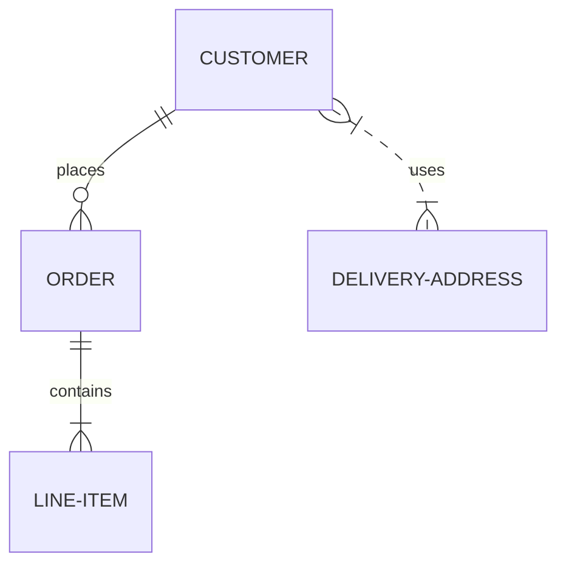
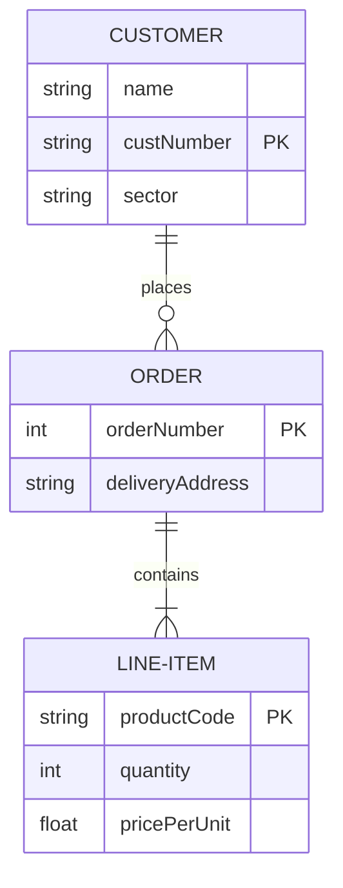
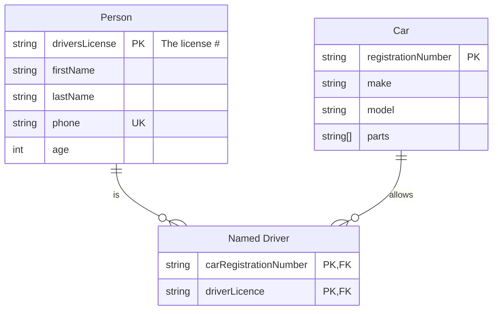
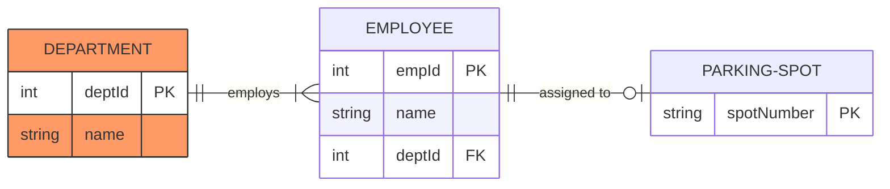
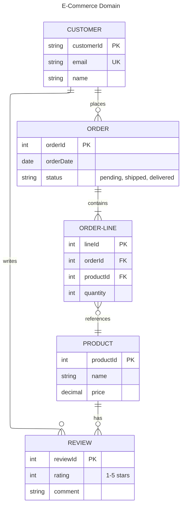

# Entity Relationship Diagram

## Declaration

Start the diagram with the `erDiagram` keyword. An optional title can be added via YAML frontmatter.

```
---
title: My ER Diagram
---
erDiagram
```

## Complete Syntax Reference

Each statement follows this pattern:

```
<first-entity> [<relationship> <second-entity> : <relationship-label>]
```

- `first-entity` -- required. The name of an entity. Supports unicode. Use double quotes for names with spaces (e.g., `"Customer Account"`).
- `relationship` -- how the two entities relate (cardinality + identification). See tables below.
- `second-entity` -- the other entity in the relationship.
- `relationship-label` -- describes the relationship from the first entity's perspective.

Only `first-entity` is mandatory. This allows declaring standalone entities with no relationships.

## Entity Definition

### Entity Names

- Conventionally UPPERCASE, but not required.
- Support unicode characters and Markdown formatting.
- Names with spaces must be wrapped in double quotes: `"Order Line Item"`.

### Entity Name Aliases

Use square brackets to display an alias instead of the internal entity name:

```
p[Person]
a["Customer Account"]
```

The internal name (`p`, `a`) is used in relationship declarations; the alias is displayed in the diagram.

### Attributes

Define attributes inside curly braces after the entity name:

```
ENTITY {
    <type> <name> [<key>] ["<comment>"]
}
```

| Component   | Required | Rules                                                                                      |
|-------------|----------|--------------------------------------------------------------------------------------------|
| `type`      | Yes      | Must start with alphabetic char. May contain digits, hyphens, underscores, `()`, `[]`.     |
| `name`      | Yes      | Same rules as type. May start with `*` to indicate primary key.                            |
| `key`       | No       | `PK`, `FK`, `UK`, or comma-separated combo (e.g., `PK, FK`).                              |
| `comment`   | No       | Double-quoted string at end of line. Cannot contain double quotes.                         |

There is no implicit set of valid data types -- use any type name you want.

### Attribute Examples

```
PERSON {
    string driversLicense PK "The license #"
    string(99) firstName "Max 99 chars"
    string lastName
    string phone UK
    int age
}
NAMED-DRIVER {
    string carReg PK, FK
    string driverLicence PK, FK
}
```

## Relationships

### Cardinality Markers

Relationships use crow's foot notation. Each side has two characters: the outer character is the maximum, the inner is the minimum.

| Left Marker | Right Marker | Meaning                       |
|:-----------:|:------------:|-------------------------------|
| `\|o`       | `o\|`        | Zero or one                   |
| `\|\|`      | `\|\|`       | Exactly one                   |
| `}o`        | `o{`         | Zero or more (no upper limit) |
| `}\|`       | `\|{`        | One or more (no upper limit)  |

### Cardinality Aliases (Word-Based Syntax)

| Alias          | Equivalent     |
|----------------|----------------|
| `one or zero`  | Zero or one    |
| `zero or one`  | Zero or one    |
| `one or more`  | One or more    |
| `one or many`  | One or more    |
| `many(1)`      | One or more    |
| `1+`           | One or more    |
| `zero or more` | Zero or more   |
| `zero or many` | Zero or more   |
| `many(0)`      | Zero or more   |
| `0+`           | Zero or more   |
| `only one`     | Exactly one    |
| `1`            | Exactly one    |

### Identification (Line Style)

| Symbol | Alias            | Line Style | Meaning           |
|:------:|------------------|------------|--------------------|
| `--`   | `to`             | Solid      | Identifying        |
| `..`   | `optionally to`  | Dashed     | Non-identifying    |

An **identifying** relationship means the child entity cannot exist without the parent. A **non-identifying** relationship means both entities can exist independently.

### Full Relationship Examples

```
CUSTOMER ||--o{ ORDER : places          (exactly one to zero or more, identifying)
PERSON }o..o{ CAR : "drives"            (zero or more to zero or more, non-identifying)
CAR 1 to zero or more NAMED-DRIVER : allows   (word-based alias syntax)
```

## Direction

Use `direction` to control diagram orientation:

| Value | Meaning         |
|-------|-----------------|
| `TB`  | Top to bottom   |
| `BT`  | Bottom to top   |
| `LR`  | Left to right   |
| `RL`  | Right to left   |

```
erDiagram
    direction LR
```

## Styling & Configuration

### Inline Styles

```
style entityName fill:#f9f,stroke:#333,stroke-width:4px
style entity1,entity2 fill:#bbf,stroke:#f66
```

### Class Definitions

```
classDef className fill:#f9f,stroke:#333,stroke-width:4px
classDef firstClass,secondClass font-size:12pt
class entityName className
class entity1,entity2 className1,className2
```

### Shorthand Class Syntax (`:::`)

Attach classes directly to entity declarations or relationship lines:

```
CAR:::myclass { ... }
PERSON:::foo ||--|| CAR : owns
PERSON o{--|| HOUSE:::bar : has
entityName:::class1,class2
```

### Default Class

A class named `default` applies to all entities without explicit class assignments:

```
classDef default fill:#f9f,stroke:#333,stroke-width:4px
```

Custom styles and other class statements override `default`.

### Layout Configuration

Use YAML frontmatter for layout engine (default is `dagre`; `elk` available for complex diagrams):

```yaml
---
config:
  layout: elk
---
```

## Practical Examples

### 1. Simple Relationships



### 2. Entities with Attributes



### 3. Keys, Comments, and Aliases



### 4. Styled Diagram with Direction



### 5. Complex Domain Model



## Common Gotchas

- **Relationship labels are required** when declaring a relationship. Omitting the `: label` part causes a parse error.
- **Multi-word labels** must be wrapped in double quotes: `: "is assigned to"`.
- **Entity names with spaces** must use double quotes: `"Order Line Item"`. When using aliases, the alias in brackets handles display names.
- **Attribute comments cannot contain double quotes** -- the parser uses them as delimiters.
- **Key constraints** (`PK`, `FK`, `UK`) do not support Markdown or unicode formatting.
- **No nested references directories** -- keep reference files one level deep.
- **The `:::` shorthand** for classes must appear directly adjacent to the entity name with no space before the colons.
