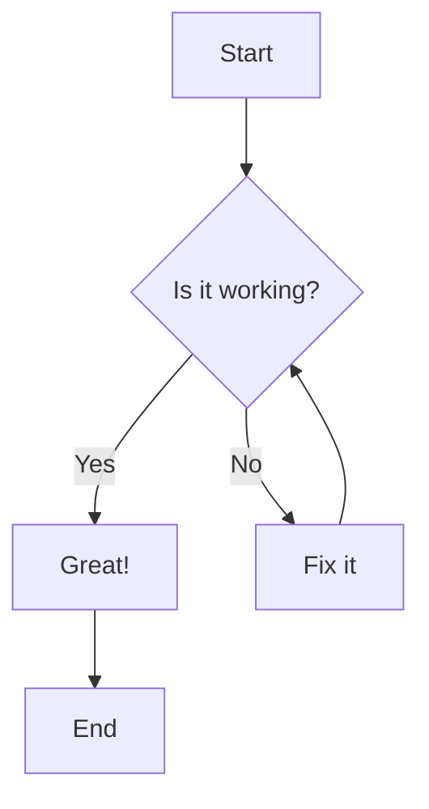
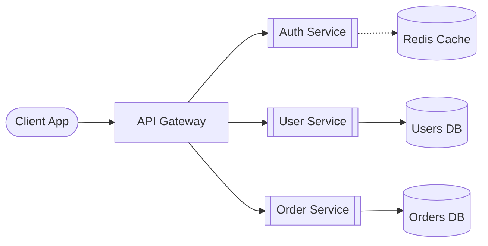
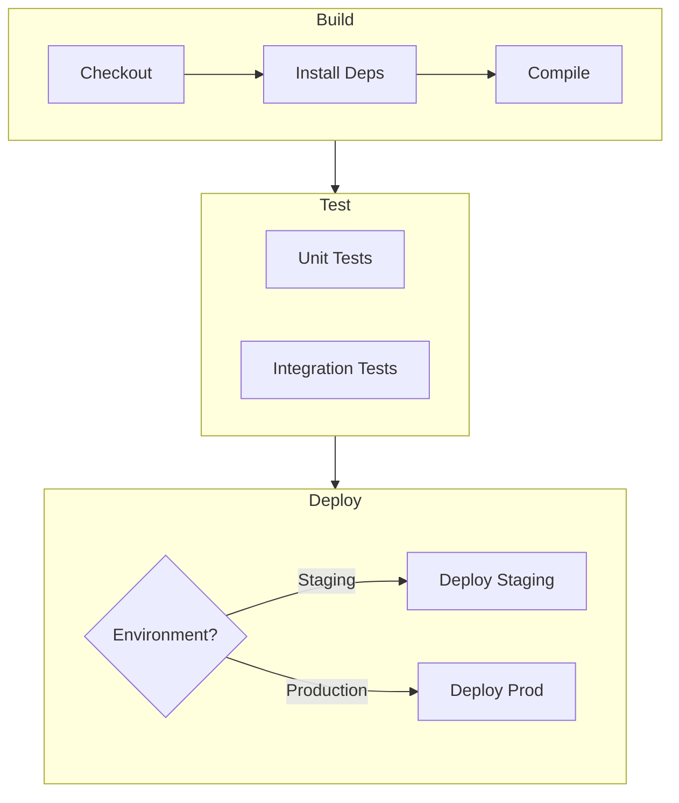
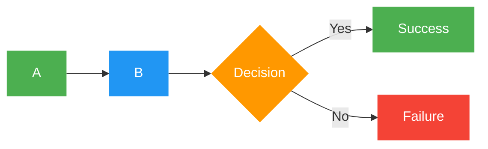
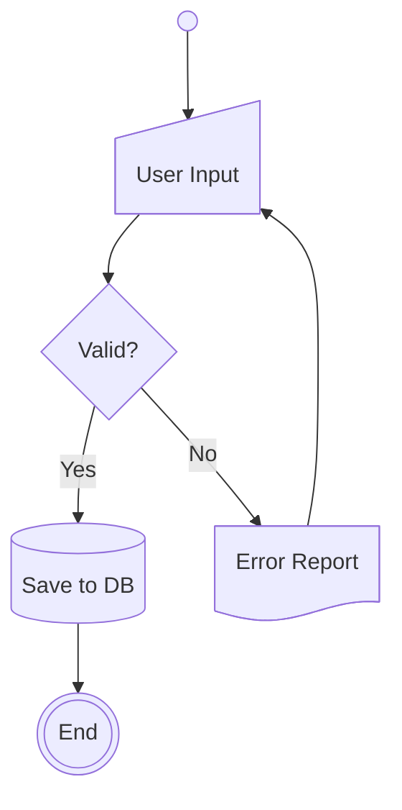

# Flowchart

## Declaration

Use `flowchart` (or `graph`) followed by a direction keyword.

```
flowchart LR
```

## Direction

| Keyword | Direction          |
|---------|--------------------|
| `TB`    | Top to bottom      |
| `TD`    | Top-down (same as TB) |
| `BT`    | Bottom to top      |
| `RL`    | Right to left      |
| `LR`    | Left to right      |

## Complete Syntax Reference

### Node Text

| Syntax | Description |
|--------|-------------|
| `id` | Node displays its id as text |
| `id[Text]` | Node with custom text |
| `id["Text with (special) chars"]` | Quoted text for special characters |
| `id["This ❤ Unicode"]` | Unicode text (use quotes) |
| `` id["`**Bold** _italic_`"] `` | Markdown formatting (double quotes + backticks) |

Entity codes escape characters: `#quot;` for `"`, `#9829;` for a heart, `#35;` for `#`. Numbers are base 10.

### Comments

Lines prefixed with `%%` are comments and ignored by the parser.

### Title

```
---
title: My Flowchart
---
flowchart LR
    A --> B
```

## Node Shapes

### Classic Shapes

| Syntax | Shape | Description |
|--------|-------|-------------|
| `id` or `id[text]` | Rectangle | Default node |
| `id(text)` | Rounded rectangle | Round edges |
| `id([text])` | Stadium | Pill shape |
| `id[[text]]` | Subroutine | Double vertical bars |
| `id[(text)]` | Cylinder | Database shape |
| `id((text))` | Circle | Round node |
| `id>text]` | Asymmetric | Flag/ribbon (right only) |
| `id{text}` | Rhombus | Diamond / decision |
| `id{{text}}` | Hexagon | Hex shape |
| `id[/text/]` | Parallelogram | Leaning right |
| `id[\text\]` | Parallelogram alt | Leaning left |
| `id[/text\]` | Trapezoid | Wide top |
| `id[\text/]` | Trapezoid alt | Wide bottom |
| `id(((text)))` | Double circle | Concentric circles |

### Extended Shapes (v11.3.0+)

Use the general syntax `A@{ shape: <name>, label: "text" }` for extended shapes.

| Shape Name | Short Name | Aliases | Description |
|------------|-----------|---------|-------------|
| Rectangle | `rect` | `proc`, `process`, `rectangle` | Standard process |
| Rounded Rectangle | `rounded` | `event` | Event |
| Stadium | `stadium` | `pill`, `terminal` | Terminal point |
| Framed Rectangle | `fr-rect` | `framed-rectangle`, `subproc`, `subprocess`, `subroutine` | Subprocess |
| Cylinder | `cyl` | `cylinder`, `database`, `db` | Database storage |
| Circle | `circle` | `circ` | Starting point |
| Small Circle | `sm-circ` | `small-circle`, `start` | Small starting point |
| Double Circle | `dbl-circ` | `double-circle` | Stop point |
| Framed Circle | `fr-circ` | `framed-circle`, `stop` | Stop point |
| Filled Circle | `f-circ` | `filled-circle`, `junction` | Junction point |
| Crossed Circle | `cross-circ` | `crossed-circle`, `summary` | Summary |
| Diamond | `diam` | `decision`, `diamond`, `question` | Decision step |
| Hexagon | `hex` | `hexagon`, `prepare` | Preparation / condition |
| Lean Right | `lean-r` | `in-out`, `lean-right` | Data input/output |
| Lean Left | `lean-l` | `lean-left`, `out-in` | Data output/input |
| Trapezoid Base Bottom | `trap-b` | `priority`, `trapezoid`, `trapezoid-bottom` | Priority action |
| Trapezoid Base Top | `trap-t` | `inv-trapezoid`, `manual`, `trapezoid-top` | Manual operation |
| Triangle | `tri` | `extract`, `triangle` | Extraction process |
| Flipped Triangle | `flip-tri` | `flipped-triangle`, `manual-file` | Manual file operation |
| Notched Rectangle | `notch-rect` | `card`, `notched-rectangle` | Card |
| Lined Rectangle | `lin-rect` | `lin-proc`, `lined-process`, `lined-rectangle`, `shaded-process` | Lined/shaded process |
| Divided Rectangle | `div-rect` | `div-proc`, `divided-process`, `divided-rectangle` | Divided process |
| Sloped Rectangle | `sl-rect` | `manual-input`, `sloped-rectangle` | Manual input |
| Filled Rectangle | `fork` | `join` | Fork/join bar |
| Stacked Rectangle | `st-rect` | `processes`, `procs`, `stacked-rectangle` | Multi-process |
| Tagged Rectangle | `tag-rect` | `tag-proc`, `tagged-process`, `tagged-rectangle` | Tagged process |
| Window Pane | `win-pane` | `internal-storage`, `window-pane` | Internal storage |
| Document | `doc` | `document` | Document |
| Lined Document | `lin-doc` | `lined-document` | Lined document |
| Stacked Document | `docs` | `documents`, `st-doc`, `stacked-document` | Multi-document |
| Tagged Document | `tag-doc` | `tagged-document` | Tagged document |
| Half-Rounded Rectangle | `delay` | `half-rounded-rectangle` | Delay |
| Horizontal Cylinder | `h-cyl` | `das`, `horizontal-cylinder` | Direct access storage |
| Lined Cylinder | `lin-cyl` | `disk`, `lined-cylinder` | Disk storage |
| Curved Trapezoid | `curv-trap` | `curved-trapezoid`, `display` | Display |
| Bow Tie Rectangle | `bow-rect` | `bow-tie-rectangle`, `stored-data` | Stored data |
| Trapezoidal Pentagon | `notch-pent` | `loop-limit`, `notched-pentagon` | Loop limit |
| Cloud | `cloud` | `cloud` | Cloud |
| Hourglass | `hourglass` | `collate`, `hourglass` | Collate operation |
| Lightning Bolt | `bolt` | `com-link`, `lightning-bolt` | Communication link |
| Curly Brace (left) | `brace` | `brace-l`, `comment` | Comment left |
| Curly Brace (right) | `brace-r` | | Comment right |
| Curly Braces (both) | `braces` | | Comment both sides |
| Flag | `flag` | `paper-tape` | Paper tape |
| Odd | `odd` | | Odd shape |
| Bang | `bang` | `bang` | Bang |
| Text Block | `text` | | Text block (no border) |

### Icon Shape

```
A@{ icon: "fa:user", form: "square", label: "User", pos: "t", h: 60 }
```

| Parameter | Description | Options |
|-----------|-------------|---------|
| `icon` | Icon name from registered pack | e.g. `fa:user` |
| `form` | Background shape (optional) | `square`, `circle`, `rounded` |
| `label` | Text label (optional) | Any string |
| `pos` | Label position (optional) | `t` (top), `b` (bottom, default) |
| `h` | Icon height (optional) | Number, min 48 (default) |

### Image Shape

```
A@{ img: "https://example.com/img.png", label: "Label", pos: "t", w: 60, h: 60, constraint: "off" }
```

| Parameter | Description | Options |
|-----------|-------------|---------|
| `img` | Image URL | Required |
| `label` | Text label (optional) | Any string |
| `pos` | Label position | `t` (top), `b` (bottom, default) |
| `w` | Width (optional) | Number |
| `h` | Height (optional) | Number |
| `constraint` | Maintain aspect ratio | `on`, `off` (default) |

## Connections / Links

### Link Types

| Syntax | Description |
|--------|-------------|
| `A --> B` | Arrow |
| `A --- B` | Open link (no arrow) |
| `A -.-> B` | Dotted with arrow |
| `A -.- B` | Dotted no arrow |
| `A ==> B` | Thick with arrow |
| `A === B` | Thick no arrow |
| `A ~~~ B` | Invisible link |
| `A --o B` | Circle end |
| `A --x B` | Cross end |

### Bidirectional Arrows

| Syntax | Description |
|--------|-------------|
| `A <--> B` | Bidirectional arrow |
| `A o--o B` | Bidirectional circle |
| `A x--x B` | Bidirectional cross |

### Text on Links

| Syntax | Description |
|--------|-------------|
| `A -->|text| B` | Arrow with text (pipe syntax) |
| `A -- text --> B` | Arrow with text (inline syntax) |
| `A ---|text| B` | Open link with text |
| `A -- text --- B` | Open link with text |
| `A -. text .-> B` | Dotted with text |
| `A == text ==> B` | Thick with text |

### Link Length

Add extra dashes/dots/equals to make links span more ranks.

| Length | 1 (default) | 2 | 3 |
|--------|:-----------:|:---:|:---:|
| Normal | `---` | `----` | `-----` |
| Normal with arrow | `-->` | `--->` | `---->` |
| Thick | `===` | `====` | `=====` |
| Thick with arrow | `==>` | `===>` | `====>` |
| Dotted | `-.-` | `-..-` | `-...-` |
| Dotted with arrow | `-.->` | `-..->` | `-...->` |

### Chaining Links

```
A -- text --> B -- text2 --> C
a --> b & c --> d
A & B --> C & D
```

### Edge IDs and Animation

Assign an ID to an edge with `id@` before the arrow:

```
A e1@--> B
```

Configure animation on named edges:

```
e1@{ animate: true }
e1@{ animation: fast }
e1@{ animation: slow }
```

### Edge-Level Curve Style (v11.10.0+)

```
A e1@==> B
e1@{ curve: linear }
```

Available curves: `basis`, `bumpX`, `bumpY`, `cardinal`, `catmullRom`, `linear`, `monotoneX`, `monotoneY`, `natural`, `step`, `stepAfter`, `stepBefore`.

## Styling & Customization

### Inline Style on Nodes

```
style id1 fill:#f9f,stroke:#333,stroke-width:4px
style id2 fill:#bbf,stroke:#f66,stroke-width:2px,color:#fff,stroke-dasharray: 5 5
```

### classDef / class

Define and apply style classes:

```
classDef className fill:#f9f,stroke:#333,stroke-width:4px;
classDef first,second font-size:12pt;
class nodeId1 className;
class nodeId1,nodeId2 className;
```

Shorthand with `:::` operator:

```
A:::someclass --> B
classDef someclass fill:#f96
```

The `default` class applies to all nodes without a specific class:

```
classDef default fill:#f9f,stroke:#333,stroke-width:4px;
```

### Styling Links

Style links by their zero-based order index:

```
linkStyle 3 stroke:#ff3,stroke-width:4px,color:red;
linkStyle 1,2,7 color:blue;
```

### Diagram-Level Curve Style

```
---
config:
  flowchart:
    curve: stepBefore
---
flowchart LR
```

### FontAwesome Icons

```
B["fa:fa-twitter for peace"]
B-->C[fa:fa-ban forbidden]
```

Supported prefixes: `fa`, `fab`, `fas`, `far`, `fal`, `fad`, `fak` (custom).

## Subgraphs

```
subgraph title
    graph definition
end
```

With explicit ID:

```
subgraph id1 [Display Title]
    graph definition
end
```

### Direction in Subgraphs

Each subgraph can have its own direction:

```
subgraph TOP
    direction TB
    subgraph B1
        direction RL
        i1 --> f1
    end
end
```

**Limitation**: If any subgraph node links to the outside, the subgraph direction is overridden by the parent graph direction.

### Edges Between Subgraphs

```
one --> two
three --> two
```

## Interaction & Click Events

Requires `securityLevel='loose'`.

```
click nodeId callback "Tooltip"
click nodeId call callback() "Tooltip"
click nodeId "https://www.github.com" "Tooltip"
click nodeId href "https://www.github.com" "Tooltip"
click nodeId href "https://www.github.com" "Tooltip" _blank
```

Link targets: `_self`, `_blank`, `_parent`, `_top`.

## Configuration

### Renderer

```
---
config:
  flowchart:
    defaultRenderer: "elk"
---
```

Options: `dagre` (default), `elk` (better for large diagrams, v9.4+).

### Markdown Auto-Wrap

```
---
config:
  markdownAutoWrap: false
---
```

## Practical Examples

### Simple Decision Flow



### Microservices Architecture



### CI/CD Pipeline with Subgraphs



### Styled Flowchart



### Extended Shapes Example



## Common Gotchas

- **The word "end" in lowercase** breaks the diagram. Capitalize it: `End`, `END`, or wrap in brackets/quotes: `[end]`, `{end}`, `"end"`.
- **"o" or "x" as the first letter** of a connecting node creates circle/cross edges. `A---oB` becomes a circle edge. Add a space: `A--- oB`, or capitalize: `A---OB`.
- **Semicolons are optional** at the end of statements (since v0.2.16).
- **No space** between a vertex and its text or a link and its text.
- **Subgraph direction is ignored** if any internal node links directly to an external node.
- **Escaping commas in `stroke-dasharray`**: Use `\,` since commas delimit properties in style definitions.
- **`elk` renderer** requires mermaid v9.4+ and explicit opt-in.
