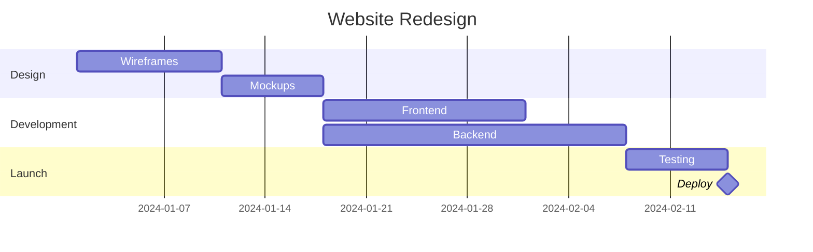
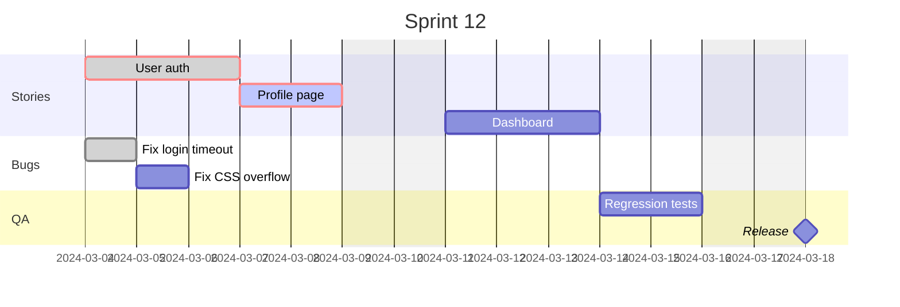
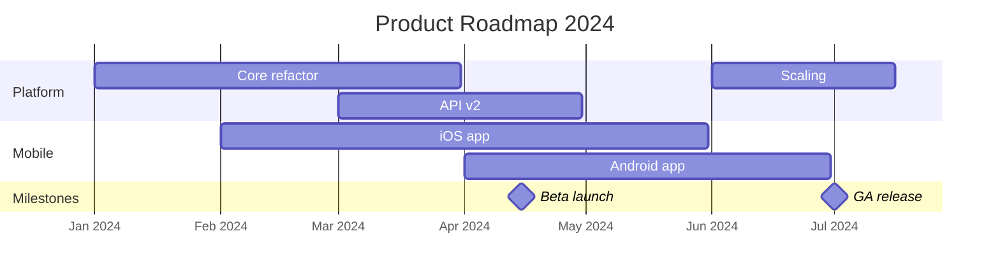

# Gantt Diagram

## Declaration

Start the diagram with the `gantt` keyword. Optional YAML frontmatter can set title, display mode, and configuration.

```
gantt
```

Or with frontmatter:

```yaml
---
displayMode: compact
config:
  gantt:
    topAxis: true
---
gantt
```

## Complete Syntax Reference

### Top-Level Directives

These directives appear at the top of the diagram body (after `gantt`), before any sections or tasks.

| Directive      | Required | Description                                                                 | Default      |
|----------------|----------|-----------------------------------------------------------------------------|--------------|
| `title`        | No       | Chart title displayed at top                                                | none         |
| `dateFormat`   | No       | Input date format for task dates                                            | `YYYY-MM-DD` |
| `axisFormat`   | No       | Output date format on the x-axis                                            | `YYYY-MM-DD` |
| `tickInterval` | No       | Interval between axis ticks (e.g., `1day`, `1week`, `1month`)              | auto         |
| `weekday`      | No       | Start day for week-based ticks (`monday`, `sunday`, etc.)                   | `sunday`     |
| `excludes`     | No       | Dates to exclude from duration calculations                                 | none         |
| `weekend`      | No       | Weekend start day when excluding weekends: `friday` or `saturday` (v11.0+)  | `saturday`   |
| `todayMarker`  | No       | Style string for today line, or `off` to hide                               | default      |

### Comments

Lines starting with `%%` are comments and ignored by the parser.

```
%% This is a comment
```

## Task Definition

### Task Syntax

```
Task name : [tags,] [taskID,] <start>, <end/duration>
```

A colon `:` separates the task title from its metadata. Metadata items are comma-separated.

### Task Tags

Tags are optional but must appear first in the metadata if used.

| Tag         | Effect                                             |
|-------------|-----------------------------------------------------|
| `done`      | Marks task as completed (visual styling)            |
| `active`    | Marks task as in-progress (visual styling)          |
| `crit`      | Marks task as critical (highlighted styling)        |
| `milestone` | Renders as a diamond instead of a bar               |
| `vert`      | Renders a vertical marker line across the chart     |

Tags can be combined: `crit, done` or `crit, active`.

### Task Metadata Patterns

| Metadata Pattern                                       | Start Date                          | End Date                              | ID       |
|--------------------------------------------------------|-------------------------------------|---------------------------------------|----------|
| `<taskID>, <startDate>, <endDate>`                     | Parsed via `dateFormat`             | Parsed via `dateFormat`               | taskID   |
| `<taskID>, <startDate>, <length>`                      | Parsed via `dateFormat`             | Start + length                        | taskID   |
| `<taskID>, after <otherID>, <endDate>`                 | End of referenced task              | Parsed via `dateFormat`               | taskID   |
| `<taskID>, after <otherID>, <length>`                  | End of referenced task              | Start + length                        | taskID   |
| `<taskID>, <startDate>, until <otherID>`               | Parsed via `dateFormat`             | Start of referenced task              | taskID   |
| `<taskID>, after <otherID>, until <otherID>`           | End of referenced task              | Start of referenced task              | taskID   |
| `<startDate>, <endDate>`                               | Parsed via `dateFormat`             | Parsed via `dateFormat`               | n/a      |
| `<startDate>, <length>`                                | Parsed via `dateFormat`             | Start + length                        | n/a      |
| `after <otherID>, <endDate>`                           | End of referenced task              | Parsed via `dateFormat`               | n/a      |
| `after <otherID>, <length>`                            | End of referenced task              | Start + length                        | n/a      |
| `<startDate>, until <otherID>`                         | Parsed via `dateFormat`             | Start of referenced task              | n/a      |
| `after <otherID>, until <otherID>`                     | End of referenced task              | Start of referenced task              | n/a      |
| `<endDate>`                                            | End of preceding task               | Parsed via `dateFormat`               | n/a      |
| `<length>`                                             | End of preceding task               | Start + length                        | n/a      |
| `until <otherID>`                                      | End of preceding task               | Start of referenced task              | n/a      |

Tasks are sequential by default -- a task's start date defaults to the end date of the preceding task.

The `after` keyword can reference multiple tasks: `after taskA taskB taskC`. The start date will be the latest end date among all referenced tasks.

The `until` keyword (v10.9.0+) defines a task that runs until another task or milestone starts.

### Duration Units

| Unit | Example |
|------|---------|
| `d`  | `5d`    |
| `h`  | `24h`   |
| `m`  | `10m`   |
| `w`  | `1w`    |
| `s`  | `1s`    |

### Milestones

Milestones render as diamond shapes. Position is calculated as: `start_date + duration / 2`.

```
Release : milestone, m1, 2024-03-01, 0d
```

### Vertical Markers

Vertical markers (`vert`) draw a line across the entire chart without occupying a row.

```
Deadline : vert, v1, 2024-06-15, 0d
```

## Sections / Grouping

Use `section` to group tasks visually. The section name is required.

```
section Development
    Design : des1, 2024-01-01, 10d
    Coding : after des1, 20d
section Testing
    QA : after des1, 15d
```

## Date Formats

### Input Date Format (`dateFormat`)

| Token      | Example        | Description                                            |
|------------|----------------|--------------------------------------------------------|
| `YYYY`     | 2024           | 4-digit year                                           |
| `YY`       | 24             | 2-digit year                                           |
| `Q`        | 1..4           | Quarter of year                                        |
| `M` `MM`   | 1..12          | Month number                                           |
| `MMM` `MMMM` | Jan..December | Month name                                           |
| `D` `DD`   | 1..31          | Day of month                                           |
| `Do`       | 1st..31st      | Day of month with ordinal                              |
| `DDD` `DDDD` | 1..365       | Day of year                                            |
| `X`        | 1410715640.579 | Unix timestamp (seconds)                               |
| `x`        | 1410715640579  | Unix timestamp (milliseconds)                          |
| `H` `HH`  | 0..23          | 24-hour time                                           |
| `h` `hh`   | 1..12          | 12-hour time (use with `a`/`A`)                        |
| `a` `A`    | am/pm          | Meridiem                                               |
| `m` `mm`   | 0..59          | Minutes                                                |
| `s` `ss`   | 0..59          | Seconds                                                |
| `S`        | 0..9           | Tenths of a second                                     |
| `SS`       | 0..99          | Hundredths of a second                                 |
| `SSS`      | 0..999         | Thousandths of a second                                |
| `Z` `ZZ`   | +12:00         | UTC offset                                             |

### Output Axis Format (`axisFormat`)

Uses d3-time-format specifiers:

| Specifier | Description                                         |
|-----------|------------------------------------------------------|
| `%a`      | Abbreviated weekday (Sun, Mon)                       |
| `%A`      | Full weekday (Sunday, Monday)                        |
| `%b`      | Abbreviated month (Jan, Feb)                         |
| `%B`      | Full month (January, February)                       |
| `%c`      | Date and time (`%a %b %e %H:%M:%S %Y`)              |
| `%d`      | Zero-padded day of month [01,31]                     |
| `%e`      | Space-padded day of month [ 1,31]                    |
| `%H`      | Hour 24h [00,23]                                     |
| `%I`      | Hour 12h [01,12]                                     |
| `%j`      | Day of year [001,366]                                |
| `%m`      | Month number [01,12]                                 |
| `%M`      | Minute [00,59]                                       |
| `%L`      | Milliseconds [000,999]                               |
| `%p`      | AM or PM                                             |
| `%S`      | Second [00,61]                                       |
| `%U`      | Week number (Sunday start) [00,53]                   |
| `%w`      | Weekday number [0=Sunday,6]                          |
| `%W`      | Week number (Monday start) [00,53]                   |
| `%x`      | Date (`%m/%d/%Y`)                                    |
| `%X`      | Time (`%H:%M:%S`)                                    |
| `%y`      | 2-digit year [00,99]                                 |
| `%Y`      | 4-digit year                                         |
| `%Z`      | Time zone offset (e.g., `-0700`)                     |
| `%%`      | Literal `%`                                          |

### Axis Ticks (`tickInterval`)

Pattern: `<number><unit>` where unit is `millisecond`, `second`, `minute`, `hour`, `day`, `week`, or `month`.

```
tickInterval 1day
tickInterval 1week
tickInterval 2month
```

## Excludes

Exclude dates from duration calculations. Excluded days extend task bars accordingly.

```
excludes weekends
excludes 2024-12-25, 2024-12-31
excludes weekends, 2024-12-25
excludes sunday
```

Accepted values: specific dates in `YYYY-MM-DD`, day names (`sunday`, `monday`, etc.), or `weekends`. The keyword `weekdays` is NOT supported.

### Weekend Configuration (v11.0+)

When using `excludes weekends`, configure which days count as the weekend:

```
weekend friday   (Friday + Saturday)
weekend saturday (Saturday + Sunday, default)
```

## Styling & Configuration

### Today Marker

```
todayMarker stroke-width:5px,stroke:#0f0,opacity:0.5
todayMarker off
```

### CSS Classes

| Class                   | Description                                    |
|-------------------------|------------------------------------------------|
| `grid.tick`             | Grid line styling                              |
| `grid.path`             | Grid border styling                            |
| `.taskText`             | Task label text                                |
| `.taskTextOutsideRight` | Task text overflowing to the right              |
| `.taskTextOutsideLeft`  | Task text overflowing to the left               |
| `todayMarker`           | Today marker line                              |

### Configuration Parameters (via frontmatter or JS)

| Parameter             | Description                                      | Default     |
|-----------------------|--------------------------------------------------|-------------|
| `titleTopMargin`      | Margin above the title                           | `25`        |
| `barHeight`           | Height of task bars                              | `20`        |
| `barGap`              | Gap between task bars                            | `4`         |
| `topPadding`          | Padding above the chart                          | `75`        |
| `rightPadding`        | Space for section names on right                 | `75`        |
| `leftPadding`         | Space for section names on left                  | `75`        |
| `gridLineStartPadding`| Vertical start of grid lines                     | `10`        |
| `fontSize`            | Font size for tasks                              | `12`        |
| `sectionFontSize`     | Font size for sections                           | `24`        |
| `numberSectionStyles` | Number of alternating section styles             | `1`         |
| `axisFormat`          | Default axis date format                         | `%d/%m`     |
| `tickInterval`        | Default tick interval                            | `1week`     |
| `topAxis`             | Show date labels at top of chart                 | `true`      |
| `displayMode`         | `compact` to show multiple tasks per row         | n/a         |
| `weekday`             | Start day for week-based intervals               | `sunday`    |

### Compact Display Mode

Set via frontmatter to allow overlapping tasks to share rows:

```yaml
---
displayMode: compact
---
```

### Interaction (Click Events)

Requires `securityLevel: 'loose'`.

```
click taskId href "https://example.com"
click taskId call callbackFunction("arg1", "arg2")
```

## Practical Examples

### 1. Simple Project Schedule



### 2. Sprint with Exclusions and Critical Path



### 3. Time-Based Schedule (Hours/Minutes)

```mermaid
gantt
    title Deployment Runbook
    dateFormat HH:mm
    axisFormat %H:%M
    section Pre-Deploy
        Notify team       :n1, 09:00, 15m
        Backup database   :n2, after n1, 30m
    section Deploy
        Stop services     :d1, after n2, 5m
        Run migrations    :crit, d2, after d1, 20m
        Start services    :d3, after d2, 5m
    section Post-Deploy
        Smoke tests       :p1, after d3, 15m
        Monitor           :p2, after p1, 60m
```



### 4. Compact Mode with Milestones and Vertical Markers



### 5. Bar Chart Using Gantt (Non-Time Use Case)

```mermaid
gantt
    title Survey Results
    dateFormat X
    axisFormat %s
    section Very Satisfied
        89 :0, 89
    section Satisfied
        64 :0, 64
    section Neutral
        32 :0, 32
    section Dissatisfied
        11 :0, 11
```



## Common Gotchas

- **`excludes weekdays` does not work** -- only `weekends`, specific day names, and specific dates are supported.
- **Excluded days extend task bars** -- they do not create gaps. The bar shifts right to maintain the specified duration.
- **Task IDs must be unique** across the entire diagram, not just within a section.
- **The `after` keyword** references task IDs, not task names. If a task has no ID, it cannot be referenced.
- **`until` requires v10.9.0+** -- it will silently fail on older versions.
- **`tickInterval` does not support `year` or `decade`** -- unsupported units are silently ignored.
- **Section names are required** -- `section` without a name causes a parse error.
- **Milestone position** is calculated as `start_date + duration / 2`, so use `0d` duration for exact placement.
- **Compact mode** is set via YAML frontmatter (`displayMode: compact`), not as a directive inside the `gantt` block.
- **Click events** require `securityLevel: 'loose'` -- they are disabled in strict mode.
