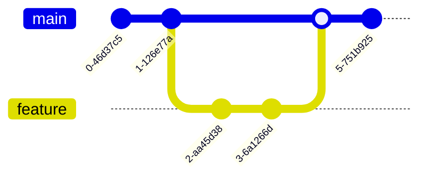
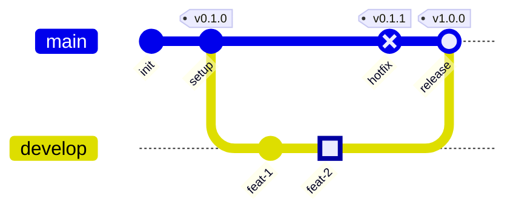
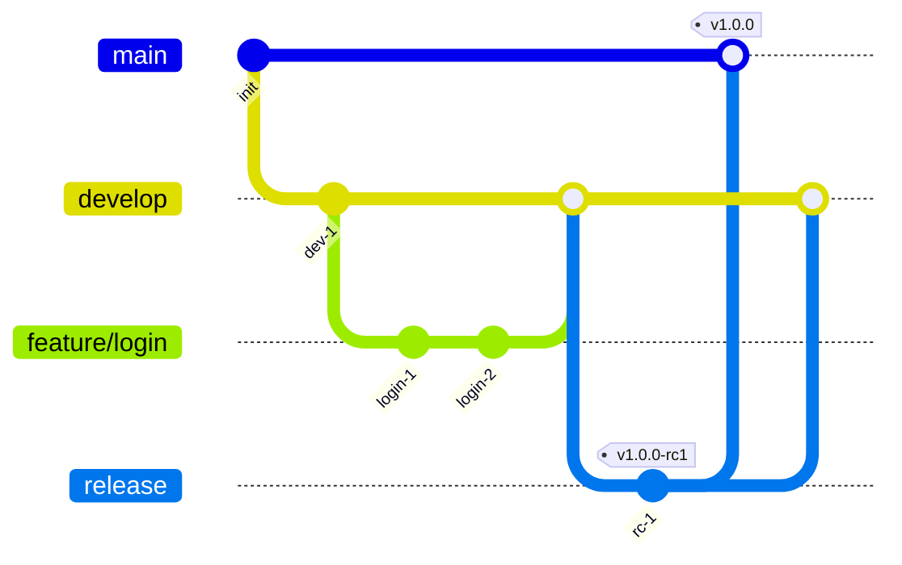
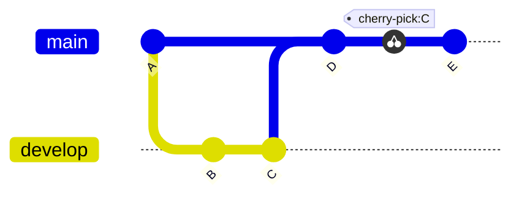
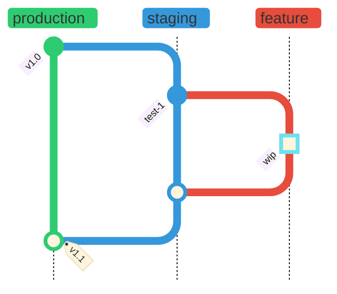

# GitGraph Diagrams

## Declaration

Start with the `gitGraph` keyword, optionally preceded by a YAML frontmatter block for title/config and optionally followed by an orientation modifier.

```
gitGraph
gitGraph LR:
gitGraph TB:
gitGraph BT:
```

## Complete Syntax Reference

### Commands

| Command | Syntax | Description |
|---------|--------|-------------|
| `commit` | `commit [id: "id"] [type: TYPE] [tag: "tag"]` | Create a commit on the current branch |
| `branch` | `branch <name> [order: N]` | Create a new branch and switch to it |
| `checkout` | `checkout <name>` | Switch to an existing branch |
| `switch` | `switch <name>` | Alias for `checkout` |
| `merge` | `merge <name> [id: "id"] [tag: "tag"] [type: TYPE]` | Merge a branch into the current branch |
| `cherry-pick` | `cherry-pick id: "id" [parent: "id"]` | Cherry-pick a commit from another branch |

### Commit Attributes

| Attribute | Syntax | Description |
|-----------|--------|-------------|
| `id` | `id: "value"` | Custom commit identifier (quoted string) |
| `type` | `type: NORMAL\|REVERSE\|HIGHLIGHT` | Visual style of the commit |
| `tag` | `tag: "value"` | Tag label attached to the commit (quoted string) |

### Commit Types

| Type | Visual | Description |
|------|--------|-------------|
| `NORMAL` | Solid circle | Default commit appearance |
| `REVERSE` | Crossed circle | Emphasizes a revert commit |
| `HIGHLIGHT` | Filled rectangle | Highlights a notable commit |

### Orientation (v10.3.0+)

| Modifier | Direction | Description |
|----------|-----------|-------------|
| `LR:` | Left-to-Right | Default. Commits flow left to right, branches stack vertically |
| `TB:` | Top-to-Bottom | Commits flow top to bottom, branches arranged side by side |
| `BT:` | Bottom-to-Top | Commits flow bottom to top, branches arranged side by side (v11.0.0+) |

### Branch Ordering

Use `order: N` after a branch name to control vertical position. Lower numbers appear first.

```
branch feature order: 2
```

Branches without `order` are drawn in definition order, followed by branches with `order` sorted numerically.

### Cherry-Pick Rules

1. The `id` must reference an existing commit on a **different** branch.
2. The current branch must have at least one commit before cherry-picking.
3. When cherry-picking a **merge commit**, the `parent` attribute is mandatory and must reference an immediate parent of that merge commit.

## Styling & Configuration

### Directive Options

Set these under `config.gitGraph` in a YAML frontmatter block.

| Option | Type | Default | Description |
|--------|------|---------|-------------|
| `showBranches` | Boolean | `true` | Show/hide branch names and lines |
| `showCommitLabel` | Boolean | `true` | Show/hide commit ID labels |
| `rotateCommitLabel` | Boolean | `true` | Rotate labels 45 degrees (`true`) or horizontal (`false`) |
| `mainBranchName` | String | `"main"` | Name of the default root branch |
| `mainBranchOrder` | Number | `0` | Position of main branch in branch ordering |
| `parallelCommits` | Boolean | `false` | Align same-depth commits at the same level (v10.8.0+) |

### Themes

Available themes: `base`, `forest`, `dark`, `default`, `neutral`.

```yaml
---
config:
  theme: 'forest'
  gitGraph:
    showBranches: true
---
```

### Theme Variables

| Variable | Description |
|----------|-------------|
| `git0` to `git7` | Branch line and commit colors (cycles after 8) |
| `gitBranchLabel0` to `gitBranchLabel7` | Branch label text colors |
| `gitInv0` to `gitInv7` | Highlight commit fill colors per branch |
| `commitLabelColor` | Commit label text color |
| `commitLabelBackground` | Commit label background color |
| `commitLabelFontSize` | Commit label font size (e.g., `'16px'`) |
| `tagLabelColor` | Tag label text color |
| `tagLabelBackground` | Tag label background color |
| `tagLabelBorder` | Tag label border color |
| `tagLabelFontSize` | Tag label font size (e.g., `'16px'`) |

## Practical Examples

### 1. Simple Feature Branch



### 2. Commits with IDs, Tags, and Types



### 3. Git Flow with Multiple Branches



### 4. Cherry-Pick Across Branches



### 5. Top-to-Bottom with Custom Theme



## Common Gotchas

- **Branch names that match keywords** (e.g., `cherry-pick`, `commit`) must be quoted: `branch "cherry-pick"`.
- **You cannot merge a branch into itself.** The merge source must be a different branch from the current one.
- **Cherry-pick requires `id`** -- you must use `commit id: "X"` on the source commit first, then `cherry-pick id: "X"` on the target branch.
- **Cherry-picking a merge commit** requires the `parent` attribute specifying which parent to follow.
- **Branch colors cycle after 8.** The 9th branch reuses the 1st branch's color scheme.
- **`checkout` and `switch` are interchangeable** -- both switch the current branch.
- **The `order` keyword on branches** only controls visual stacking, not commit timeline.
- **`parallelCommits: true`** removes temporal spacing, aligning commits purely by depth from parent.
- **Orientation colon is required** -- use `gitGraph TB:` not `gitGraph TB`.
