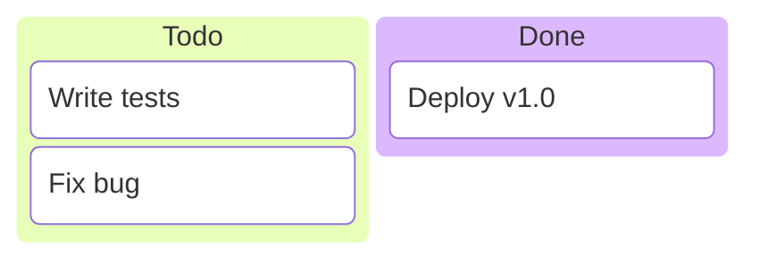
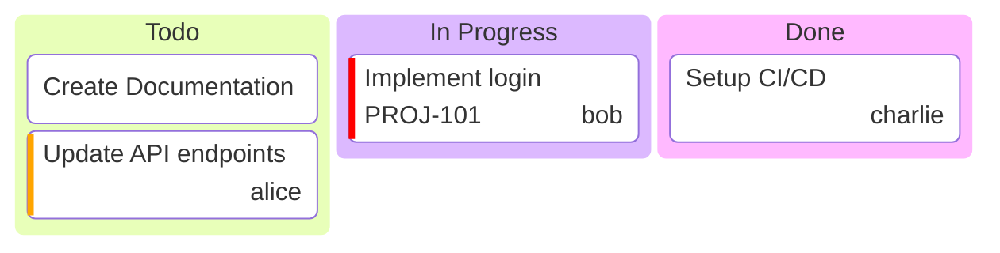
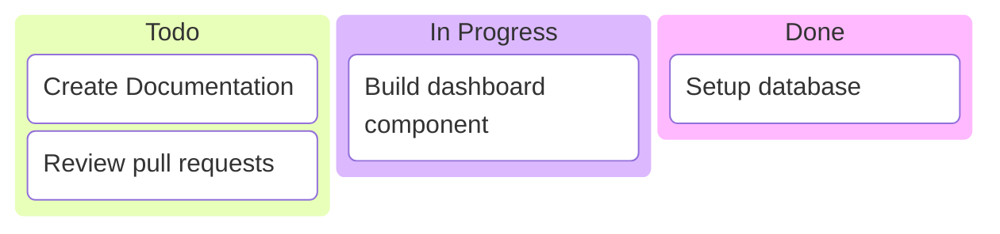
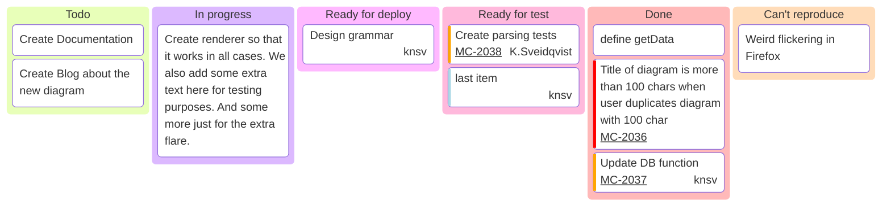
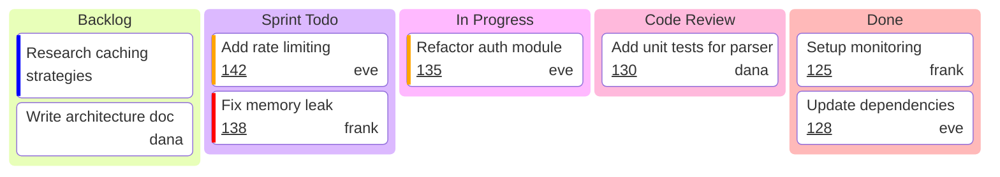

# Kanban Diagram

## Declaration

The diagram begins with the `kanban` keyword, followed by column and task definitions using indentation.

```
kanban
  columnId[Column Title]
    taskId[Task Description]
```

## Complete Syntax Reference

### Columns

Columns represent workflow stages (e.g., "Todo", "In Progress", "Done").

| Syntax | Description |
|--------|-------------|
| `columnId[Column Title]` | Column with explicit ID and title |
| `[Column Title]` | Column with auto-generated ID (title only) |
| `ColumnTitle` | Column using the identifier as both ID and title (no spaces allowed) |

- Column identifiers must be unique within the diagram.
- Column titles are enclosed in square brackets.
- Columns are defined at the root indentation level (no indent or one level of indent).

### Tasks

Tasks are listed under their parent column with additional indentation.

| Syntax | Description |
|--------|-------------|
| `taskId[Task Description]` | Task with explicit ID and description |
| `[Task Description]` | Task with auto-generated ID (description only) |

- Task identifiers should be unique within the diagram.
- Task descriptions are enclosed in square brackets.
- Tasks must be indented under their parent column.

### Task Metadata

Metadata is appended to a task using the `@{ ... }` syntax with key-value pairs.

```
taskId[Task Description]@{ key: value, key2: 'value2' }
```

| Metadata Key | Type | Description | Allowed Values |
|-------------|------|-------------|----------------|
| `assigned` | String | Person responsible for the task | Any string (e.g., `'knsv'`, `'K.Sveidqvist'`) |
| `ticket` | String | Ticket or issue reference number | Any string (e.g., `'MC-2037'`) |
| `priority` | String | Task priority level | `'Very High'`, `'High'`, `'Low'`, `'Very Low'` |

- Values containing spaces must be wrapped in single quotes.
- Multiple metadata keys are separated by commas.
- Metadata is rendered as part of the task card.

### Indentation Rules

Indentation is critical and defines the hierarchy:

```
kanban
  column1[Title]          <-- Column level (indented under kanban)
    task1[Description]    <-- Task level (indented under column)
  column2[Title]          <-- Another column
    task2[Description]    <-- Task under column2
```

| Level | Indentation | Element |
|-------|-------------|---------|
| 0 | None / base | `kanban` keyword |
| 1 | 1 level | Column definitions |
| 2 | 2 levels | Task definitions |

### Comments

```
%% This is a comment
```

## Styling & Configuration

### Configuration via Frontmatter

```yaml
---
config:
  kanban:
    ticketBaseUrl: 'https://yourproject.atlassian.net/browse/#TICKET#'
---
```

### Configuration Parameters

| Parameter | Type | Description |
|-----------|------|-------------|
| `ticketBaseUrl` | String | Base URL for external ticket links. The placeholder `#TICKET#` is replaced with the task's `ticket` metadata value. |

When `ticketBaseUrl` is set and a task has a `ticket` metadata value, the ticket number in the rendered diagram becomes a clickable link to the external system.

**URL template example:**

| Template | Ticket Value | Resulting URL |
|----------|-------------|---------------|
| `https://jira.example.com/browse/#TICKET#` | `MC-2037` | `https://jira.example.com/browse/MC-2037` |
| `https://github.com/org/repo/issues/#TICKET#` | `42` | `https://github.com/org/repo/issues/42` |

## Practical Examples

### Example 1 -- Minimal Kanban Board



### Example 2 -- Board with Metadata



### Example 3 -- Auto-ID Columns and Tasks



### Example 4 -- Full Board with Ticket Links



### Example 5 -- Sprint Board



## Common Gotchas

| Issue | Cause | Fix |
|-------|-------|-----|
| Tasks appear as columns | Incorrect indentation | Tasks must be indented one level deeper than their parent column |
| Diagram won't render | Missing `kanban` keyword | Ensure the diagram starts with `kanban` on the first line |
| Ticket links not working | `ticketBaseUrl` not set or missing `#TICKET#` placeholder | Set `ticketBaseUrl` in frontmatter config with `#TICKET#` in the URL |
| Metadata not rendering | Incorrect `@{}` syntax | Use `@{ key: 'value' }` with proper comma separation |
| Priority not recognized | Invalid priority string | Use exactly: `'Very High'`, `'High'`, `'Low'`, or `'Very Low'` |
| Column title with spaces breaks | Using spaces without brackets | Wrap column titles in square brackets: `[In Progress]` |
| Duplicate IDs cause merge | Same ID used for different tasks/columns | Ensure all identifiers are unique across the diagram |
| Metadata values with spaces | Unquoted multi-word values | Wrap values in single quotes: `assigned: 'John Doe'` |
