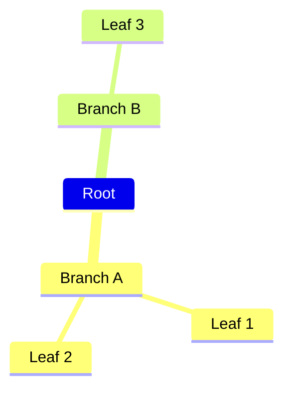
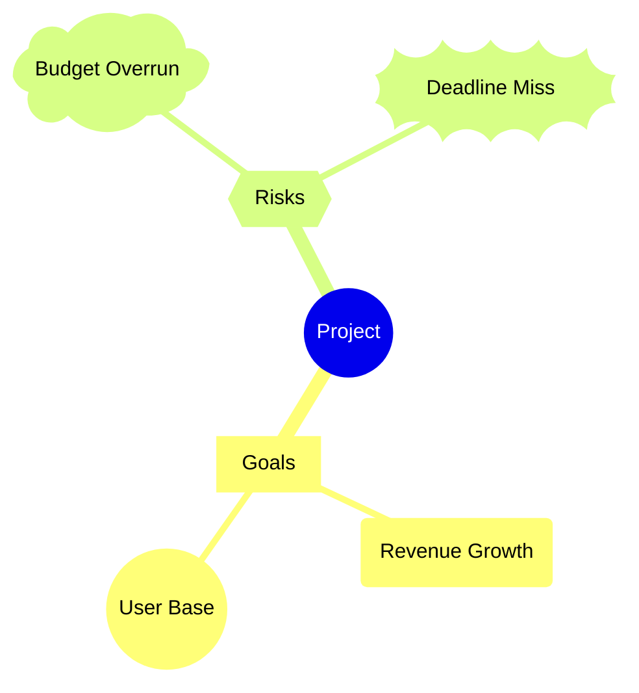
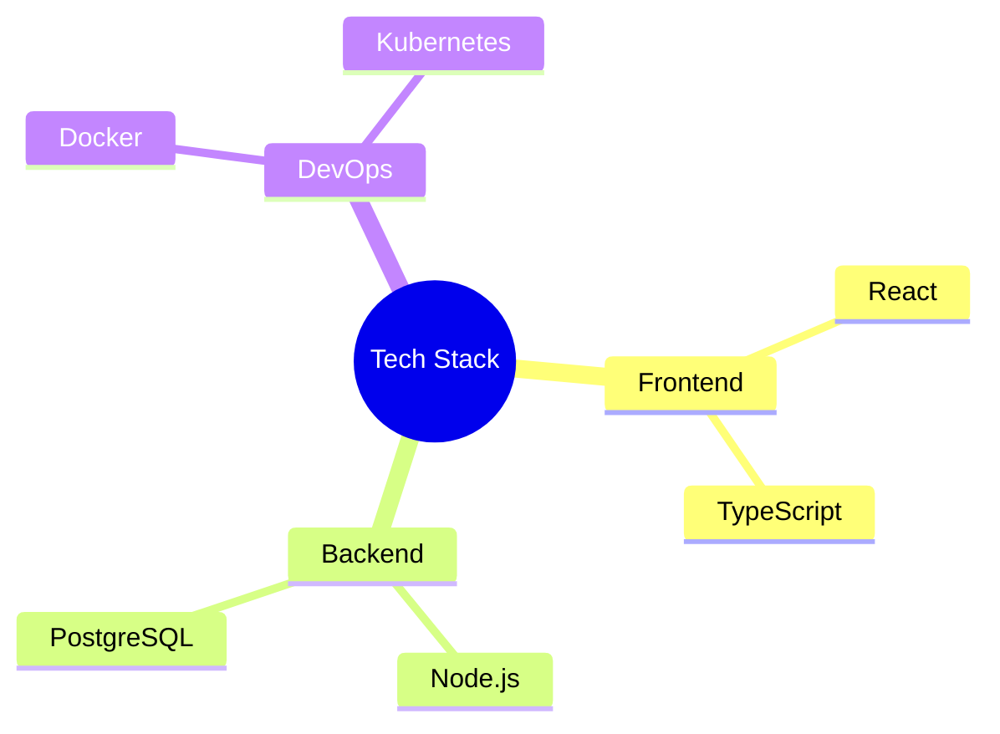
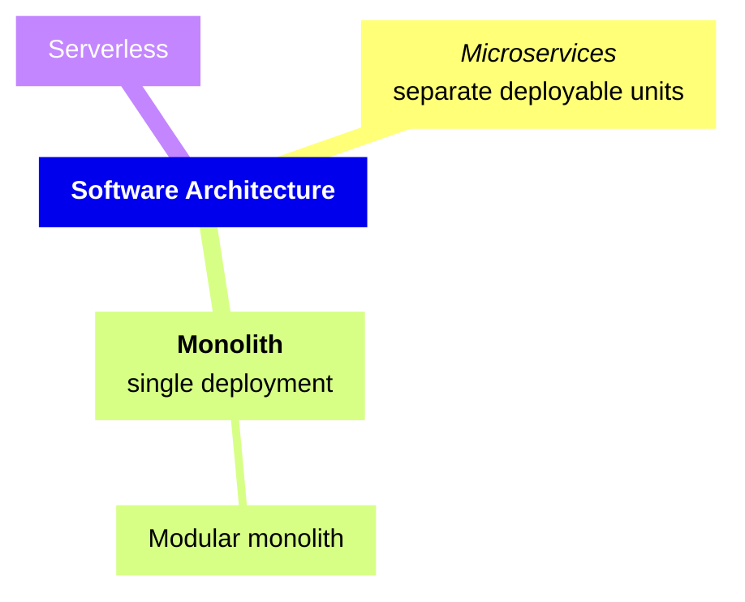
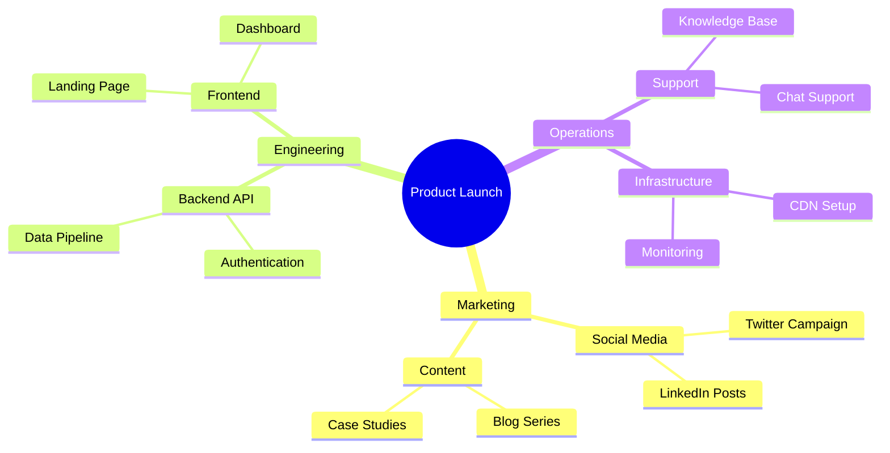

# Mindmap

## Declaration

Start with the `mindmap` keyword. The hierarchy is defined entirely by indentation (spaces or tabs). Each indented line becomes a child of the nearest less-indented line above it.

```
mindmap
  Root
    Child A
      Grandchild
    Child B
```

## Complete Syntax Reference

### Structure

The mindmap is a text outline. Indentation determines parent-child relationships.

| Concept | Rule |
|---------|------|
| Root node | First node after `mindmap` keyword |
| Child nodes | Indented further than their parent |
| Sibling nodes | Same indentation level under the same parent |
| Depth | Unlimited nesting via progressive indentation |

### Node Syntax

Each node can have an optional **id**, a **shape**, and **text content**.

```
id               --> default shape with "id" as text
id[text]         --> square shape
id(text)         --> rounded square shape
id((text))       --> circle shape
id))text((       --> bang shape
id)text(         --> cloud shape
id{{text}}       --> hexagon shape
```

If no shape delimiters are used, the node renders with the default shape and the entire line is the label text.

## Node Shapes

| Shape | Syntax | Description |
|-------|--------|-------------|
| Default | `Just text` | Rectangle with no border emphasis |
| Square | `id[Text]` | Square with sharp corners |
| Rounded square | `id(Text)` | Rectangle with rounded corners |
| Circle | `id((Text))` | Circle shape |
| Bang | `id))Text((` | Explosion/starburst shape |
| Cloud | `id)Text(` | Cloud shape |
| Hexagon | `id{{Text}}` | Hexagonal shape |

## Icons and Classes

### Icons

Add icons to nodes using `::icon()` on the line immediately following the node. Requires icon fonts (Font Awesome, Material Design Icons) to be available in the rendering environment.

```
mindmap
  Root
    NodeA
    ::icon(fa fa-book)
    NodeB(B)
    ::icon(mdi mdi-skull-outline)
```

### CSS Classes

Add custom CSS classes using `:::` followed by space-separated class names on the line after the node. Classes must be defined by the site/application.

```
mindmap
  Root
    A[Important]
    :::urgent large
    B(Normal)
```

## Markdown Strings

Use backtick-quoted strings inside shape delimiters for rich text formatting.

| Feature | Syntax |
|---------|--------|
| Bold | `**text**` |
| Italic | `*text*` |
| Line break | Literal newline inside the backtick string (no `<br>` needed) |

```
mindmap
  id1["`**Bold root** with
a second line`"]
    id2["`*Italic* child`"]
    id3[Regular label]
```

## Styling & Configuration

### Layouts

Mermaid supports an alternative tidy-tree layout via configuration.

```yaml
---
config:
  layout: tidy-tree
---
mindmap
  root((Central Idea))
    A
    B
    C
```

### Themes

Available themes: `base`, `forest`, `dark`, `default`, `neutral`. Set via frontmatter directives.

```yaml
---
config:
  theme: 'forest'
---
mindmap
  Root
    A
    B
```

### Indentation Behavior

The actual number of spaces does not matter -- only the **relative** indentation compared to previous lines. Mermaid resolves ambiguous indentation by finding the nearest ancestor with a smaller indent.

## Practical Examples

### 1. Simple Mindmap



### 2. Mindmap with Shapes



### 3. Mindmap with Icons



### 4. Mindmap with Markdown Strings



### 5. Comprehensive Planning Mindmap



## Common Gotchas

- **Indentation is everything.** Mixing tabs and spaces can produce unexpected hierarchies. Pick one and be consistent.
- **Ambiguous indentation** is resolved by finding the closest ancestor with smaller indent -- this may not match your intent.
- **Icons require external font integration** (Font Awesome, MDI). They will not render without the icon fonts loaded in the page.
- **CSS classes (`:::`)** must be defined by the hosting application; Mermaid does not ship built-in classes like `urgent`.
- **Shape delimiters must match exactly.** For example, a circle requires `((text))` -- using `(text)` gives a rounded square instead.
- **The `::icon()` and `:::class` lines** must appear on the line immediately after the node they modify.
- **`<br>` tags work** for line breaks in regular labels, but inside markdown strings (backtick syntax), use actual newlines instead.
- **No edge/connection syntax** -- mindmaps are purely hierarchical. For linked diagrams, use flowchart instead.
