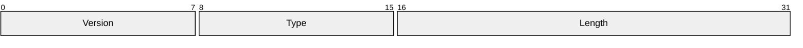
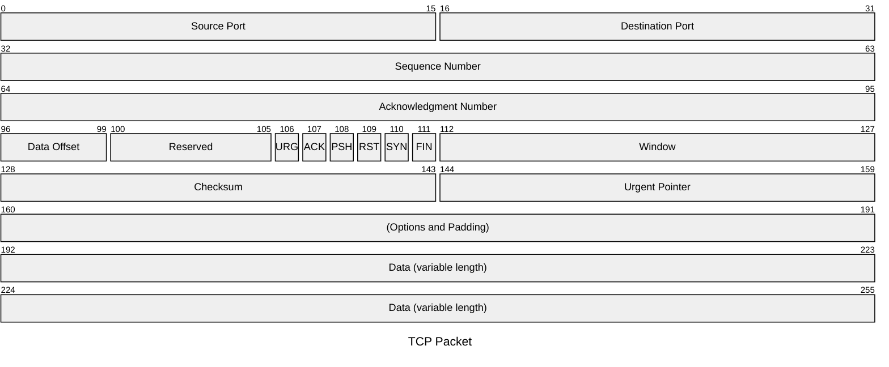
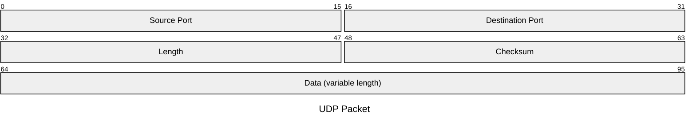
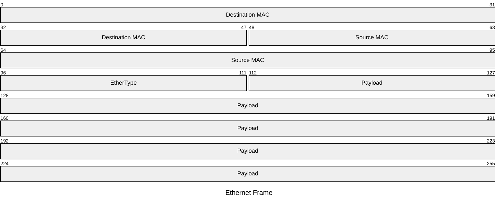
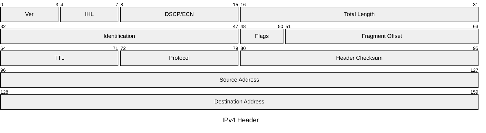

# Packet Diagram

## Declaration

The diagram begins with the `packet` keyword, optionally preceded by a frontmatter block with a title.

```
packet
0-15: "Field Name"
```

Available since Mermaid v11.0.0.

## Complete Syntax Reference

### Title

The title can be set via frontmatter or inline syntax.

**Frontmatter syntax:**

```yaml
---
title: "TCP Packet"
---
packet
```

**Inline syntax:**

```
packet
title UDP Packet
```

### Field Definition

Each line after the `packet` keyword (and optional title) defines a field in the packet structure.

| Syntax | Description | Example |
|--------|-------------|---------|
| `start: "Name"` | Single-bit field at position `start` | `106: "URG"` |
| `start-end: "Name"` | Multi-bit field spanning from `start` to `end` | `0-15: "Source Port"` |
| `+count: "Name"` | Bit-count field, auto-positioned from previous field end (v11.7.0+) | `+16: "Source Port"` |

### Field Syntax Details

| Component | Required | Description |
|-----------|----------|-------------|
| Bit range (`start-end`) or bit count (`+count`) or single bit (`start`) | Yes | Defines the position and width of the field |
| Colon (`:`) | Yes | Separator between range and field name |
| Field name | Yes | Enclosed in double quotes, describes the field |

### Bit Positioning

Bits are zero-indexed. Each row in the rendered diagram shows a fixed number of bits (typically 32 bits per row, based on the default configuration).

| Concept | Description |
|---------|-------------|
| Row width | Determined by `bitsPerRow` config (default: 32) |
| Bit numbering | Starts at 0, increments left-to-right |
| Row wrapping | Fields automatically wrap to new rows when exceeding the row width |
| Single-bit field | When `start` equals `end`, use just `start:` |

### Bit Count Syntax (v11.7.0+)

The `+count` syntax auto-calculates the start position based on the previous field's end. This simplifies editing since adding or removing fields does not require recalculating all subsequent positions.

| Syntax | Equivalent | Description |
|--------|------------|-------------|
| `+1: "Flag"` | Next single bit | 1-bit field starting after previous field |
| `+8: "Data"` | Next 8 bits | 8-bit field starting after previous field |
| `+16: "Port"` | Next 16 bits | 16-bit field starting after previous field |

Bit-count (`+N`) and explicit range (`start-end`) syntaxes can be mixed in the same diagram.

### Comments

```
%% This is a comment
```

## Data Format

Each data line follows this pattern:

```
RANGE: "DESCRIPTION"
```

Where `RANGE` is one of:

- `N` -- a single bit at position N
- `N-M` -- bits from position N to position M (inclusive)
- `+N` -- the next N bits starting from the end of the previous field

The `DESCRIPTION` is a quoted string describing the field purpose.

## Styling & Configuration

### Configuration Parameters

Configuration is set via frontmatter:

```yaml
---
config:
  packet:
    showBits: true
    bitsPerRow: 32
    paddingX: 5
    paddingY: 5
---
```

| Parameter | Type | Default | Description |
|-----------|------|---------|-------------|
| `showBits` | Boolean | `true` | Show bit position numbers |
| `bitsPerRow` | Number | `32` | Number of bits displayed per row |
| `paddingX` | Number | `5` | Horizontal padding inside field blocks |
| `paddingY` | Number | `5` | Vertical padding inside field blocks |

### Theme Variables

Note: Theme variable propagation may be limited due to known issues. The following variables are defined but may not take effect in all versions.

| Property | Description | Default |
|----------|-------------|---------|
| `byteFontSize` | Font size of the bit numbers | `'10px'` |
| `startByteColor` | Color of the starting byte number | `'black'` |
| `endByteColor` | Color of the ending byte number | `'black'` |
| `labelColor` | Color of the field labels | `'black'` |
| `labelFontSize` | Font size of the field labels | `'12px'` |
| `titleColor` | Color of the title text | `'black'` |
| `titleFontSize` | Font size of the title | `'14px'` |
| `blockStrokeColor` | Border color of field blocks | `'black'` |
| `blockStrokeWidth` | Border width of field blocks | `'1'` |
| `blockFillColor` | Fill color of field blocks | `'#efefef'` |

## Practical Examples

### Example 1 -- Simple Header



### Example 2 -- TCP Packet (Explicit Ranges)



### Example 3 -- UDP Packet (Using Bit Count Syntax)



### Example 4 -- Ethernet Frame Header



### Example 5 -- IPv4 Header with Configuration



## Common Gotchas

| Issue | Cause | Fix |
|-------|-------|-----|
| Field not rendering | Missing quotes around field name | Always wrap field names in double quotes: `0-7: "Version"` |
| Fields overlap | Overlapping bit ranges in explicit syntax | Ensure ranges are contiguous and non-overlapping |
| Wrong field width | Off-by-one in range (ranges are inclusive) | `0-15` is 16 bits, not 15; both endpoints are included |
| Bit count misalignment | Mixing `+N` with incorrect explicit ranges | When mixing syntaxes, ensure the explicit range starts where `+N` fields left off |
| Title not showing | Incorrect frontmatter syntax | Use `title: "Name"` in YAML frontmatter or `title Name` inline |
| Theme variables not working | Known Mermaid bug with theme propagation | Use configuration parameters instead of theme variables where possible |
| Diagram too wide | Too many bits per row for available width | Reduce `bitsPerRow` in config or increase container width |
