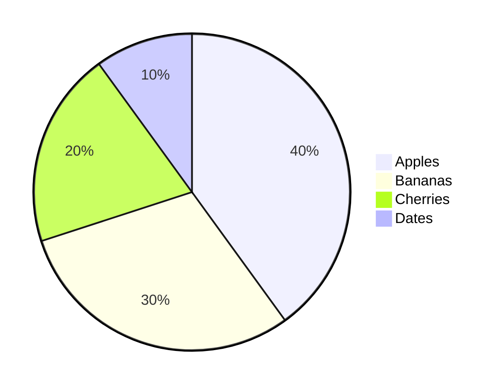
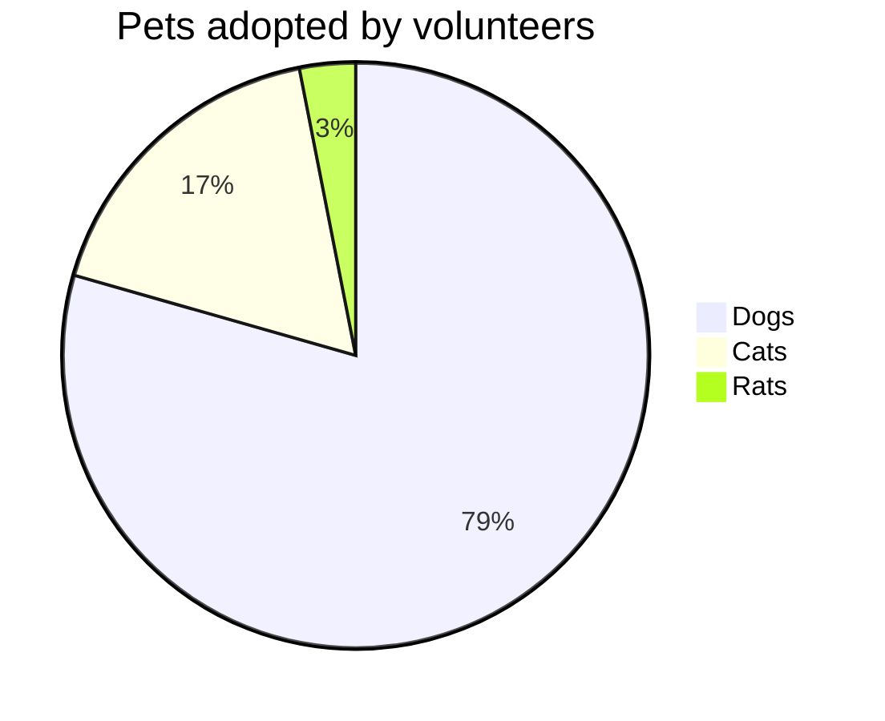
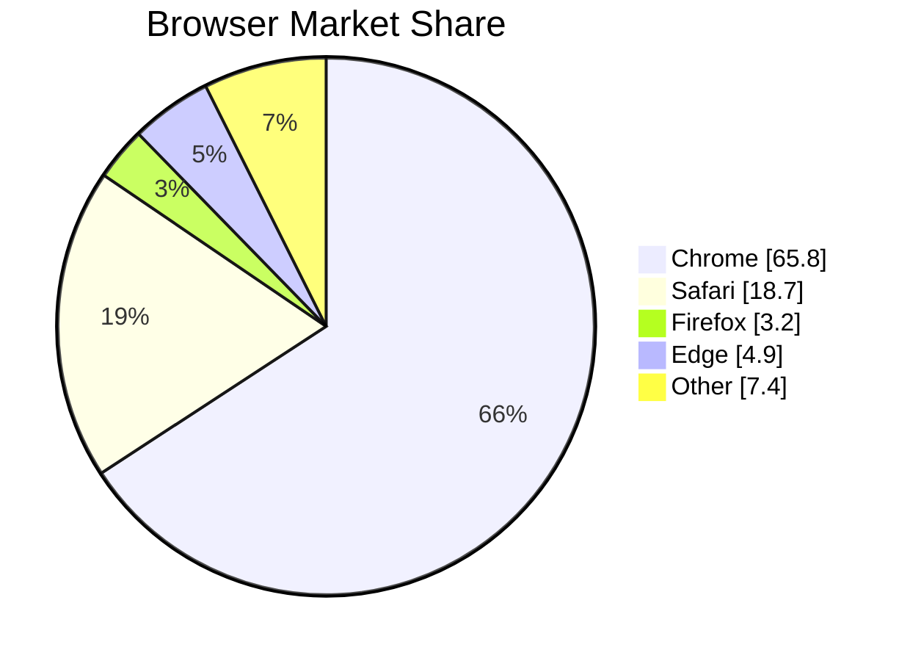
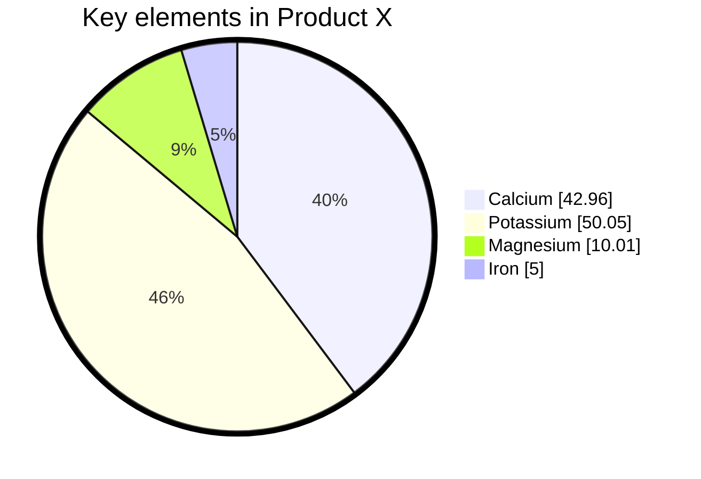
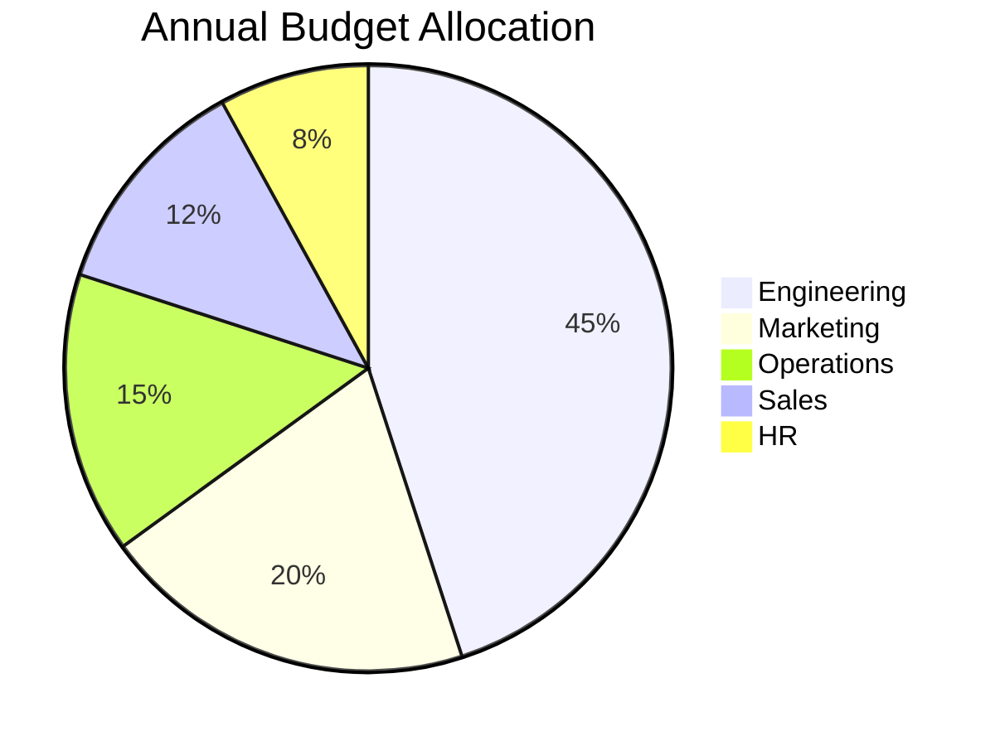

# Pie Chart

## Declaration

Start the diagram with the `pie` keyword. Optional modifiers follow on the same line.

```
pie [showData] [title <title text>]
```

## Complete Syntax Reference

### Keywords and Options

| Keyword    | Required | Position       | Description                                                     |
|------------|----------|----------------|-----------------------------------------------------------------|
| `pie`      | Yes      | First line     | Declares a pie chart diagram                                    |
| `showData` | No       | After `pie`    | Displays numeric values alongside legend labels                 |
| `title`    | No       | After `pie`/`showData` | Sets the chart title. The value is the rest of the line. |

### Data Entry Syntax

Each data slice is defined on its own line:

```
"<label>" : <value>
```

| Component  | Rules                                                                     |
|------------|---------------------------------------------------------------------------|
| `label`    | Wrapped in double quotes `" "`. Any text.                                 |
| `:`        | Required separator between label and value.                               |
| `value`    | Positive number greater than zero. Supports up to two decimal places.     |

Slices are rendered clockwise in the same order as they appear in the source.

### Value Rules

- Values must be **positive numbers greater than zero**.
- **Negative values cause an error**.
- Zero values are not allowed.
- Values represent proportions -- Mermaid calculates percentages automatically.
- Up to two decimal places are supported (e.g., `42.96`).

## Sections / Grouping

Pie charts do not have sections or grouping. All slices are part of a single chart.

## Styling & Configuration

### Configuration Parameters

Set via YAML frontmatter:

| Parameter      | Description                                                                              | Default |
|----------------|------------------------------------------------------------------------------------------|---------|
| `textPosition` | Axial position of slice labels, from `0.0` (center) to `1.0` (outside edge of circle).  | `0.75`  |

### Theme Variables

| Variable              | Description                              |
|-----------------------|------------------------------------------|
| `pieOuterStrokeWidth` | Width of the outer stroke around the pie |

### Frontmatter Configuration Example

```yaml
---
config:
  pie:
    textPosition: 0.5
  themeVariables:
    pieOuterStrokeWidth: "5px"
---
```

## Practical Examples

### 1. Minimal Pie Chart



### 2. Pie Chart with Title



### 3. Show Data Values



### 4. Styled with Configuration



### 5. Budget Allocation



## Common Gotchas

- **Values must be positive and greater than zero** -- negative numbers and zero cause parse errors.
- **Labels must be in double quotes** -- unquoted labels cause parse errors.
- **`showData` must come before `title`** on the `pie` declaration line.
- **No percentage syntax** -- provide raw numbers and Mermaid calculates percentages automatically.
- **Decimal precision** -- only up to two decimal places are supported.
- **Slice ordering** -- slices render clockwise in the order they appear in the source. There is no automatic sorting by value.
- **The `title` keyword** is part of the `pie` line or the line immediately after. It is not a standalone directive like in Gantt charts.
