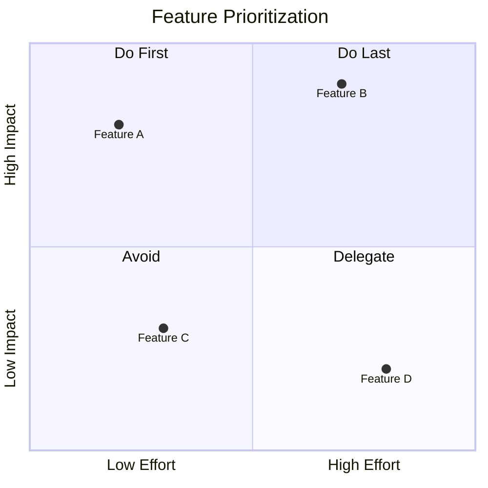
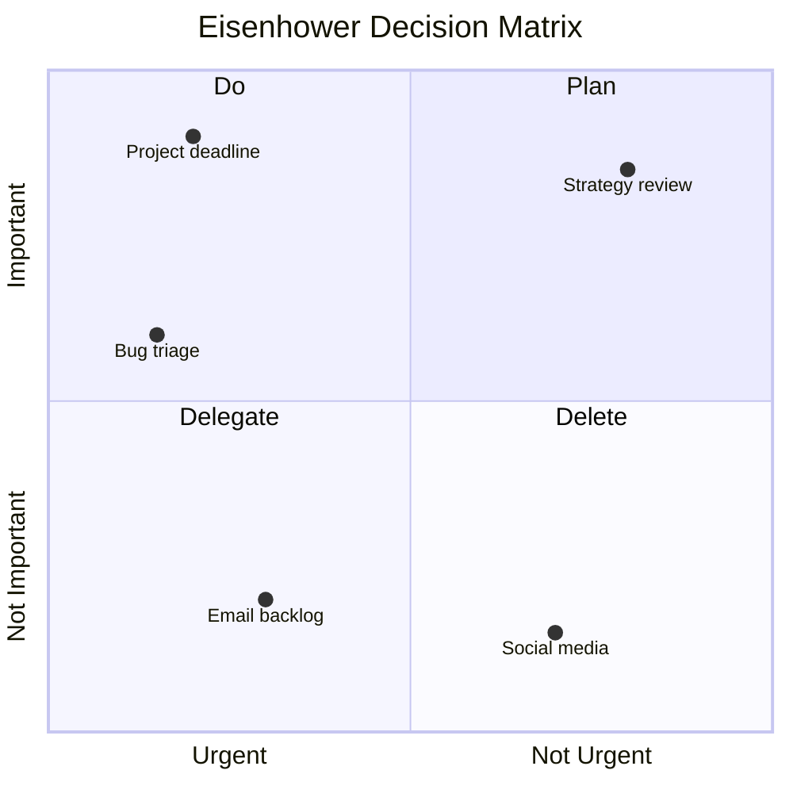
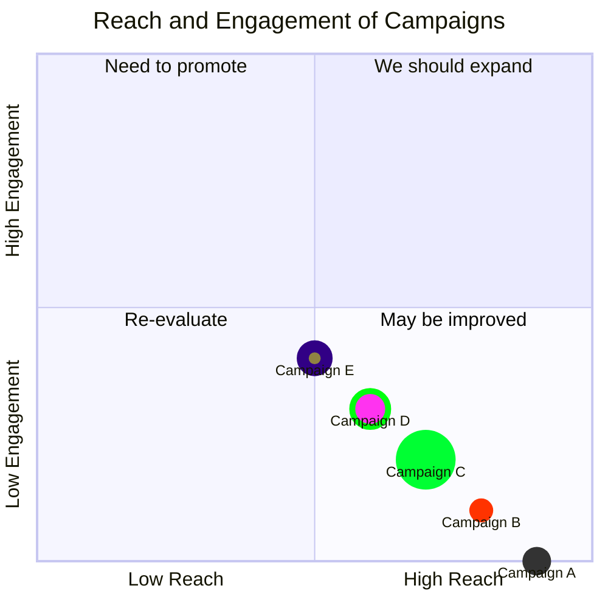
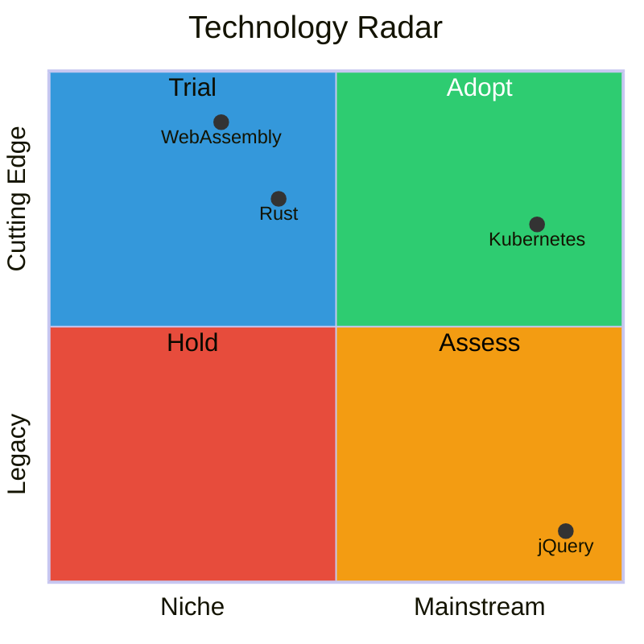

# Quadrant Chart

## Declaration

Start with the `quadrantChart` keyword.

```
quadrantChart
    title My Chart
    x-axis Low --> High
    y-axis Small --> Large
    quadrant-1 Top Right
    quadrant-2 Top Left
    quadrant-3 Bottom Left
    quadrant-4 Bottom Right
    Point A: [0.5, 0.5]
```

## Complete Syntax Reference

### Keywords

| Keyword | Syntax | Required | Description |
|---------|--------|----------|-------------|
| `quadrantChart` | `quadrantChart` | Yes | Declares the diagram type |
| `title` | `title <text>` | No | Chart title rendered at the top |
| `x-axis` | `x-axis <left> [--> <right>]` | No | X-axis labels. Left text only, or both with `-->` delimiter |
| `y-axis` | `y-axis <bottom> [--> <top>]` | No | Y-axis labels. Bottom text only, or both with `-->` delimiter |
| `quadrant-1` | `quadrant-1 <text>` | No | Label for **top-right** quadrant |
| `quadrant-2` | `quadrant-2 <text>` | No | Label for **top-left** quadrant |
| `quadrant-3` | `quadrant-3 <text>` | No | Label for **bottom-left** quadrant |
| `quadrant-4` | `quadrant-4 <text>` | No | Label for **bottom-right** quadrant |
| `classDef` | `classDef <name> <styles>` | No | Define a reusable style class for points |

### Quadrant Layout

```
         quadrant-2  |  quadrant-1
        (top-left)   |  (top-right)
       ──────────────┼──────────────
         quadrant-3  |  quadrant-4
       (bottom-left) |  (bottom-right)
```

### Points

Points plot circles on the chart. Coordinates range from `0` to `1` on both axes.

| Syntax | Description |
|--------|-------------|
| `Label: [x, y]` | Basic point at coordinates (x, y) |
| `Label: [x, y] radius: N` | Point with custom radius |
| `Label: [x, y] color: #hex` | Point with custom fill color |
| `Label: [x, y] stroke-color: #hex` | Point with custom border color |
| `Label: [x, y] stroke-width: Npx` | Point with custom border width |
| `Label:::className: [x, y]` | Point using a defined class |
| `Label:::className: [x, y] color: #hex` | Point with class + inline override |

Multiple style properties can be combined with commas:

```
Point A: [0.7, 0.2] radius: 25, color: #00ff33, stroke-color: #10f0f0
```

### Class Definitions

Define reusable styles with `classDef`:

```
classDef className color: #hex, radius: N, stroke-color: #hex, stroke-width: Npx
```

### Point Style Properties

| Property | Description |
|----------|-------------|
| `color` | Fill color of the point |
| `radius` | Radius of the point circle |
| `stroke-width` | Border width of the point |
| `stroke-color` | Border color (only visible when `stroke-width` is set) |

Style precedence: Direct styles > Class styles > Theme styles.

## Styling & Configuration

### Chart Configuration Options

Set under `config.quadrantChart` in frontmatter.

| Parameter | Description | Default |
|-----------|-------------|---------|
| `chartWidth` | Width of the chart in pixels | `500` |
| `chartHeight` | Height of the chart in pixels | `500` |
| `titlePadding` | Top and bottom padding of the title | `10` |
| `titleFontSize` | Title font size | `20` |
| `quadrantPadding` | Padding outside all quadrants | `5` |
| `quadrantTextTopPadding` | Quadrant text top padding (no data points) | `5` |
| `quadrantLabelFontSize` | Quadrant label font size | `16` |
| `quadrantInternalBorderStrokeWidth` | Inner border stroke width | `1` |
| `quadrantExternalBorderStrokeWidth` | Outer border stroke width | `2` |
| `xAxisLabelPadding` | Top and bottom padding of x-axis text | `5` |
| `xAxisLabelFontSize` | X-axis label font size | `16` |
| `xAxisPosition` | Position of x-axis: `'top'` or `'bottom'` | `'top'` |
| `yAxisLabelPadding` | Left and right padding of y-axis text | `5` |
| `yAxisLabelFontSize` | Y-axis label font size | `16` |
| `yAxisPosition` | Position of y-axis: `'left'` or `'right'` | `'left'` |
| `pointTextPadding` | Padding between point and its label | `5` |
| `pointLabelFontSize` | Point label font size | `12` |
| `pointRadius` | Default radius of points | `5` |

### Theme Variables

| Variable | Description |
|----------|-------------|
| `quadrant1Fill` | Fill color of top-right quadrant |
| `quadrant2Fill` | Fill color of top-left quadrant |
| `quadrant3Fill` | Fill color of bottom-left quadrant |
| `quadrant4Fill` | Fill color of bottom-right quadrant |
| `quadrant1TextFill` | Text color of top-right quadrant |
| `quadrant2TextFill` | Text color of top-left quadrant |
| `quadrant3TextFill` | Text color of bottom-left quadrant |
| `quadrant4TextFill` | Text color of bottom-right quadrant |
| `quadrantPointFill` | Default point fill color |
| `quadrantPointTextFill` | Point label text color |
| `quadrantXAxisTextFill` | X-axis text color |
| `quadrantYAxisTextFill` | Y-axis text color |
| `quadrantInternalBorderStrokeFill` | Inner border color |
| `quadrantExternalBorderStrokeFill` | Outer border color |
| `quadrantTitleFill` | Title text color |

## Practical Examples

### 1. Basic Quadrant Chart



### 2. Eisenhower Matrix



### 3. Campaign Analysis with Styled Points



### 4. Custom Sized Chart with Theme



## Common Gotchas

- **Point coordinates must be between 0 and 1.** Values outside this range will cause errors.
- **Quadrant numbering is counterintuitive.** `quadrant-1` is top-right (not top-left). The numbering follows mathematical convention (counterclockwise from top-right).
- **Axis label rendering changes with data points.** Without points, axis text and quadrant labels center in each quadrant. With points, x-axis labels move to the bottom and y-axis labels shift downward.
- **`stroke-color` requires `stroke-width`** to be visible. Setting only `stroke-color` without `stroke-width` has no effect.
- **Style precedence matters.** Inline styles on a point override class styles, which override theme styles.
- **Axis text supports quoted strings** with special characters: `y-axis Not Important --> "Important ❤"`.
- **`x-axis` with only left text** omits the right label entirely. Same for `y-axis` with only bottom text.
