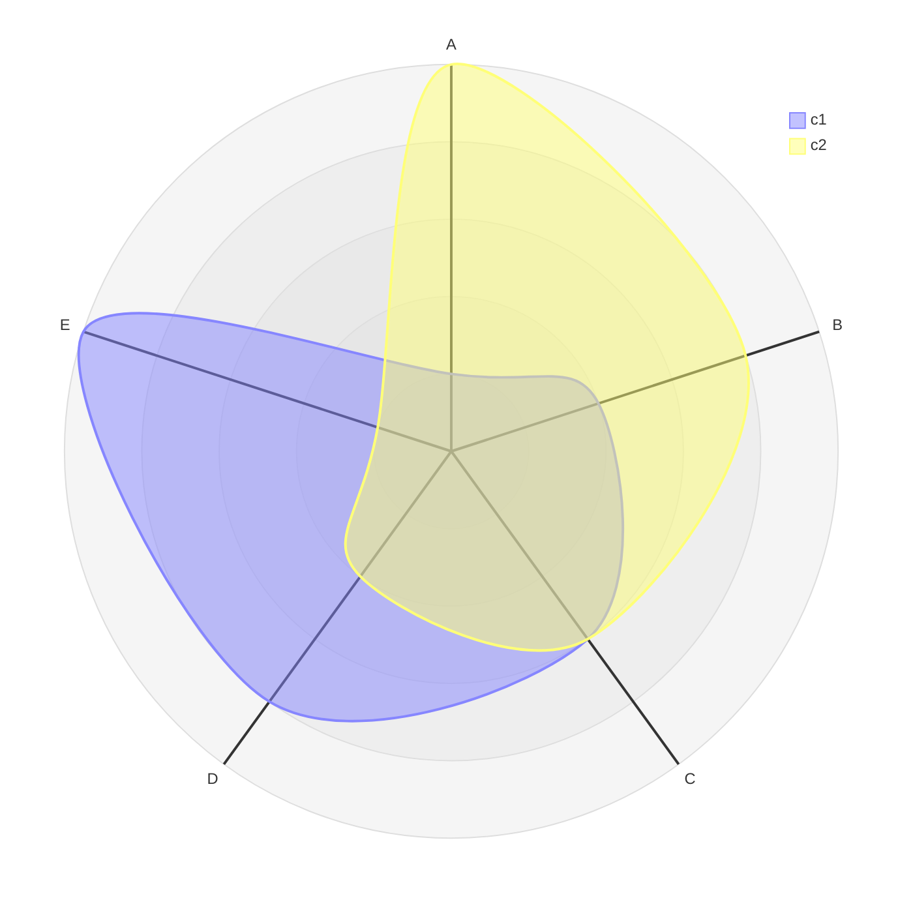
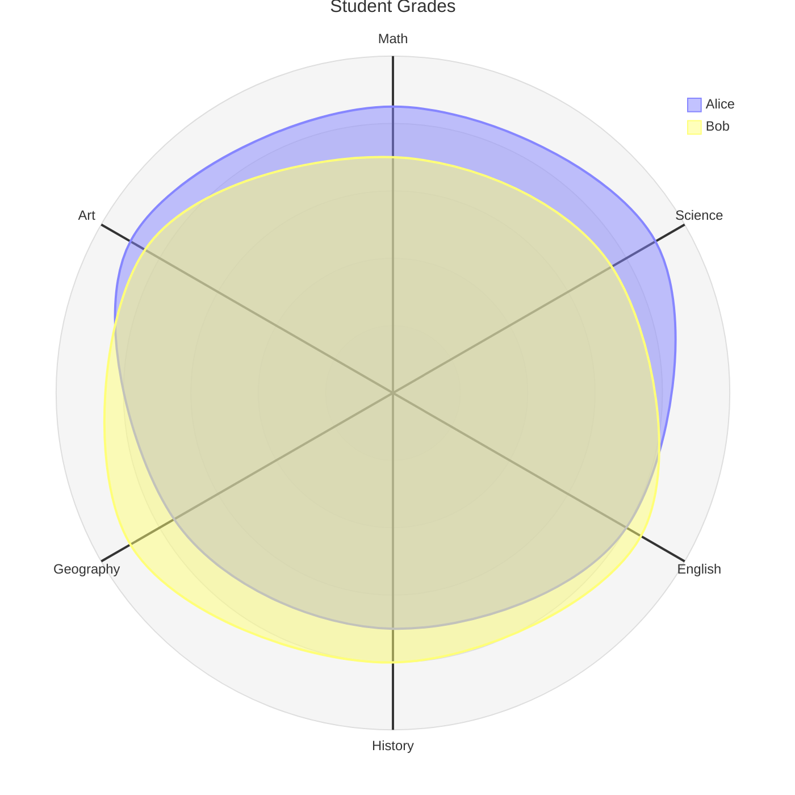
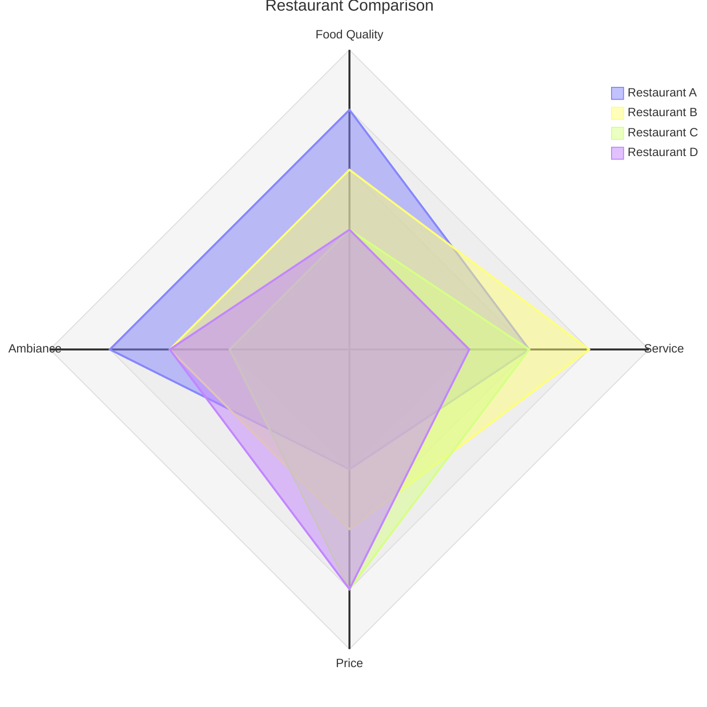
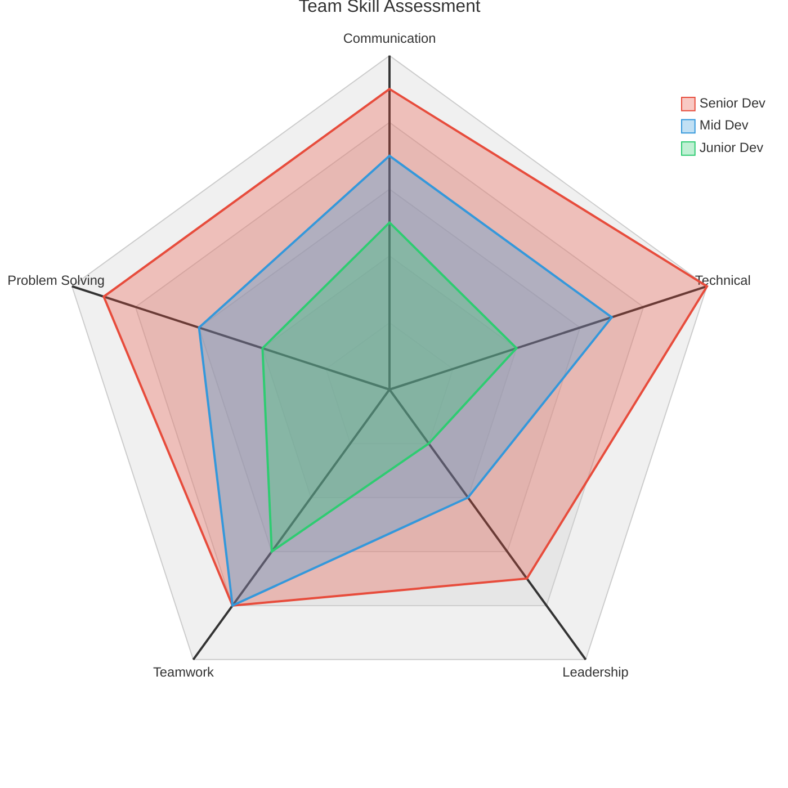
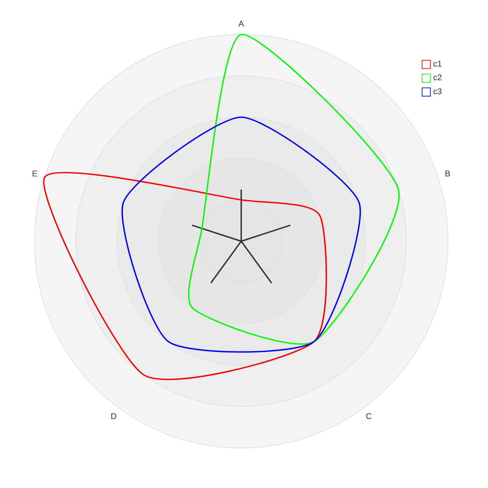

# Radar Chart (v11.6.0+)

## Declaration

Start with the `radar-beta` keyword. Also known as spider chart, star chart, cobweb chart, polar chart, or Kiviat diagram.

```
radar-beta
  axis A, B, C, D, E
  curve c1{1, 2, 3, 4, 5}
```

## Complete Syntax Reference

### Keywords

| Keyword | Syntax | Required | Description |
|---------|--------|----------|-------------|
| `radar-beta` | `radar-beta` | Yes | Declares the diagram type |
| `title` | `title <text>` | No | Chart title (can also be set in YAML frontmatter as `title: "text"`) |
| `axis` | `axis id["Label"], ...` | Yes | Define one or more axes |
| `curve` | `curve id["Label"]{values}` | Yes | Define a data series |
| `max` | `max <number>` | No | Maximum scale value |
| `min` | `min <number>` | No | Minimum scale value (default: `0`) |
| `graticule` | `graticule circle\|polygon` | No | Grid line shape (default: `circle`) |
| `ticks` | `ticks <number>` | No | Number of concentric scale rings (default: `5`) |
| `showLegend` | `showLegend true\|false` | No | Show or hide the legend (default: `true`) |

### Axis Definition

Each axis has a required **id** and an optional **label** in square brackets with quotes.

```
axis id1["Label 1"], id2["Label 2"], id3["Label 3"]
```

Multiple `axis` lines can be used to define axes across several lines:

```
axis m["Math"], s["Science"], e["English"]
axis h["History"], g["Geography"]
```

If no label is provided, the id is used as the label:

```
axis A, B, C
```

### Curve Definition

Each curve has a required **id**, an optional **label**, and **data values** in curly braces.

#### Positional Values

Values are mapped to axes in order of definition:

```
curve c1["Series A"]{85, 90, 80, 70, 75}
```

#### Key-Value Pairs

Map values to specific axes by id:

```
curve c1{ axis3: 30, axis1: 20, axis2: 10 }
```

#### Multiple Curves Per Line

```
curve id1["A"]{1, 2, 3}, id2["B"]{4, 5, 6}
```

### Options

| Option | Values | Default | Description |
|--------|--------|---------|-------------|
| `max` | Any number | Auto-calculated from data | Maximum value on all axes |
| `min` | Any number | `0` | Minimum value on all axes |
| `graticule` | `circle`, `polygon` | `circle` | Shape of the background grid |
| `ticks` | Any positive integer | `5` | Number of concentric grid rings |
| `showLegend` | `true`, `false` | `true` | Toggle legend visibility |

## Styling & Configuration

### Chart Configuration Options

Set under `config.radar` in frontmatter.

| Parameter | Description | Default |
|-----------|-------------|---------|
| `width` | Width of the radar diagram | `600` |
| `height` | Height of the radar diagram | `600` |
| `marginTop` | Top margin | `50` |
| `marginBottom` | Bottom margin | `50` |
| `marginLeft` | Left margin | `50` |
| `marginRight` | Right margin | `50` |
| `axisScaleFactor` | Scale factor for the axis length | `1` |
| `axisLabelFactor` | Factor to adjust axis label distance from center | `1.05` |
| `curveTension` | Tension for smooth curve rendering | `0.17` |

### Global Theme Variables

Set under `config.themeVariables`.

| Variable | Description |
|----------|-------------|
| `fontSize` | Font size of the title |
| `titleColor` | Color of the title |
| `cScale0` to `cScale11` | Color for the Nth curve (cycles after 12) |

### Radar-Specific Theme Variables

Set under `config.themeVariables.radar`.

| Variable | Description | Default |
|----------|-------------|---------|
| `axisColor` | Color of the axis lines | `black` |
| `axisStrokeWidth` | Width of the axis lines | `1` |
| `axisLabelFontSize` | Font size of axis labels | `12px` |
| `curveOpacity` | Fill opacity of curves | `0.7` |
| `curveStrokeWidth` | Stroke width of curves | `2` |
| `graticuleColor` | Color of grid lines | `black` |
| `graticuleOpacity` | Opacity of grid lines | `0.5` |
| `graticuleStrokeWidth` | Width of grid lines | `1` |
| `legendBoxSize` | Size of legend color boxes | `10` |
| `legendFontSize` | Font size of legend text | `14px` |

## Practical Examples

### 1. Simple Radar Chart



### 2. Student Grades Comparison



### 3. Restaurant Comparison with Polygon Grid



### 4. Skill Assessment with Custom Theme



### 5. Transparent Curves with Axis Scaling



## Common Gotchas

- **Use `radar-beta`, not `radar`.** The keyword includes the `-beta` suffix as this is a beta feature.
- **Number of curve values must match number of axes.** Mismatched counts will cause rendering errors.
- **Curve colors cycle after 12** via `cScale0` through `cScale11`.
- **`min` defaults to `0`**, not to the minimum data value. Set it explicitly if your data starts above zero and you want a tighter chart.
- **`max` auto-calculates from data** if not specified. Set it explicitly for consistent scaling across charts.
- **Radar theme variables nest under `themeVariables.radar`**, not directly under `themeVariables`. For example: `themeVariables.radar.curveOpacity`.
- **`curveTension: 0`** produces sharp polygon edges. Higher values produce smoother curves.
- **`curveOpacity: 0`** makes the fill invisible, showing only the stroke lines -- useful for overlapping curves.
- **Key-value curve syntax** (`axis_id: value`) allows out-of-order axis mapping, but axis ids must match defined axis ids exactly.
- **Title can be set two ways**: via `title` keyword in the body or via YAML frontmatter `title: "text"`. Both work.
