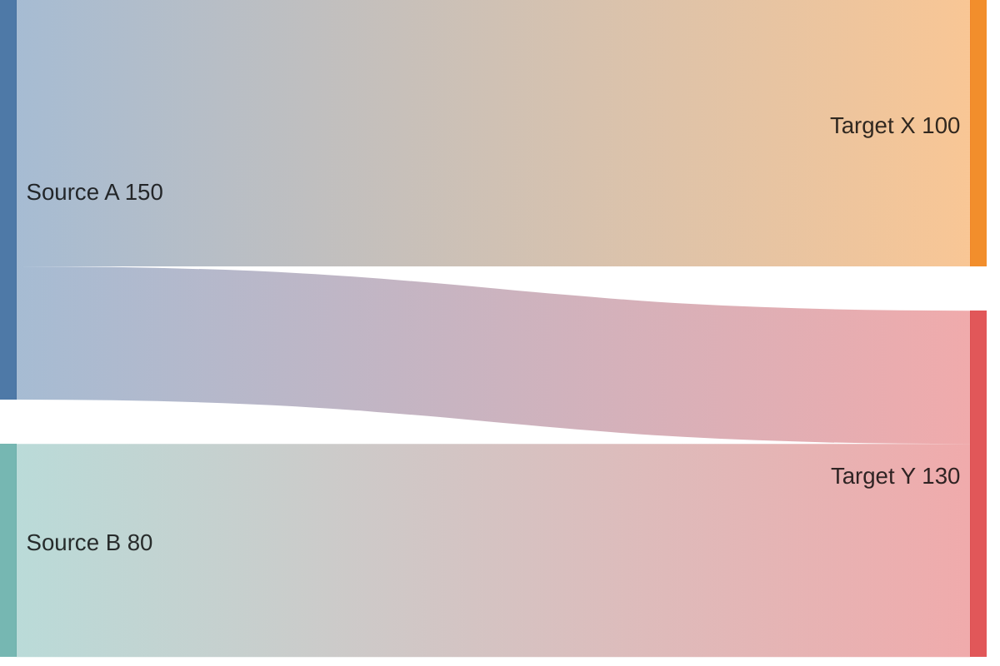
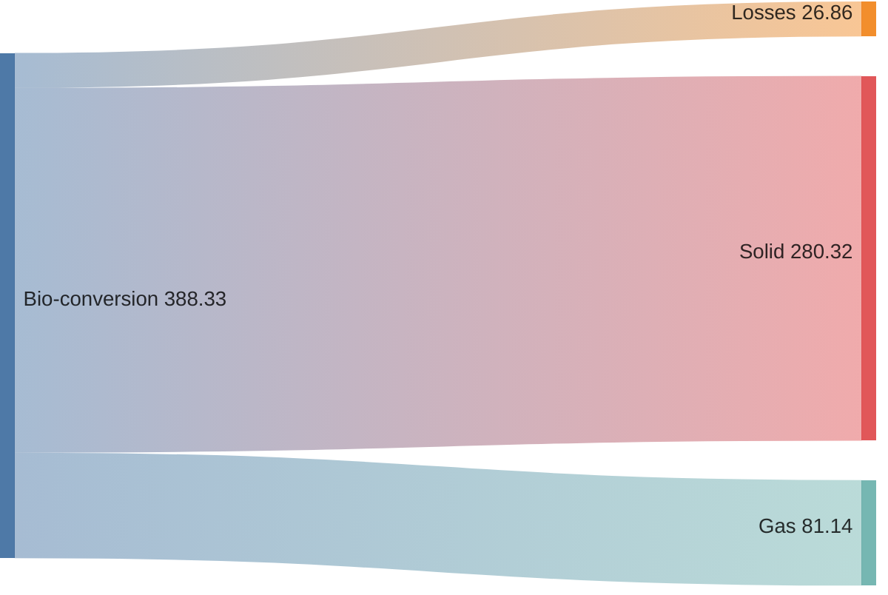
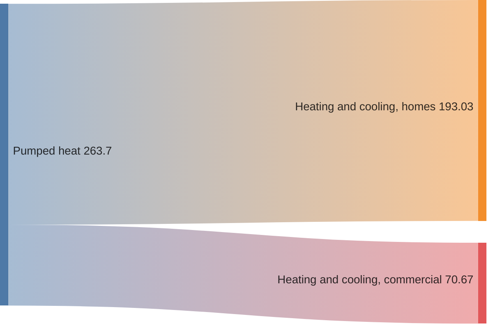
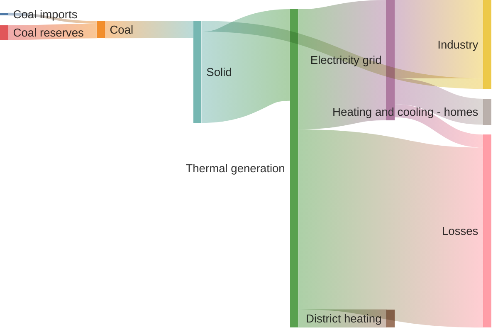
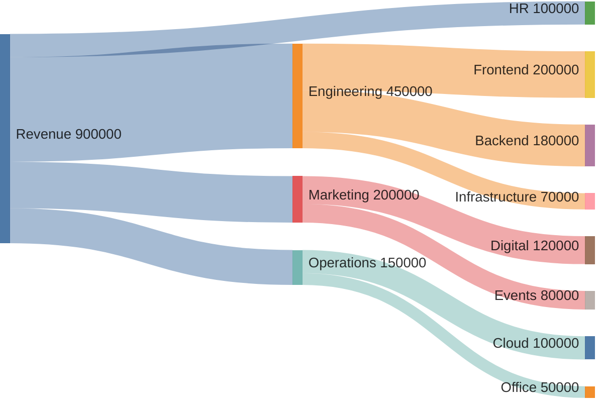

# Sankey Diagram

## Declaration

The diagram begins with the `sankey` keyword on its own line, followed by CSV-formatted data rows.

```
sankey

source,target,value
```

Available since Mermaid v10.3.0. This is an experimental diagram type.

## Complete Syntax Reference

### Data Format

The data follows CSV (RFC 4180) with these specific rules:

| Rule            | Description                                                 |
|-----------------|-------------------------------------------------------------|
| Columns         | Exactly **3 columns** required: `source`, `target`, `value` |
| Separator       | Comma (`,`) between fields                                  |
| Header row      | Not required; data rows begin immediately after `sankey`    |
| Empty lines     | Allowed between data rows for visual grouping               |
| Comments        | Use `%%` for comments                                       |
| Quoting         | Wrap fields containing commas in double quotes              |
| Escaping quotes | Use two double quotes (`""`) inside a quoted string         |
| Value format    | Numeric (integer or decimal), e.g. `124.729`, `35`, `0.597` |

### Column Specification

| Column | Position | Type   | Description                                  |
|--------|----------|--------|----------------------------------------------|
| source | 1st      | String | The originating node name                    |
| target | 2nd      | String | The destination node name                    |
| value  | 3rd      | Number | The flow magnitude between source and target |

Nodes are automatically created from unique source and target names. The same node name can appear as both a source and a target to create multi-level flows.

### Quoting Rules

| Scenario                | Syntax                        | Example                                                |
|-------------------------|-------------------------------|--------------------------------------------------------|
| Plain text              | No quotes needed              | `Coal,Solid,75.571`                                    |
| Text with commas        | Wrap in double quotes         | `Pumped heat,"Heating and cooling, homes",193.026`     |
| Text with double quotes | Use `""` inside quoted string | `Pumped heat,"Heating and cooling, ""homes""",193.026` |
| Text with apostrophes   | No special handling needed    | `Agricultural 'waste',Bio-conversion,124.729`          |

## Styling & Configuration

Configuration is set via frontmatter directives or JavaScript initialization.

### Frontmatter Directive

```yaml
---
config:
  sankey:
    width: 800
    height: 400
    linkColor: 'source'
    nodeAlignment: 'left'
    showValues: false
---
```

### Configuration Parameters

| Parameter       | Type    | Default     | Description                                |
|-----------------|---------|-------------|--------------------------------------------|
| `width`         | Number  | 800         | Width of the diagram in pixels             |
| `height`        | Number  | 400         | Height of the diagram in pixels            |
| `linkColor`     | String  | `'source'`  | Coloring strategy for links                |
| `nodeAlignment` | String  | `'justify'` | How nodes are aligned vertically           |
| `showValues`    | Boolean | `true`      | Whether to display numeric values on links |

### Link Color Options

| Value                        | Effect                                             |
|------------------------------|----------------------------------------------------|
| `'source'`                   | Link takes the color of its source node            |
| `'target'`                   | Link takes the color of its target node            |
| `'gradient'`                 | Smooth color transition from source to target node |
| Hex color (e.g. `'#a1a1a1'`) | All links use the specified color                  |

### Node Alignment Options

| Value       | Effect                                         |
|-------------|------------------------------------------------|
| `'justify'` | Nodes spread to fill the full height (default) |
| `'left'`    | Nodes aligned to the top/left                  |
| `'right'`   | Nodes aligned to the bottom/right              |
| `'center'`  | Nodes centered vertically                      |

## Practical Examples

### Example 1 -- Minimal Sankey



### Example 2 -- With Empty Lines for Readability



### Example 3 -- Quoted Fields with Commas



### Example 4 -- Multi-Level Energy Flow with Configuration



### Example 5 -- Budget Allocation



## Common Gotchas

| Issue                    | Cause                                     | Fix                                                           |
|--------------------------|-------------------------------------------|---------------------------------------------------------------|
| Diagram won't render     | Missing `sankey` keyword on first line    | Ensure `sankey` appears alone on the first line               |
| Broken node names        | Commas inside unquoted field names        | Wrap fields containing commas in double quotes                |
| Unexpected extra nodes   | Inconsistent node naming (case-sensitive) | Use identical strings for the same node across all rows       |
| Only 2 or 4+ columns     | CSV must have exactly 3 columns           | Ensure every row has exactly `source,target,value`            |
| Non-numeric value column | Value contains text or is empty           | Provide a valid integer or decimal number in the third column |
| Values not showing       | `showValues` set to `false`               | Set `showValues: true` in config or remove the override       |
