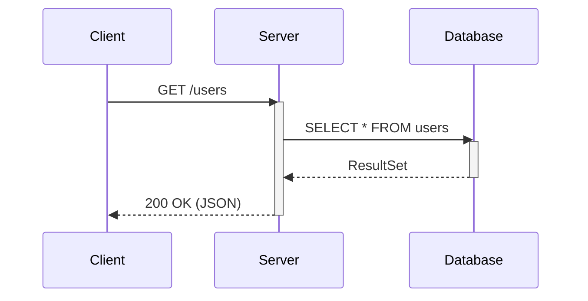
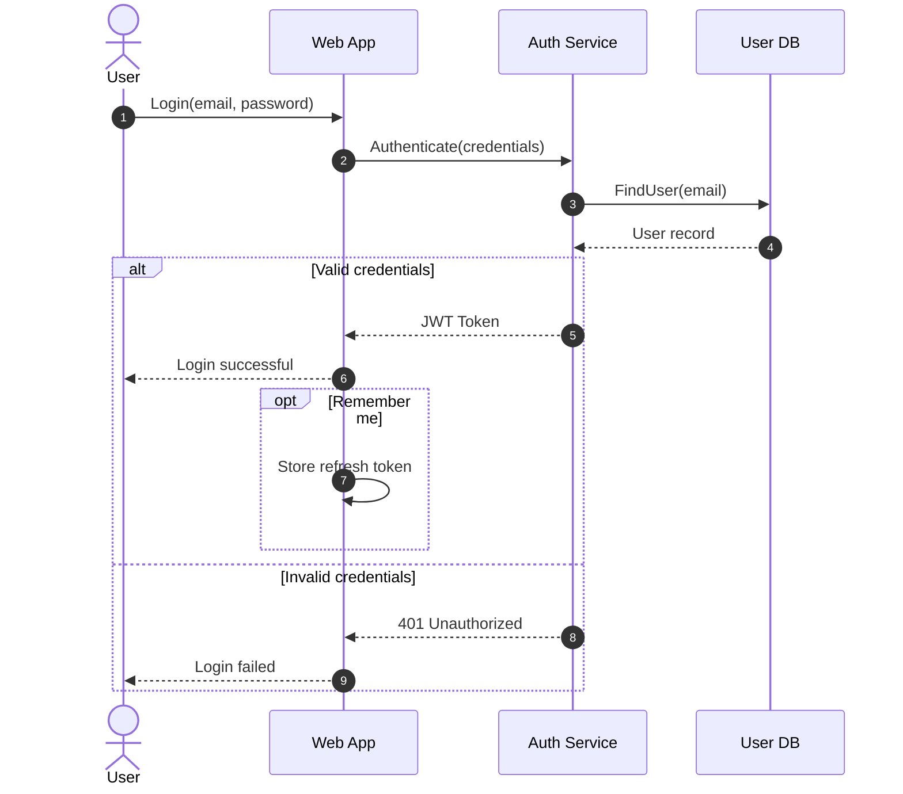
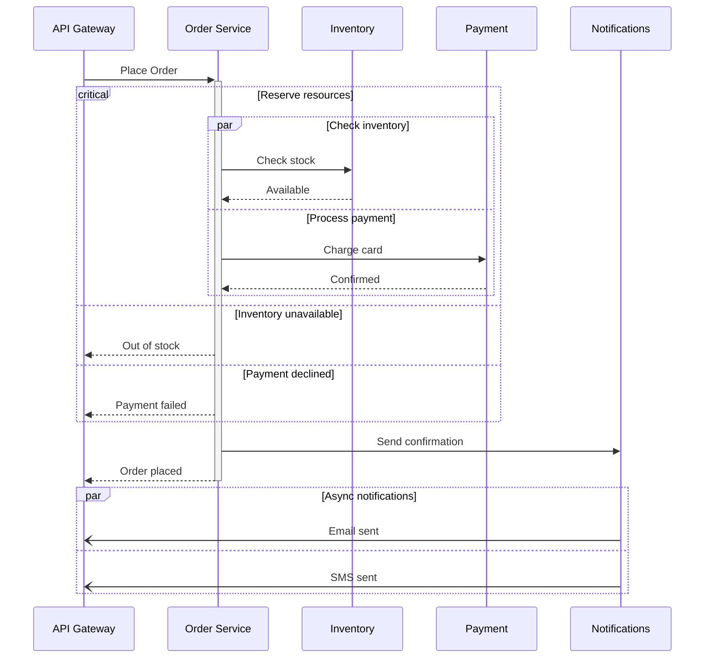
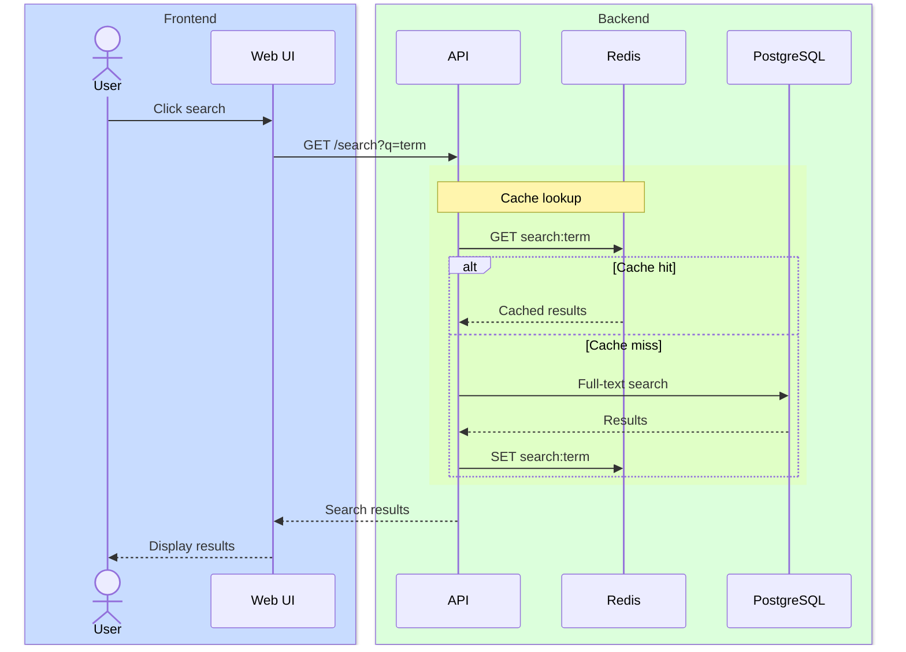

# Sequence Diagram

## Declaration

```
sequenceDiagram
```

## Complete Syntax Reference

### Participants

Participants are rendered in order of appearance. Use explicit declarations to control order.

```
participant Alice
participant Bob
```

### Actors

Use `actor` instead of `participant` to render a stick figure symbol.

```
actor Alice
actor Bob
```

### Participant Types (Stereotypes)

Use JSON configuration syntax to set a participant type:

```
participant Alice@{ "type" : "boundary" }
```

| Type          | Symbol             | Description               |
|---------------|--------------------|---------------------------|
| (default)     | Rectangle          | Standard participant      |
| `actor`       | Stick figure       | Actor keyword alternative |
| `boundary`    | Boundary symbol    | System boundary           |
| `control`     | Control symbol     | Controller                |
| `entity`      | Entity symbol      | Entity object             |
| `database`    | Database symbol    | Database                  |
| `collections` | Collections symbol | Collection of objects     |
| `queue`       | Queue symbol       | Message queue             |

### Aliases

#### External Alias (using `as` keyword)

```
participant A as Alice
participant API@{ "type": "boundary" } as Public API
```

#### Inline Alias (in configuration object)

```
participant API@{ "type": "boundary", "alias": "Public API" }
```

When both are provided, the external alias (`as`) takes precedence.

### Actor Creation and Destruction (v10.3.0+)

```
create participant Carl
Alice->>Carl: Hi Carl!

create actor D as Donald
Carl->>D: Hi!

destroy Carl
Alice-xCarl: We are too many

destroy Bob
Bob->>Alice: I agree
```

- Only the recipient can be **created** via a message.
- Either sender or recipient can be **destroyed**.

### Grouping / Box

Group actors in colored vertical boxes:

```
box Aqua Group Description
    participant A
    participant B
end
```

Color options:
- Named color: `box Purple Label`
- RGB: `box rgb(33,66,99)`
- RGBA: `box rgba(33,66,99,0.5)`
- Transparent: `box transparent Aqua` (when name is a color)
- No color: `box Group Name`

## Messages / Arrow Types

Format: `[Actor][Arrow][Actor]:Message text`

### Standard Arrow Types

| Arrow    | Description                                |
|----------|--------------------------------------------|
| `->`     | Solid line without arrow                   |
| `-->`    | Dotted line without arrow                  |
| `->>`    | Solid line with arrowhead                  |
| `-->>`   | Dotted line with arrowhead                 |
| `<<->>`  | Solid bidirectional arrowheads (v11.0.0+)  |
| `<<-->>` | Dotted bidirectional arrowheads (v11.0.0+) |
| `-x`     | Solid line with cross at end               |
| `--x`    | Dotted line with cross at end              |
| `-)`     | Solid line with open arrow (async)         |
| `--)`    | Dotted line with open arrow (async)        |

### Central Lifeline Connections

Append `()` to connect to a participant's central lifeline point:

```
Alice->>()John: Hello John
Alice()->>John: How are you?
John()->>()Alice: Great!
```

## Activations

### Explicit Activate/Deactivate

```
activate John
deactivate John
```

### Shortcut with `+` / `-`

```
Alice->>+John: Hello John, how are you?
John-->>-Alice: Great!
```

Activations can be stacked:

```
Alice->>+John: Hello John, how are you?
Alice->>+John: John, can you hear me?
John-->>-Alice: Hi Alice, I can hear you!
John-->>-Alice: I feel great!
```

## Notes

```
Note right of John: Text in note
Note left of Alice: Left side note
Note over Alice,John: Spans two participants
```

### Line Breaks

Use `<br/>` in notes and messages:

```
Alice->John: Hello John,<br/>how are you?
Note over Alice,John: Line 1<br/>Line 2
```

Line breaks in actor names require aliases:

```
participant Alice as Alice<br/>Johnson
```

## Control Flow Blocks

### Loop

```
loop Loop text
    statements...
end
```

### Alt / Else / Opt

```
alt Describing text
    statements...
else Another case
    statements...
end

opt Optional section
    statements...
end
```

### Parallel (par / and)

```
par Alice to Bob
    Alice->>Bob: Hello!
and Alice to John
    Alice->>John: Hello!
end
```

Parallel blocks can be nested.

### Critical Region

```
critical Establish a connection to the DB
    Service-->DB: connect
option Network timeout
    Service-->Service: Log error
option Credentials rejected
    Service-->Service: Log different error
end
```

Can also be used without options. Can be nested.

### Break

```
break when the booking process fails
    API-->Consumer: show failure
end
```

## Background Highlighting

```
rect rgb(191, 223, 255)
    note right of Alice: Alice calls John.
    Alice->>+John: Hello!
    John-->>-Alice: Hi!
end
```

Supports `rgb()` and `rgba()` colors. Rects can be nested.

## Sequence Numbers

### Via Configuration

```html
<script>
  mermaid.initialize({ sequence: { showSequenceNumbers: true } });
</script>
```

### Via Diagram Code

```
sequenceDiagram
    autonumber
    Alice->>John: Hello
    John-->>Alice: Hi!
```

## Actor Menus

### Simple Link Syntax

```
link Alice: Dashboard @ https://dashboard.contoso.com/alice
link Alice: Wiki @ https://wiki.contoso.com/alice
```

### JSON Link Syntax

```
links Alice: {"Dashboard": "https://dashboard.contoso.com/alice", "Wiki": "https://wiki.contoso.com/alice"}
```

## Entity Codes

Escape characters using `#code;` syntax:

```
A->>B: I #9829; you!
B->>A: I #9829; you #infin; times more!
```

Numbers are base 10. HTML character names are supported. Use `#59;` for semicolons in message text.

## Comments

```
%% This is a comment
```

## Styling & Customization

### CSS Classes

| Class            | Description                |
|------------------|----------------------------|
| `actor`          | Actor box styles           |
| `actor-top`      | Actor figure/box at top    |
| `actor-bottom`   | Actor figure/box at bottom |
| `text.actor`     | Text of all actors         |
| `text.actor-box` | Text of actor box          |
| `text.actor-man` | Text of actor figure       |
| `actor-line`     | Vertical lifeline          |
| `messageLine0`   | Solid message line         |
| `messageLine1`   | Dotted message line        |
| `messageText`    | Text on message arrows     |
| `labelBox`       | Label box in loops         |
| `labelText`      | Text in loop labels        |
| `loopText`       | Text in loop box           |
| `loopLine`       | Lines in loop box          |
| `note`           | Note box                   |
| `noteText`       | Text in note boxes         |

## Configuration Parameters

| Parameter           | Description                   | Default                          |
|---------------------|-------------------------------|----------------------------------|
| `mirrorActors`      | Render actors at bottom too   | `false`                          |
| `bottomMarginAdj`   | Bottom margin adjustment      | `1`                              |
| `actorFontSize`     | Actor description font size   | `14`                             |
| `actorFontFamily`   | Actor description font family | `"Open Sans", sans-serif`        |
| `actorFontWeight`   | Actor description font weight | `"Open Sans", sans-serif`        |
| `noteFontSize`      | Note font size                | `14`                             |
| `noteFontFamily`    | Note font family              | `"trebuchet ms", verdana, arial` |
| `noteFontWeight`    | Note font weight              | `"trebuchet ms", verdana, arial` |
| `noteAlign`         | Note text alignment           | `center`                         |
| `messageFontSize`   | Message font size             | `16`                             |
| `messageFontFamily` | Message font family           | `"trebuchet ms", verdana, arial` |
| `messageFontWeight` | Message font weight           | `"trebuchet ms", verdana, arial` |

Configure via:

```javascript
mermaid.sequenceConfig = {
    diagramMarginX: 50,
    diagramMarginY: 10,
    boxTextMargin: 5,
    noteMargin: 10,
    messageMargin: 35,
    mirrorActors: true
};
```

## Practical Examples

### Basic API Interaction



### Authentication Flow with Alt/Opt



### Microservice Orchestration with Parallel and Critical



### Grouped Participants with Background Highlighting



## Common Gotchas

- **The word "end"** can break the diagram. Wrap it: `(end)`, `[end]`, `{end}`, `"end"`.
- **Semicolons in message text**: Use `#59;` entity code since semicolons can act as line separators.
- **Actor creation/deletion errors** on older versions: Update to mermaid v10.7.0+ if you see "destroyed participant does not have an associated destroying message" errors.
- **`securityLevel='strict'`** disables click events and interactive links.
- **Box names that are colors** (e.g., `box Aqua`): The word is treated as the box color. Use `box transparent Aqua` to force it as a label.
- **Bidirectional arrows** (`<<->>`, `<<-->>`) require v11.0.0+.
- **`autonumber`** must appear right after `sequenceDiagram` to apply globally.
