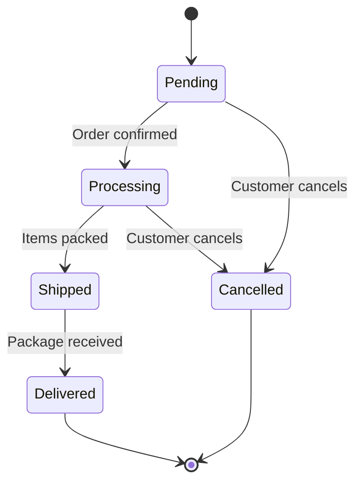
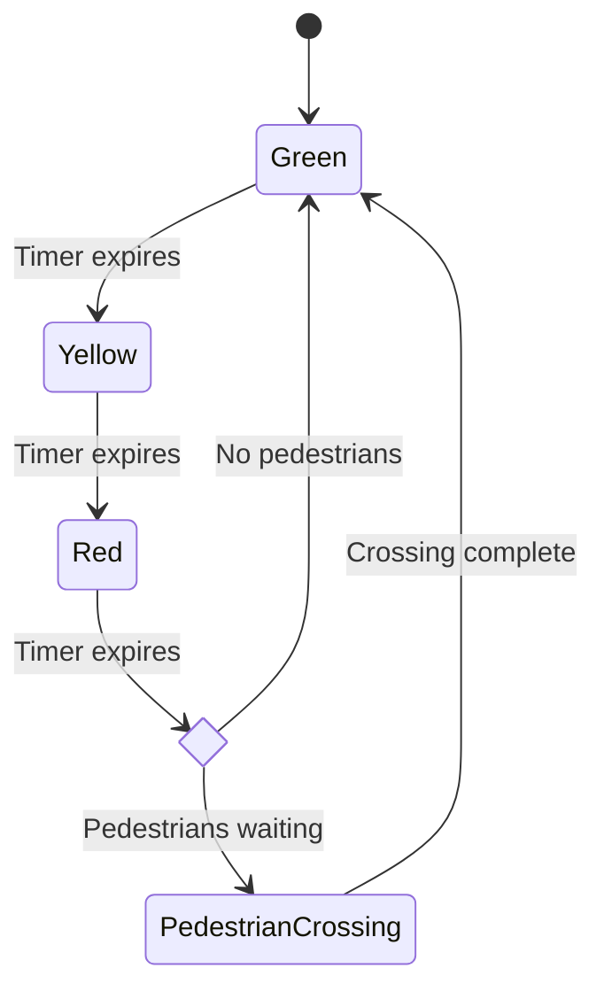
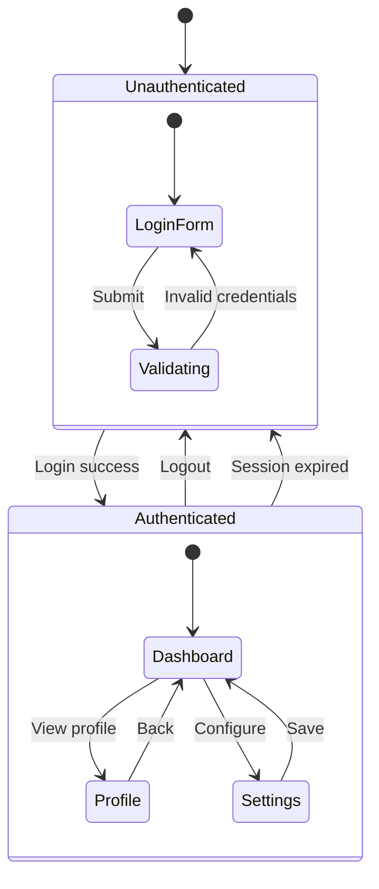
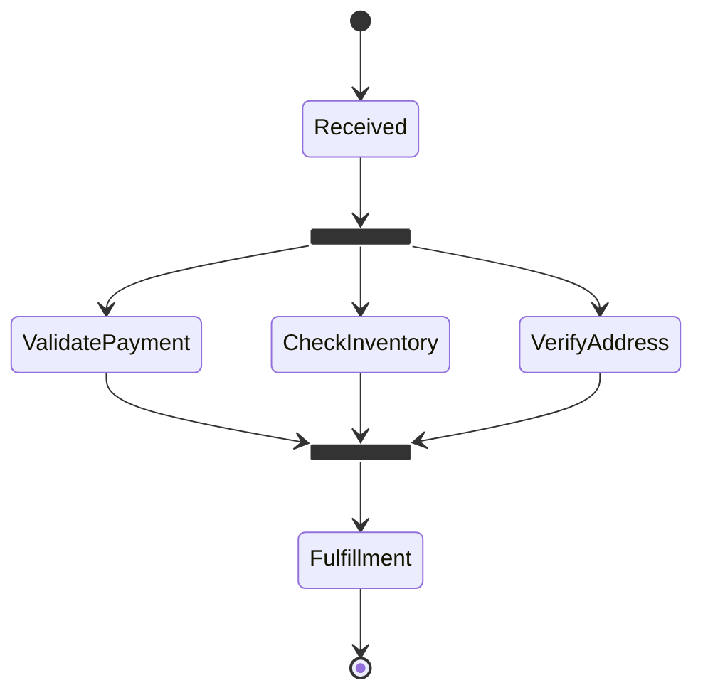
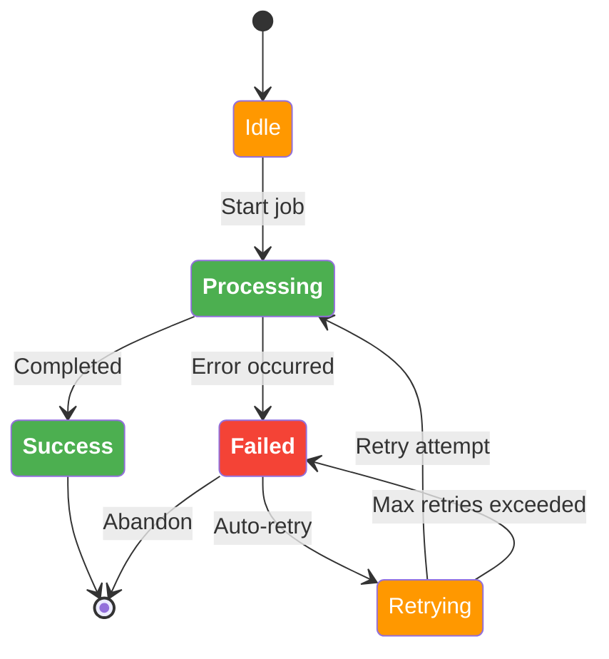

# State Diagram

## Declaration

Two renderer versions are available:

| Keyword | Description |
|---------|-------------|
| `stateDiagram-v2` | Current renderer (recommended) |
| `stateDiagram` | Older renderer |

```
stateDiagram-v2
    [*] --> Still
```

## Direction

Set rendering direction with the `direction` statement:

```
stateDiagram-v2
    direction LR
```

| Keyword | Direction |
|---------|-----------|
| `TB` | Top to bottom |
| `TD` | Top-down |
| `BT` | Bottom to top |
| `RL` | Right to left |
| `LR` | Left to right |

Direction can also be set within composite states.

## Complete Syntax Reference

### Title

```
---
title: Simple sample
---
stateDiagram-v2
    [*] --> Still
```

### Defining States

Three ways to define a state:

| Syntax | Description |
|--------|-------------|
| `stateId` | Bare id (used as both id and display text) |
| `state "Description" as s2` | State keyword with description and alias |
| `s2 : Description text` | Id followed by colon and description |

### Spaces in State Names

Define the state with an id and description, then reference by id:

```
yswsii: Your state with spaces in it
[*] --> yswsii
yswsii --> YetAnotherState
```

## Transitions

Transitions use the `-->` arrow:

```
s1 --> s2
```

### Transition Labels

Add text after a colon:

```
s1 --> s2: A transition
```

### Start and End States

Use `[*]` for start and end states. The direction of the transition determines which it is:

```
[*] --> s1       %% [*] is a start state
s1 --> [*]       %% [*] is an end state
```

## Composite States

Nest states within `state Name { }` blocks:

```
state First {
    [*] --> second
    second --> [*]
}
```

### Named Composite States

```
NamedComposite: Display Name
state NamedComposite {
    [*] --> inner
    inner --> [*]
}
```

### Multi-Level Nesting

Composite states can be nested to any depth:

```
state First {
    state Second {
        state Third {
            [*] --> third
            third --> [*]
        }
    }
}
```

### Transitions Between Composite States

```
[*] --> First
First --> Second
First --> Third

state First {
    [*] --> fir
    fir --> [*]
}
state Second {
    [*] --> sec
    sec --> [*]
}
```

**Limitation**: You cannot define transitions between internal states belonging to different composite states.

## Choice

Model decision points with `<<choice>>`:

```
state if_state <<choice>>
[*] --> IsPositive
IsPositive --> if_state
if_state --> False: if n < 0
if_state --> True : if n >= 0
```

## Forks and Joins

Model parallel execution with `<<fork>>` and `<<join>>`:

```
state fork_state <<fork>>
[*] --> fork_state
fork_state --> State2
fork_state --> State3

state join_state <<join>>
State2 --> join_state
State3 --> join_state
join_state --> State4
State4 --> [*]
```

## Concurrency

Use `--` to separate concurrent regions within a composite state:

```
state Active {
    [*] --> NumLockOff
    NumLockOff --> NumLockOn : EvNumLockPressed
    NumLockOn --> NumLockOff : EvNumLockPressed
    --
    [*] --> CapsLockOff
    CapsLockOff --> CapsLockOn : EvCapsLockPressed
    CapsLockOn --> CapsLockOff : EvCapsLockPressed
    --
    [*] --> ScrollLockOff
    ScrollLockOff --> ScrollLockOn : EvScrollLockPressed
    ScrollLockOn --> ScrollLockOff : EvScrollLockPressed
}
```

## Notes

### Multi-Line Note (right or left)

```
note right of State1
    Important information! You can write
    notes.
end note
```

### Single-Line Note

```
note left of State2 : This is the note to the left.
```

Positions: `right of`, `left of`.

## Comments

```
%% this is a comment
Moving --> Still %% inline comment
```

## Styling & Customization

### classDef

Define style classes:

```
classDef notMoving fill:white
classDef movement font-style:italic
classDef badBadEvent fill:#f00,color:white,font-weight:bold,stroke-width:2px,stroke:yellow
```

**Current limitations:**
1. Cannot be applied to start or end states
2. Cannot be applied to or within composite states

### Applying Styles

#### Using `class` Statement

```
class Still notMoving
class Moving, Crash movement
```

Apply multiple styles to the same state:

```
class Crash movement
class Crash badBadEvent
```

#### Using `:::` Operator

```
[*] --> Still:::notMoving
Still --> Moving:::movement
Crash:::badBadEvent --> [*]
```

### Accessibility

```
accTitle: This is the accessible title
accDescr: This is an accessible description
```

## Practical Examples

### Simple Order Lifecycle



### Traffic Light with Choice



### Composite States - Authentication System



### Fork/Join with Concurrent Processing



### Styled State Diagram



## Common Gotchas

- **`stateDiagram-v2` vs `stateDiagram`**: Use `v2` for the current renderer. The older one may lack some features.
- **The word "end"** can break parsing in certain contexts. Capitalize or wrap it: `End`, `[end]`, `{end}`.
- **`classDef` cannot be applied to start/end (`[*]`) states** or composite states in current versions.
- **No transitions between internal states of different composites**: You can only connect composite states themselves, not their internal states.
- **Concurrent regions** use `--` separator and must be inside a composite state.
- **Direction inside composite states**: You can set `direction` within a composite state to override the parent direction.
- **PlantUML compatibility**: The syntax is designed to be close to PlantUML, making diagram sharing easier between tools.
