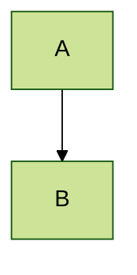
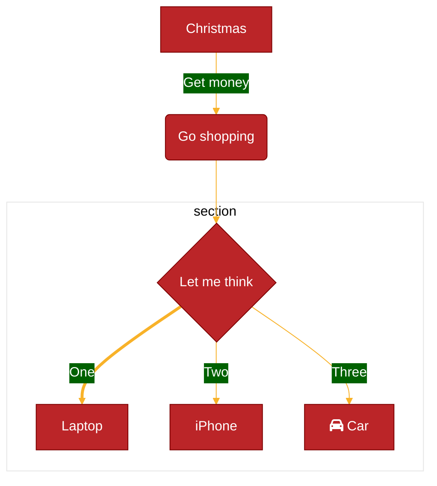
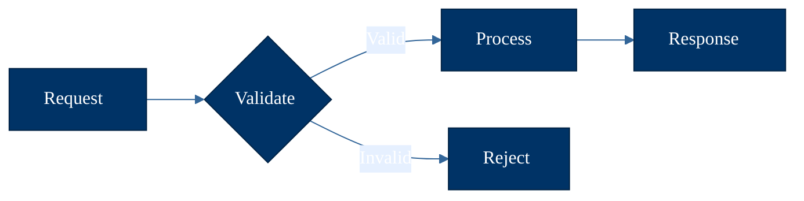
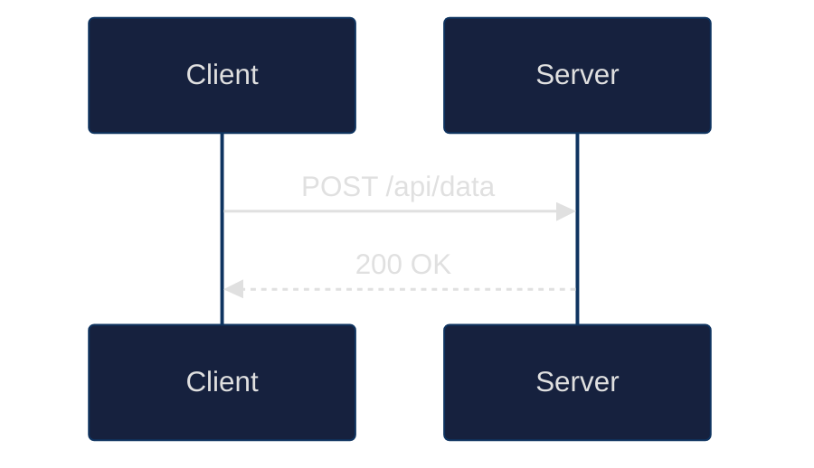
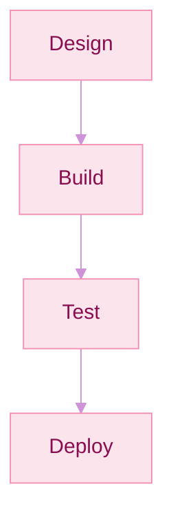
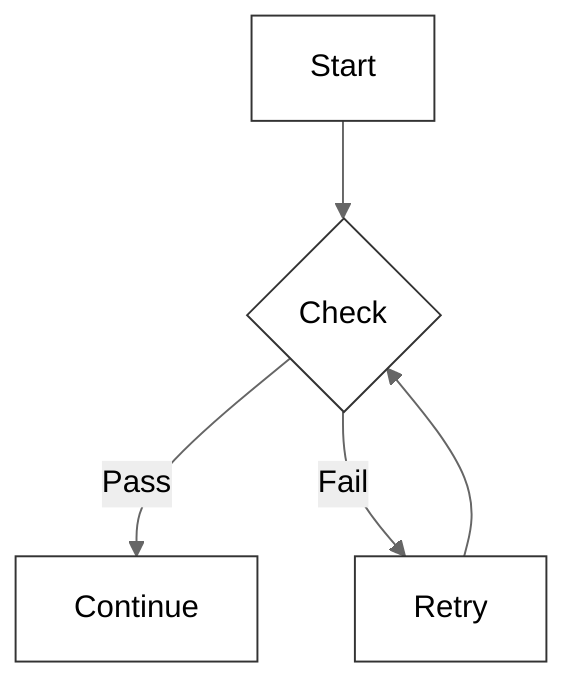
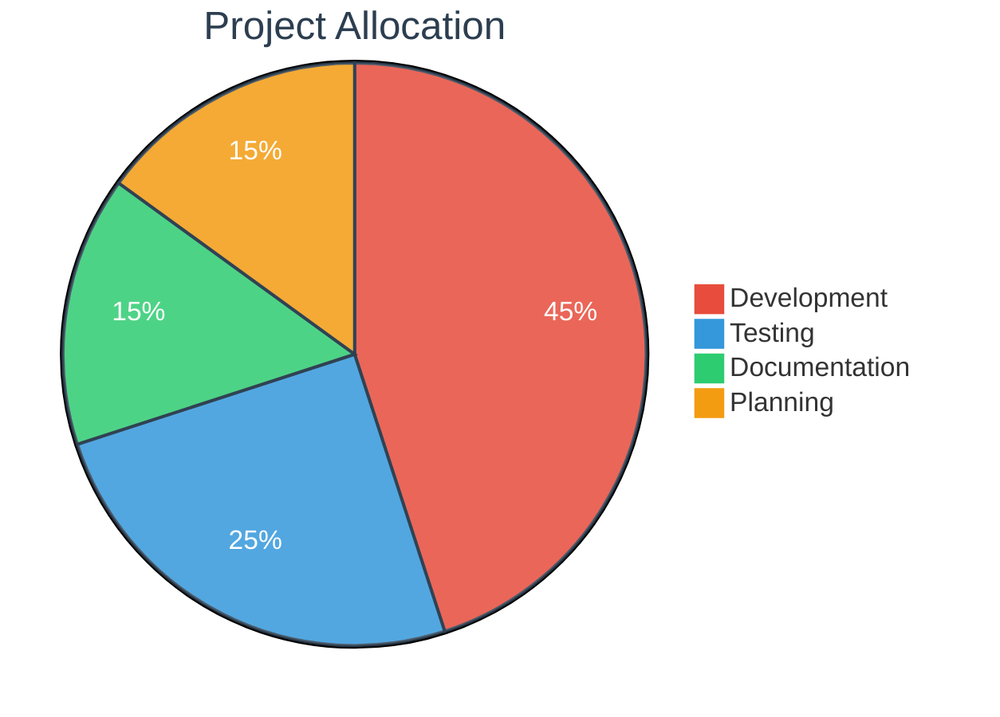

# Theming Reference

## Overview

Mermaid provides five built-in themes and a comprehensive variable system for customizing diagram appearance. Only the `base` theme supports variable customization. Theme variables cascade: many colors are automatically derived from a handful of primary values, so small changes can restyle an entire diagram.

## Available Themes

| Theme | Description | Customizable |
|---|---|---|
| `default` | Standard Mermaid look with warm tones. Default for all diagrams. | No |
| `neutral` | Grayscale-friendly theme ideal for printed documents. | No |
| `dark` | Dark background theme for dark-mode UIs. | No |
| `forest` | Green-toned theme with natural palette. | No |
| `base` | Minimal theme designed as the starting point for customization. | Yes |

### Setting a Theme

**Via frontmatter (per-diagram):**



**Via initialize (site-wide):**

```javascript
mermaid.initialize({
  theme: 'dark',
});
```

**Via directive (deprecated):**


## Customizing with themeVariables

To create a custom theme, set `theme: base` and override variables via `themeVariables`. This is the only theme that accepts customizations.



## Color Derivation

Many theme variables are automatically calculated from a few primary values. For example, `primaryBorderColor` is derived from `primaryColor` by darkening or inverting it. This means setting just `primaryColor` restyls nodes, borders, and text in one step.

Derivation operations include: color inversion, hue shifting, darkening/lightening by ~10%, and contrast calculation based on `darkMode`.

**Important**: The theming engine only recognizes hex color values (`#ff0000`). CSS color names (`red`) are not supported.

## Global Theme Variables

These variables affect all diagram types.

| Variable | Default | Description |
|---|---|---|
| `darkMode` | `false` | Toggles dark-mode color derivation. Set to `true` for dark backgrounds. |
| `background` | `#f4f4f4` | Page/diagram background. Used to calculate contrasting colors. |
| `fontFamily` | `trebuchet ms, verdana, arial` | Font family for all diagram text. |
| `fontSize` | `16px` | Base font size in pixels. |
| `primaryColor` | `#fff4dd` | Primary node background. Many other colors derive from this. |
| `primaryTextColor` | derived (`#ddd`/`#333`) | Text color for nodes using `primaryColor`. Derived based on `darkMode`. |
| `primaryBorderColor` | derived from `primaryColor` | Border color for primary nodes. |
| `secondaryColor` | derived from `primaryColor` | Background for secondary elements. |
| `secondaryTextColor` | derived from `secondaryColor` | Text color for secondary elements. |
| `secondaryBorderColor` | derived from `secondaryColor` | Border color for secondary elements. |
| `tertiaryColor` | derived from `primaryColor` | Background for tertiary elements (subgraphs, alt states). |
| `tertiaryTextColor` | derived from `tertiaryColor` | Text color for tertiary elements. |
| `tertiaryBorderColor` | derived from `tertiaryColor` | Border color for tertiary elements. |
| `noteBkgColor` | `#fff5ad` | Background color for notes. |
| `noteTextColor` | `#333` | Text color inside notes. |
| `noteBorderColor` | derived from `noteBkgColor` | Border color for notes. |
| `lineColor` | derived from `background` | Color for connecting lines and edges. |
| `textColor` | derived from `primaryTextColor` | General text color over background (labels, signals, titles). |
| `mainBkg` | derived from `primaryColor` | Background for main objects (rects, circles, classes). |
| `errorBkgColor` | `tertiaryColor` | Background for syntax error messages. |
| `errorTextColor` | `tertiaryTextColor` | Text color for syntax error messages. |

## Flowchart Variables

| Variable | Default | Description |
|---|---|---|
| `nodeBorder` | `primaryBorderColor` | Node border color. |
| `clusterBkg` | `tertiaryColor` | Subgraph background color. |
| `clusterBorder` | `tertiaryBorderColor` | Subgraph border color. |
| `defaultLinkColor` | `lineColor` | Edge/link color. |
| `titleColor` | `tertiaryTextColor` | Diagram title color. |
| `edgeLabelBackground` | derived from `secondaryColor` | Background behind edge labels. |
| `nodeTextColor` | `primaryTextColor` | Text color inside nodes. |

## Sequence Diagram Variables

| Variable | Default | Description |
|---|---|---|
| `actorBkg` | `mainBkg` | Actor box background. |
| `actorBorder` | `primaryBorderColor` | Actor box border. |
| `actorTextColor` | `primaryTextColor` | Actor name text color. |
| `actorLineColor` | `actorBorder` | Actor lifeline color. |
| `signalColor` | `textColor` | Signal arrow color. |
| `signalTextColor` | `textColor` | Signal label text color. |
| `labelBoxBkgColor` | `actorBkg` | Label box background. |
| `labelBoxBorderColor` | `actorBorder` | Label box border. |
| `labelTextColor` | `actorTextColor` | Label text color. |
| `loopTextColor` | `actorTextColor` | Loop/alt/opt label text color. |
| `activationBorderColor` | derived from `secondaryColor` | Activation box border. |
| `activationBkgColor` | `secondaryColor` | Activation box background. |
| `sequenceNumberColor` | derived from `lineColor` | Sequence number text color. |

## Pie Diagram Variables

| Variable | Default | Description |
|---|---|---|
| `pie1` | `primaryColor` | Fill for 1st section. |
| `pie2` | `secondaryColor` | Fill for 2nd section. |
| `pie3` | derived from `tertiaryColor` | Fill for 3rd section. |
| `pie4` | derived from `primaryColor` | Fill for 4th section. |
| `pie5` | derived from `secondaryColor` | Fill for 5th section. |
| `pie6` | derived from `tertiaryColor` | Fill for 6th section. |
| `pie7` | derived from `primaryColor` | Fill for 7th section. |
| `pie8` | derived from `primaryColor` | Fill for 8th section. |
| `pie9` | derived from `primaryColor` | Fill for 9th section. |
| `pie10` | derived from `primaryColor` | Fill for 10th section. |
| `pie11` | derived from `primaryColor` | Fill for 11th section. |
| `pie12` | derived from `primaryColor` | Fill for 12th section. |
| `pieTitleTextSize` | `25px` | Title text font size. |
| `pieTitleTextColor` | `taskTextDarkColor` | Title text color. |
| `pieSectionTextSize` | `17px` | Section label font size. |
| `pieSectionTextColor` | `textColor` | Section label text color. |
| `pieLegendTextSize` | `17px` | Legend label font size. |
| `pieLegendTextColor` | `taskTextDarkColor` | Legend label text color. |
| `pieStrokeColor` | `black` | Section border color. |
| `pieStrokeWidth` | `2px` | Section border width. |
| `pieOuterStrokeWidth` | `2px` | Outer circle border width. |
| `pieOuterStrokeColor` | `black` | Outer circle border color. |
| `pieOpacity` | `0.7` | Section fill opacity. |

## State Diagram Variables

| Variable | Default | Description |
|---|---|---|
| `labelColor` | `primaryTextColor` | State label text color. |
| `altBackground` | `tertiaryColor` | Background for nested/composite states. |

## Class Diagram Variables

| Variable | Default | Description |
|---|---|---|
| `classText` | `textColor` | Text color in class boxes. |

## User Journey Variables

| Variable | Default | Description |
|---|---|---|
| `fillType0` | `primaryColor` | Fill for 1st journey section. |
| `fillType1` | `secondaryColor` | Fill for 2nd journey section. |
| `fillType2` | derived from `primaryColor` | Fill for 3rd journey section. |
| `fillType3` | derived from `secondaryColor` | Fill for 4th journey section. |
| `fillType4` | derived from `primaryColor` | Fill for 5th journey section. |
| `fillType5` | derived from `secondaryColor` | Fill for 6th journey section. |
| `fillType6` | derived from `primaryColor` | Fill for 7th journey section. |
| `fillType7` | derived from `secondaryColor` | Fill for 8th journey section. |

## Practical Examples

### Corporate Brand Theme



### Dark Mode Diagram



### Pastel/Soft Theme



### Monochrome Print-Friendly Theme



### Custom Pie Chart Colors



## Common Gotchas

- **Only `base` theme is customizable**: Setting `themeVariables` with `default`, `dark`, `forest`, or `neutral` has no effect. Those themes ignore variable overrides entirely.
- **Hex values only**: Use `"#ff0000"`, not `"red"`. The theming engine does not resolve CSS color names.
- **Quote hex values in YAML frontmatter**: The `#` character starts a YAML comment. Always wrap hex colors in quotes: `primaryColor: "#ff0000"`.
- **Derived colors auto-update**: Changing `primaryColor` automatically recalculates `primaryBorderColor`, `primaryTextColor`, `secondaryColor`, `tertiaryColor`, and many others. Override derived colors explicitly only when the auto-calculated value is unsatisfactory.
- **`darkMode` changes derivation logic**: Setting `darkMode: true` inverts how text colors and borders are derived. Always set it explicitly when targeting dark backgrounds to ensure readable contrast.
- **Pie section variables are fixed at 12**: Only `pie1` through `pie12` exist. If your pie chart has more than 12 sections, colors will cycle back to defaults.
- **Font size values need units**: Variables like `fontSize`, `pieTitleTextSize`, and `pieSectionTextSize` require CSS units (e.g., `"16px"`, `"1.2em"`).
