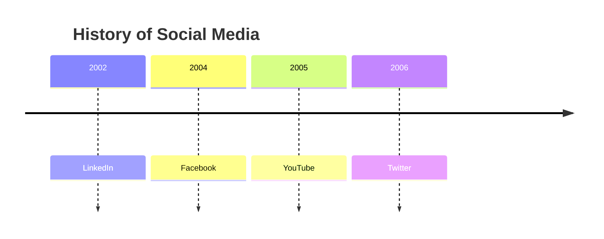
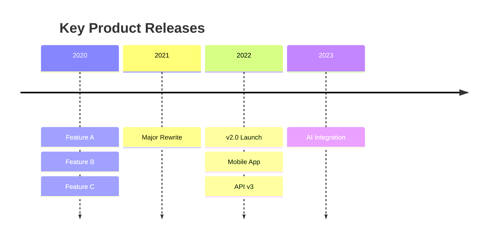
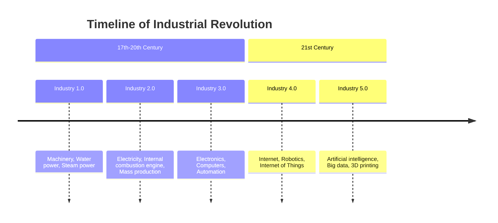
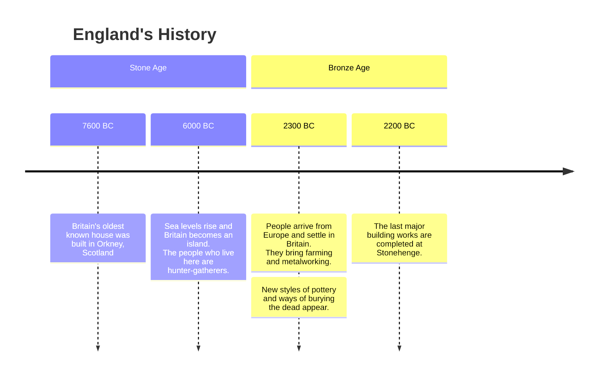
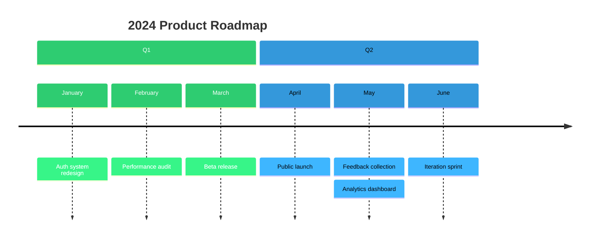

# Timeline Diagram

## Declaration

Start with the `timeline` keyword. Optionally add a title on the next line with the `title` keyword.

```
timeline
    title My Timeline
    2020 : Event A
    2021 : Event B
```

## Complete Syntax Reference

### Keywords

| Keyword    | Syntax           | Description                                         |
|------------|------------------|-----------------------------------------------------|
| `timeline` | `timeline`       | Declares the diagram type (required, first line)    |
| `title`    | `title <text>`   | Optional title rendered at the top                  |
| `section`  | `section <name>` | Groups subsequent time periods into a named section |

### Time Period and Events

```
{time period} : {event}
{time period} : {event} : {event}
{time period} : {event}
              : {event}
              : {event}
```

| Element           | Description                                                                        |
|-------------------|------------------------------------------------------------------------------------|
| Time period       | Any text before the first `:`. Not limited to dates or numbers.                    |
| Event             | Text after `:`. Multiple events per period separated by additional `:` delimiters. |
| Multi-line events | Place additional `: {event}` lines below, aligned with the colon.                  |

### Sections

Use `section <name>` to group time periods. All time periods after a `section` line belong to that section until a new `section` is declared. Sections share a color scheme across their time periods.

If no `section` is defined, each time period gets its own color (multicolor mode, the default).

### Text Wrapping

- Text wraps automatically when too long.
- Use `<br>` to force a line break within time periods, events, or section names.

## Styling & Configuration

### Directive Options

| Option              | Type    | Default | Description                                                                    |
|---------------------|---------|---------|--------------------------------------------------------------------------------|
| `disableMulticolor` | Boolean | `false` | When `true`, all unsectioned periods use the same color instead of alternating |

```yaml
---
config:
  timeline:
    disableMulticolor: true
---
```

### Themes

Available themes: `base`, `forest`, `dark`, `default`, `neutral`.

```yaml
---
config:
  theme: 'forest'
---
timeline
    title My Timeline
    2020 : Event
```

### Theme Variables

Customize background and label colors for up to 12 sections/periods. Colors cycle after 12.

| Variable                          | Description                                                |
|-----------------------------------|------------------------------------------------------------|
| `cScale0` to `cScale11`           | Background color for the Nth section or time period        |
| `cScaleLabel0` to `cScaleLabel11` | Foreground (text) color for the Nth section or time period |

```yaml
---
config:
  theme: 'default'
  themeVariables:
    cScale0: '#ff0000'
    cScaleLabel0: '#ffffff'
    cScale1: '#00ff00'
    cScale2: '#0000ff'
    cScaleLabel2: '#ffffff'
---
```

## Practical Examples

### 1. Simple Timeline



### 2. Multiple Events per Period



### 3. Grouped into Sections



### 4. With Line Breaks in Text



### 5. Quarterly Roadmap with Custom Colors



## Common Gotchas

- **Time periods are plain text**, not parsed as dates. `"Q1 2024"`, `"Phase 1"`, or `"Day One"` all work.
- **Colon (`:`) is the delimiter** between time period and events, and between multiple events. Colons inside event text may cause parsing issues.
- **Section colors override multicolor.** When sections are defined, all periods in a section share one color. Without sections, each period gets its own color.
- **`disableMulticolor`** only affects unsectioned timelines. It forces a single color for all periods.
- **`<br>` tags work** in time periods, section names, and event text for forced line breaks.
- **Event ordering** is top-to-bottom as declared. The first event for a period renders at the top.
- **Color variables cycle after 12.** The 13th section/period reuses `cScale0`.
- **No interactivity or links** -- timeline is a static visual diagram.
