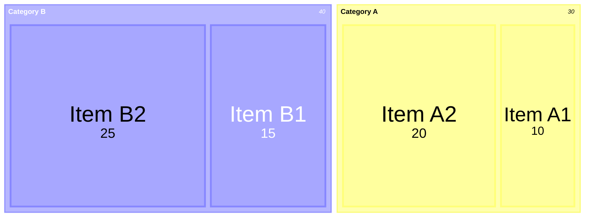
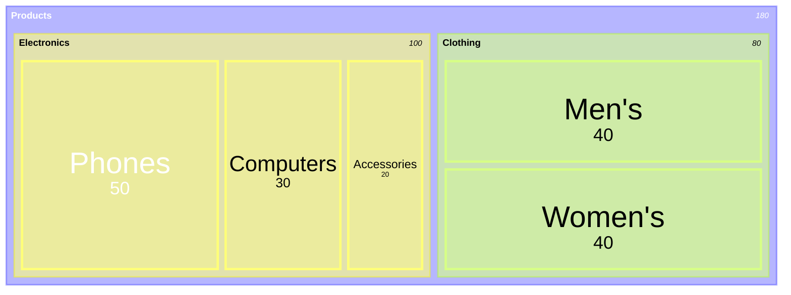
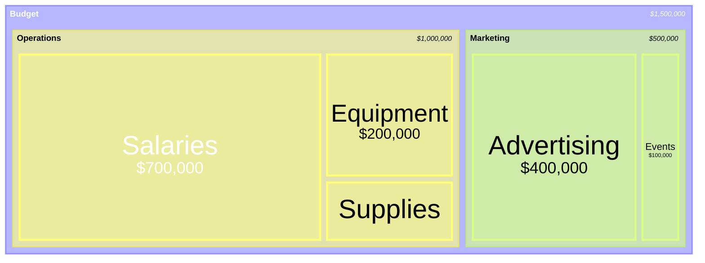
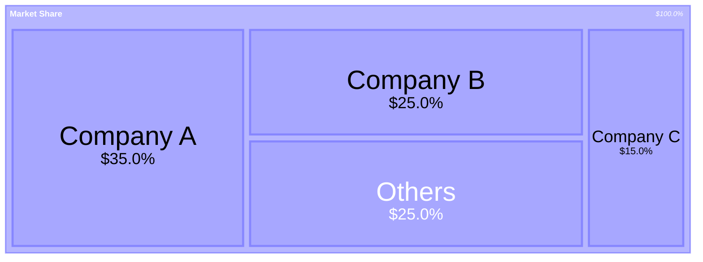
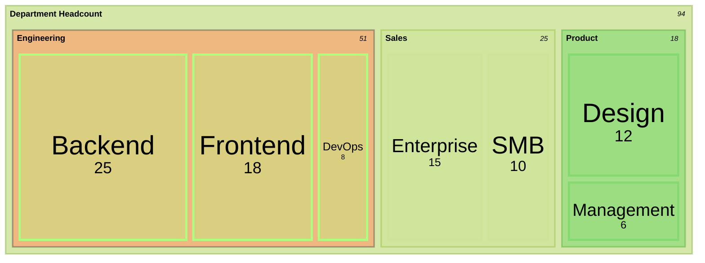

# Treemap Diagram

## Declaration

Use the keyword `treemap-beta` to start a treemap diagram. This is a newer diagram type whose syntax may evolve in future Mermaid versions.

```
treemap-beta
```

## Complete Syntax Reference

Treemap diagrams display hierarchical data as nested rectangles where each rectangle's size is proportional to its value.

### Node Definition

| Node Type       | Syntax                       | Description                  |
|-----------------|------------------------------|------------------------------|
| Section/Parent  | `"Section Name"`             | Parent node, no value        |
| Leaf with value | `"Leaf Name": value`         | Leaf node with numeric value |
| Styled node     | `"Name":::className`        | Node with class applied      |
| Styled leaf     | `"Name": value:::className` | Leaf with class applied      |

### Hierarchy

Hierarchy is created through **indentation** (spaces or tabs). Deeper indentation means deeper nesting.

```
"Root"
    "Child"
        "Grandchild": 10
```

### General Structure

```
treemap-beta
"Section 1"
    "Leaf 1.1": 12
    "Section 1.2"
        "Leaf 1.2.1": 12
"Section 2"
    "Leaf 2.1": 20
    "Leaf 2.2": 25
```

## Components / Elements

Treemap diagrams have two node types:

| Type   | Has Value | Has Children | Description                          |
|--------|-----------|--------------|--------------------------------------|
| Section | No       | Yes          | A branch node containing sub-nodes   |
| Leaf    | Yes      | No           | A terminal node with a numeric value |

Section nodes derive their visual size from the sum of their children's values.

## Styling & Configuration

### classDef

Define reusable styles using `classDef`:

```
classDef className fill:#color,stroke:#color,stroke-width:2px;
```

Apply during node definition with `:::`:

```
"Node Name":::className
"Leaf Name": 20:::className
```

### Theme Configuration

Set the overall theme using frontmatter:

```
---
config:
    theme: 'forest'
---
treemap-beta
...
```

Available themes: `default`, `forest`, `dark`, `neutral`, `base`.

### Configuration Options

All options are set under `config.treemap` in the frontmatter block:

```
---
config:
  treemap:
    <option>: <value>
---
```

| Option           | Description                                           | Default | Type    |
|------------------|-------------------------------------------------------|---------|---------|
| `useMaxWidth`    | When true, diagram width scales to 100% of container  | `true`  | boolean |
| `padding`        | Internal padding between nodes                        | `10`    | number  |
| `diagramPadding` | Padding around the entire diagram                     | `8`     | number  |
| `showValues`     | Whether to display values on leaf nodes               | `true`  | boolean |
| `nodeWidth`      | Width of nodes                                        | `100`   | number  |
| `nodeHeight`     | Height of nodes                                       | `40`    | number  |
| `borderWidth`    | Width of node borders                                 | `1`     | number  |
| `valueFontSize`  | Font size for displayed values                        | `12`    | number  |
| `labelFontSize`  | Font size for node labels                             | `14`    | number  |
| `valueFormat`    | D3 format specifier for value display                 | `','`   | string  |

### Value Formatting

The `valueFormat` option uses [D3 format specifiers](https://github.com/d3/d3-format#locale_format) plus some shorthand currency formats:

| Format      | Description                                      | Example Input | Example Output |
|-------------|--------------------------------------------------|---------------|----------------|
| `,`         | Thousands separator (default)                    | `1000`        | `1,000`        |
| `$`         | Dollar sign prefix                               | `1000`        | `$1000`        |
| `.1f`       | One decimal place                                | `3.14159`     | `3.1`          |
| `.1%`       | Percentage with one decimal                      | `0.35`        | `35.0%`        |
| `$0,0`      | Dollar sign with thousands separator             | `700000`      | `$700,000`     |
| `$.2f`      | Dollar sign with 2 decimal places                | `19.9`        | `$19.90`       |
| `$,.2f`     | Dollar, thousands separator, 2 decimals          | `1234.5`      | `$1,234.50`    |

## Practical Examples

### Example 1: Basic Treemap



### Example 2: Multi-Level Hierarchy



### Example 3: Budget with Currency Formatting



### Example 4: Market Share with Percentage Formatting



### Example 5: Styled Treemap with Custom Theme



## Common Gotchas

- **Beta status**: The keyword is `treemap-beta`, indicating the syntax may change in future Mermaid releases.
- **Indentation defines hierarchy**: Unlike most Mermaid diagrams that use explicit nesting syntax, treemaps rely on indentation (like YAML). Inconsistent indentation will produce incorrect hierarchies.
- **Node names must be quoted**: All node names must be wrapped in double quotes (`"Name"`).
- **Values must be numeric**: Leaf node values must be numbers. Non-numeric values will cause parsing errors.
- **Negative values are not supported**: Treemap diagrams cannot represent negative values meaningfully.
- **Very small values may be invisible**: Rectangles for very small values relative to the total may be too small to see or label.
- **Deep hierarchies lose clarity**: More than 3-4 levels of nesting becomes difficult to read in treemap form.
- **`:::` placement for leaves**: When styling a leaf node, the class annotation goes after the value: `"Name": 20:::className`.
- **`classDef` goes after the tree data**: Place `classDef` statements after all node definitions, not inside the tree structure.
