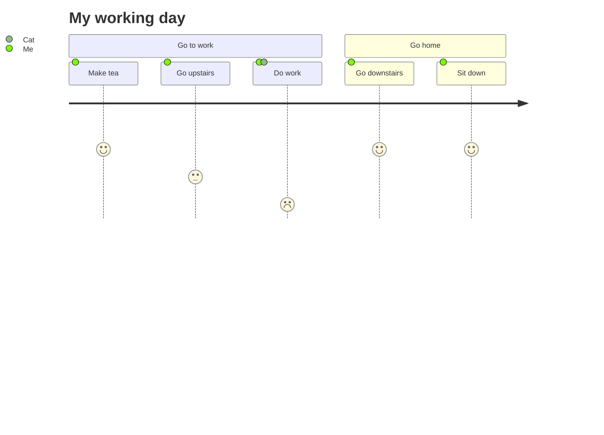
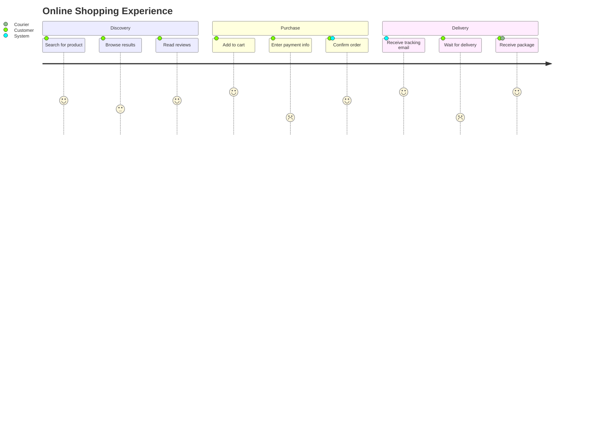
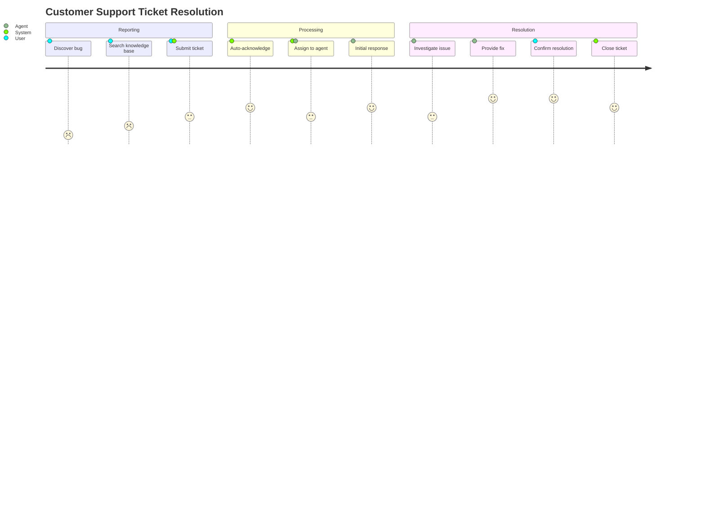
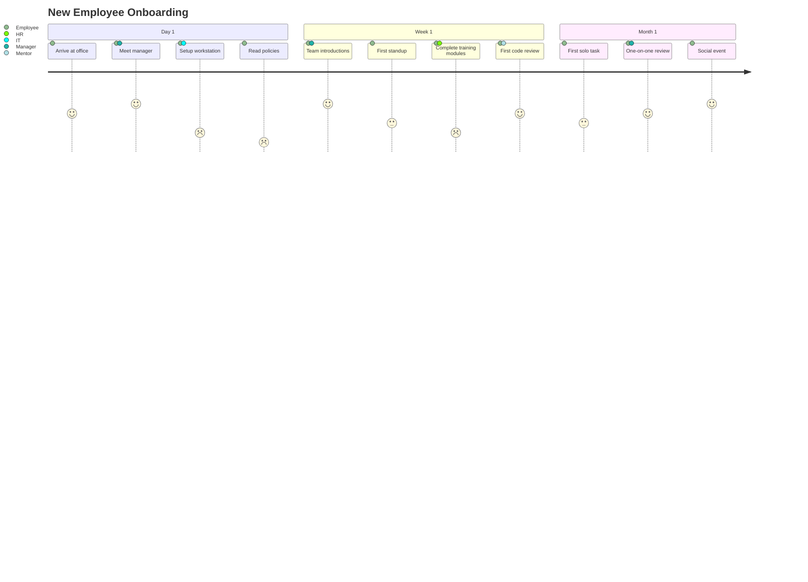
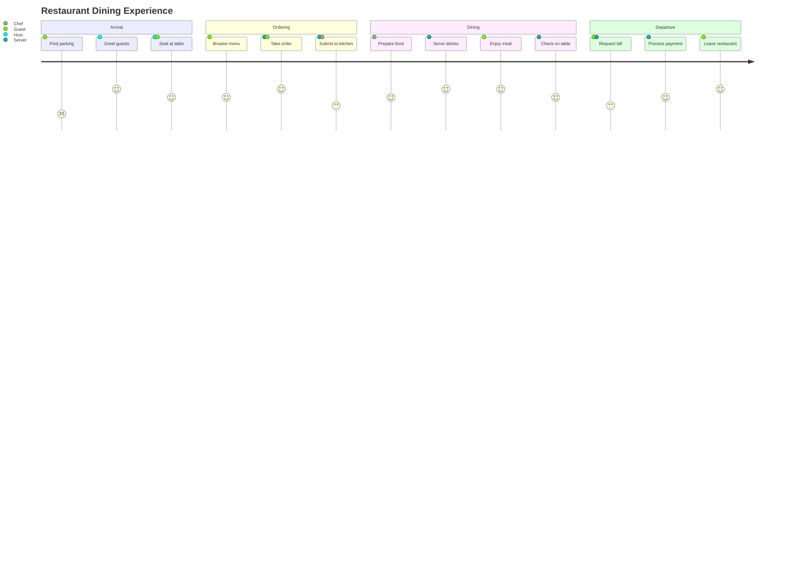

# User Journey Diagram

## Declaration

Start the diagram with the `journey` keyword.

```
journey
```

## Complete Syntax Reference

### Top-Level Directives

| Directive | Required | Description                                         |
|-----------|----------|-----------------------------------------------------|
| `title`   | No       | Title displayed at the top of the journey diagram   |

### Task Syntax

Each task is defined on a single line with the following format:

```
Task name: <score>: <actor1>[, <actor2>, ...]
```

| Component  | Required | Description                                                  |
|------------|----------|--------------------------------------------------------------|
| Task name  | Yes      | Free-text name of the step/action                            |
| `score`    | Yes      | Satisfaction score, integer from `1` to `5` inclusive         |
| Actors     | Yes      | Comma-separated list of actors involved in this task         |

The colon `:` separates each component.

### Score Scale

| Score | Meaning                        | Visual Color      |
|-------|--------------------------------|--------------------|
| `1`   | Very negative / frustrating    | Red tones          |
| `2`   | Negative                       | Orange tones       |
| `3`   | Neutral                        | Yellow tones       |
| `4`   | Positive                       | Light green tones  |
| `5`   | Very positive / delightful     | Green tones        |

### Actors

- Each task must have at least one actor.
- Multiple actors are separated by commas: `Me, System, Admin`.
- Actor names are free-text strings.
- Each unique actor gets its own color in the diagram.
- Actors appear in the legend at the bottom of the diagram.

## Sections / Grouping

Use `section` to group tasks into phases or stages of the journey. Section names are free-text.

```
section Section Name
    Task 1: 5: Actor
    Task 2: 3: Actor
```

Sections create visual separations in the diagram, helping to distinguish different phases of the user's journey.

## Styling & Configuration

User journey diagrams use the default Mermaid theme. Score values (1-5) determine the color of each task bar automatically. There are no additional configuration parameters specific to user journey diagrams beyond the global Mermaid theme settings.

## Practical Examples

### 1. Simple Daily Journey



### 2. Online Shopping Experience



### 3. Customer Support Journey



### 4. Employee Onboarding



### 5. Multi-Actor Service Journey



## Common Gotchas

- **Scores must be between 1 and 5** inclusive. Values outside this range cause parse errors or unexpected rendering.
- **Colons are structural** -- the format is strictly `Task name: score: actors`. Missing colons break parsing.
- **At least one actor is required** per task. A task with no actor after the second colon will fail.
- **No quotes needed** around task names or actor names, unlike entity or pie chart labels.
- **Sections are optional** but strongly recommended for readability. Tasks without a section still render, but grouping is lost.
- **Actor names are case-sensitive** -- `Me` and `me` are treated as different actors and will receive different colors.
- **Commas in actor lists** -- spaces after commas are trimmed, so `Me, Cat` and `Me,Cat` both work.
- **No click events or interactivity** -- user journey diagrams do not support click handlers or links.
- **No direction control** -- the diagram always flows left to right. There is no `direction` directive.
