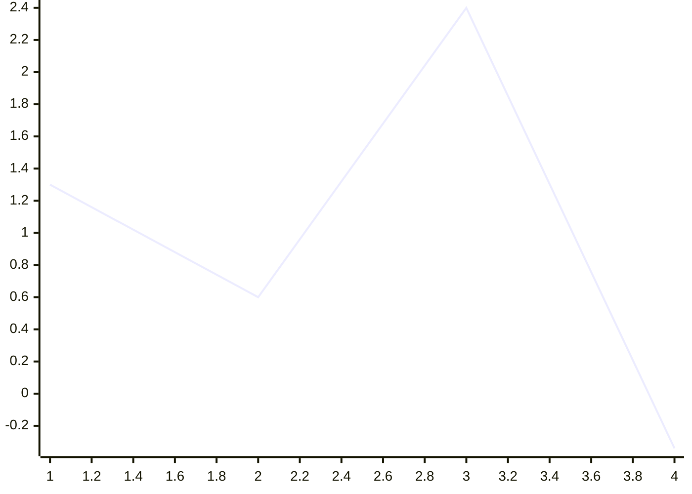
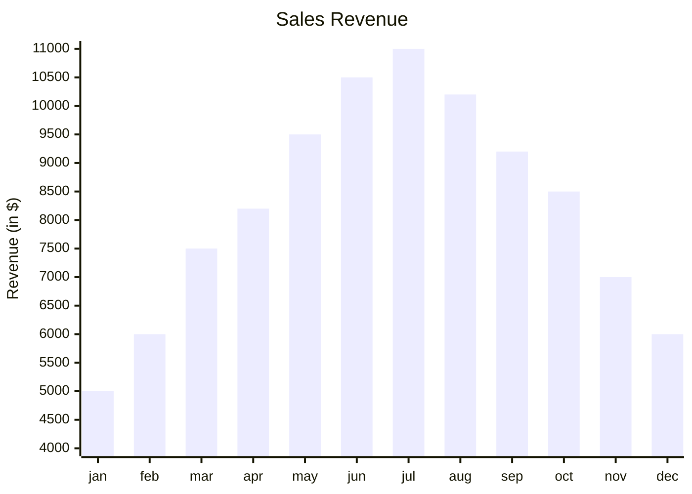
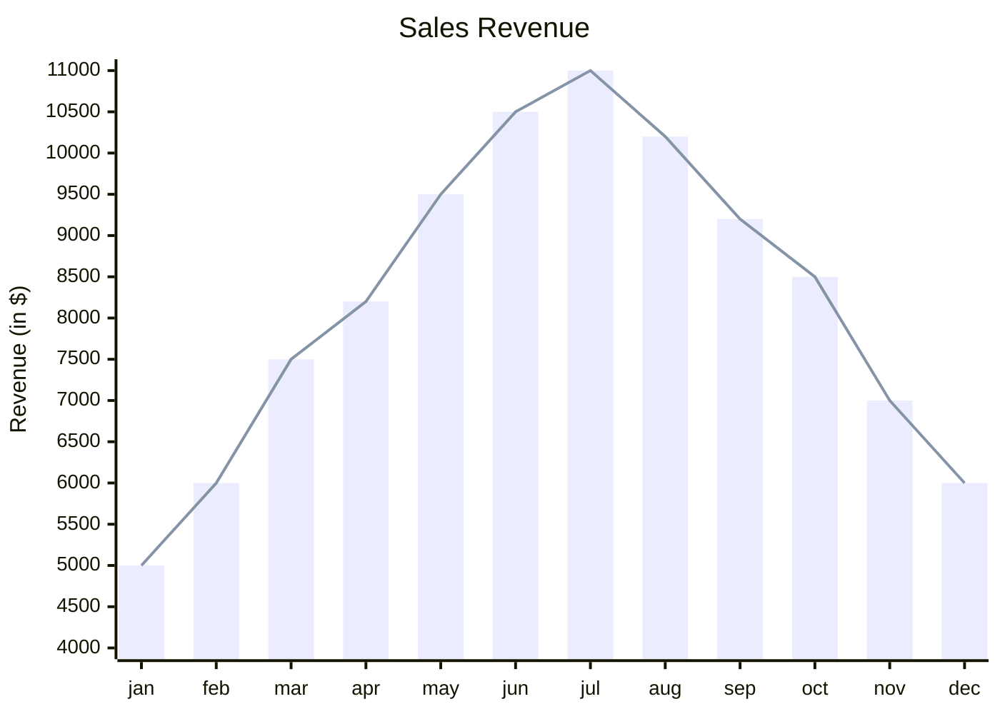
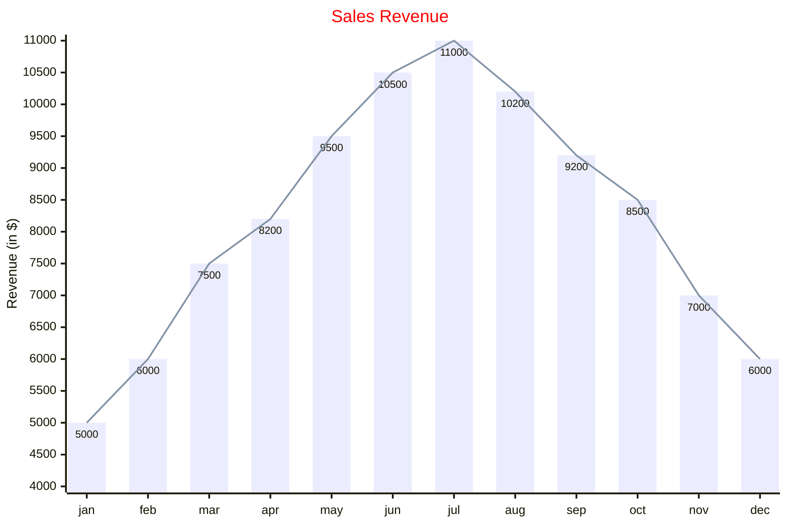

# XY Chart

## Declaration

The diagram begins with the `xychart` keyword, optionally followed by an orientation.

```
xychart
xychart horizontal
```

The minimum required elements are the `xychart` keyword and at least one data series (`line` or `bar`).

## Complete Syntax Reference

### Orientation

| Keyword | Description |
|---------|-------------|
| `xychart` | Vertical chart (default) |
| `xychart horizontal` | Horizontal chart |

### Title

```
title "Chart Title"
title SingleWordTitle
```

Single-word titles do not require quotes. Multi-word titles must be wrapped in double quotes.

### X-Axis

| Syntax | Type | Description |
|--------|------|-------------|
| `x-axis [cat1, cat2, cat3]` | Categorical | List of category labels |
| `x-axis "Title" [cat1, "cat 2", cat3]` | Categorical with title | Title plus categories |
| `x-axis title min --> max` | Numeric range | Numeric axis with title and range |
| `x-axis "Title with spaces" min --> max` | Numeric range with quoted title | Quoted title with range |

Category labels containing spaces must be wrapped in double quotes. The x-axis is optional; if omitted, Mermaid auto-generates it from the data.

### Y-Axis

| Syntax | Type | Description |
|--------|------|-------------|
| `y-axis title` | Auto-range | Title only; range derived from data |
| `y-axis "Title" min --> max` | Explicit range | Title with minimum and maximum values |

The y-axis is optional; if omitted, the range is auto-generated from data.

### Data Series

| Keyword | Syntax | Description |
|---------|--------|-------------|
| `bar` | `bar [val1, val2, val3]` | Renders a bar chart series |
| `line` | `line [val1, val2, val3]` | Renders a line chart series |

- Values can be integers, decimals, or negative numbers (e.g. `2.3`, `.98`, `-3.4`, `+1.3`).
- Multiple `bar` and `line` series can be combined in a single chart.
- The number of values in each series should match the number of x-axis categories.

### Comments

Use `%%` for inline comments.

```
%% This is a comment
bar [10, 20, 30]
```

## Styling & Configuration

### Chart Configuration (via frontmatter)

```yaml
---
config:
  xyChart:
    width: 900
    height: 600
    showDataLabel: true
---
```

| Parameter | Description | Default |
|-----------|-------------|:-------:|
| `width` | Width of the chart in pixels | 700 |
| `height` | Height of the chart in pixels | 500 |
| `titlePadding` | Top and bottom padding of the title | 10 |
| `titleFontSize` | Title font size in pixels | 20 |
| `showTitle` | Whether the title is shown | true |
| `xAxis` | X-axis configuration object (see AxisConfig) | AxisConfig |
| `yAxis` | Y-axis configuration object (see AxisConfig) | AxisConfig |
| `chartOrientation` | `'vertical'` or `'horizontal'` | `'vertical'` |
| `plotReservedSpacePercent` | Minimum percentage of space for plot area | 50 |
| `showDataLabel` | Show value labels on bars | false |

### AxisConfig

| Parameter | Description | Default |
|-----------|-------------|:-------:|
| `showLabel` | Show axis labels or tick values | true |
| `labelFontSize` | Font size of axis labels | 14 |
| `labelPadding` | Top and bottom padding of labels | 5 |
| `showTitle` | Whether the axis title is shown | true |
| `titleFontSize` | Axis title font size | 16 |
| `titlePadding` | Top and bottom padding of the axis title | 5 |
| `showTick` | Whether tick marks are shown | true |
| `tickLength` | Length of tick marks in pixels | 5 |
| `tickWidth` | Width of tick marks in pixels | 2 |
| `showAxisLine` | Whether the axis line is shown | true |
| `axisLineWidth` | Thickness of the axis line in pixels | 2 |

### Theme Variables

Theme variables are set under `themeVariables.xyChart`:

```yaml
---
config:
  themeVariables:
    xyChart:
      titleColor: '#ff0000'
      plotColorPalette: '#000000, #0000FF, #00FF00'
---
```

| Parameter | Description |
|-----------|-------------|
| `backgroundColor` | Background color of the entire chart |
| `titleColor` | Color of the title text |
| `xAxisLabelColor` | Color of x-axis labels |
| `xAxisTitleColor` | Color of x-axis title |
| `xAxisTickColor` | Color of x-axis tick marks |
| `xAxisLineColor` | Color of x-axis line |
| `yAxisLabelColor` | Color of y-axis labels |
| `yAxisTitleColor` | Color of y-axis title |
| `yAxisTickColor` | Color of y-axis tick marks |
| `yAxisLineColor` | Color of y-axis line |
| `plotColorPalette` | Comma-separated hex colors for series (e.g. `"#f3456, #43445"`) |

Colors in `plotColorPalette` are assigned sequentially to data series in the order they appear (first bar/line gets the first color, second gets the second, etc.).

## Practical Examples

### Example 1 -- Minimal Chart



### Example 2 -- Bar Chart with Categories



### Example 3 -- Combined Bar and Line



### Example 4 -- Custom Colors per Series

```mermaid
---
config:
  themeVariables:
    xyChart:
      plotColorPalette: '#000000, #0000FF, #00FF00, #FF0000'
---
xychart
    title "Different Colors in xyChart"
    x-axis "categoriesX" ["Category 1", "Category 2", "Category 3", "Category 4"]
    y-axis "valuesY" 0 --> 50
    %% Black line
    line [10, 20, 30, 40]
    %% Blue bar
    bar [20, 30, 25, 35]
    %% Green bar
    bar [15, 25, 20, 30]
    %% Red line
    line [5, 15, 25, 35]
```



### Example 5 -- Full Config and Theme



## Common Gotchas

| Issue | Cause | Fix |
|-------|-------|-----|
| Title not rendering | Multi-word title without quotes | Wrap in double quotes: `title "My Title"` |
| Category labels merge | Category with spaces not quoted | Wrap in double quotes: `"Category 1"` |
| Data series mismatch | Number of values does not match number of categories | Ensure each series has the same count as x-axis categories |
| Axis range too narrow | Explicit `min --> max` excludes some data points | Widen the range or omit for auto-range |
| Colors not applying | `plotColorPalette` under wrong YAML key | Must be under `config.themeVariables.xyChart` |
| Horizontal chart not working | Using `horizontal` as a separate line | Must be on the same line: `xychart horizontal` |
| Negative values not showing | Using unsigned notation | Prefix with `-` for negatives (e.g. `-3.4`) |
