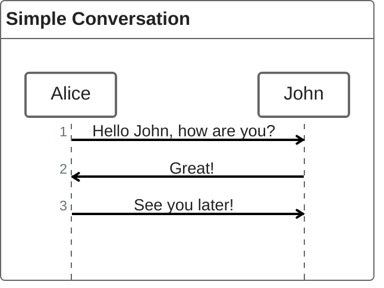
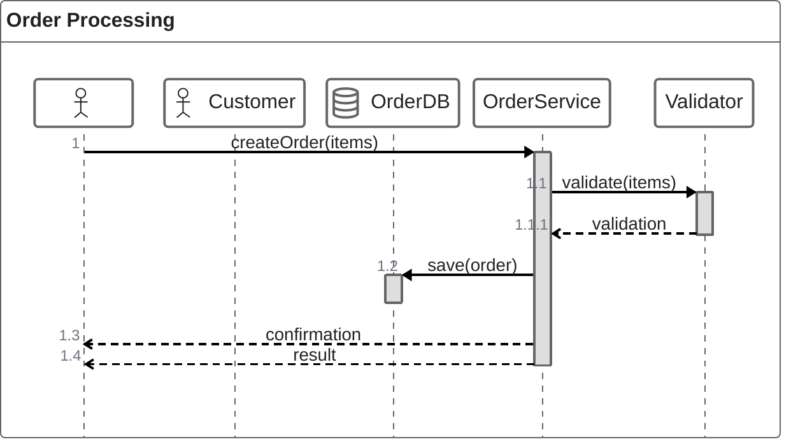
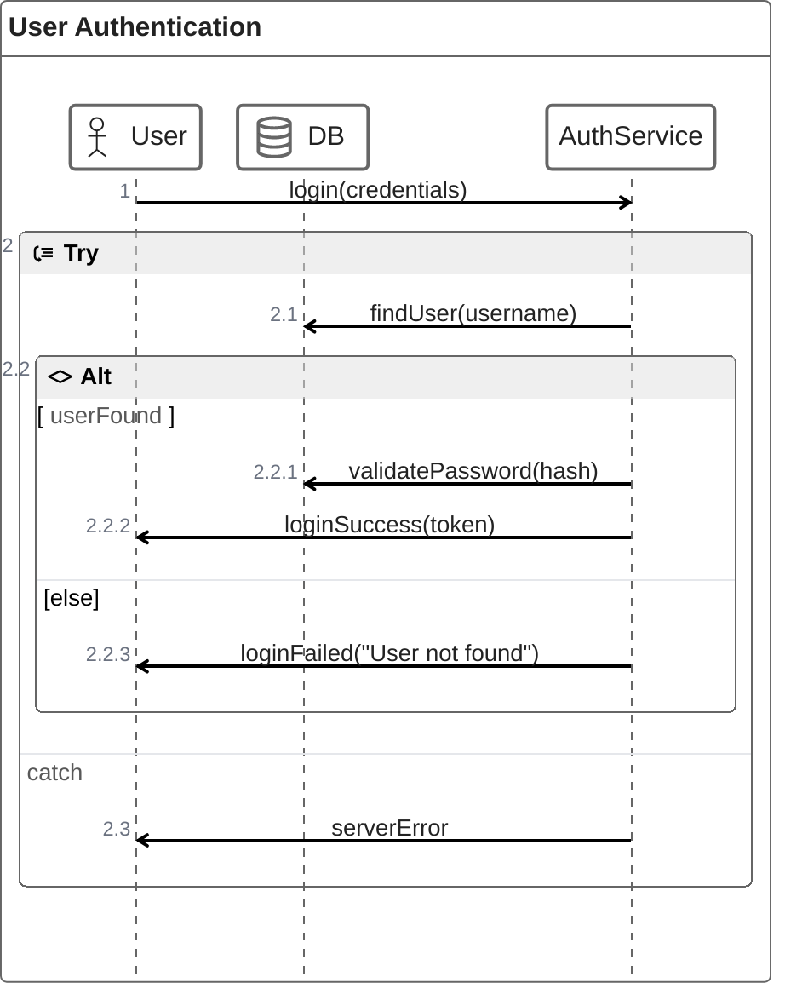
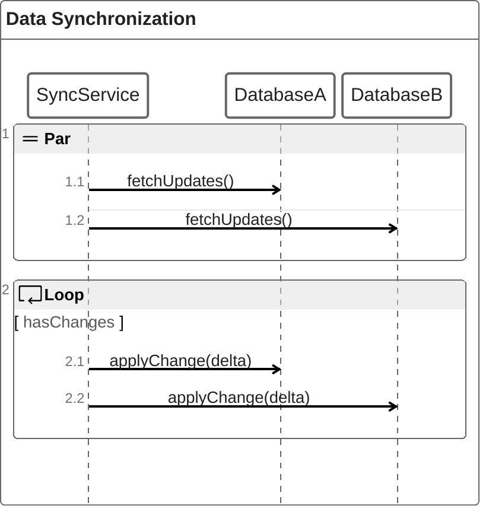
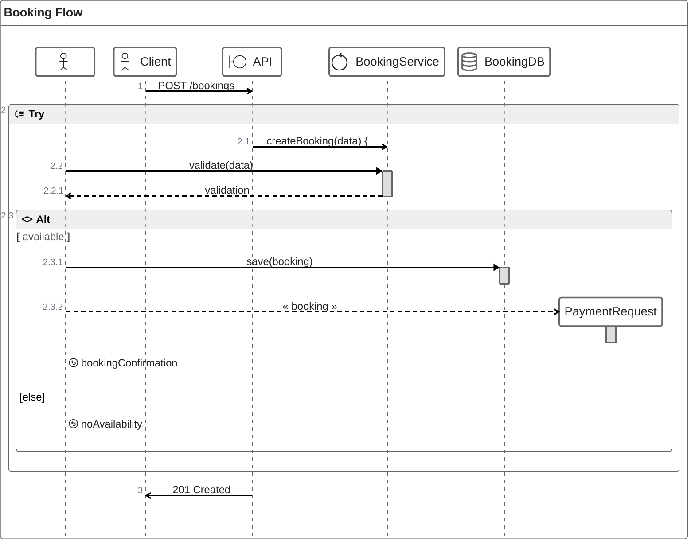

# ZenUML Sequence Diagram

## Declaration

Use the keyword `zenuml` to start a ZenUML sequence diagram. ZenUML uses a programming-language-style syntax that differs from Mermaid's native sequence diagram syntax.

```
zenuml
    title My Diagram
```

ZenUML requires the `@mermaid-js/mermaid-zenuml` external module for web integration.

## Complete Syntax Reference

### Title

```
title <text>
```

Set the diagram title. Optional.

### Comments

```
// single line comment
```

Comments render above the next message or fragment. Markdown is supported in comments. Comments placed on participant declarations are not rendered.

## Components / Elements

### Participants

Participants are declared implicitly by their first usage in a message, or explicitly to control ordering.

#### Implicit Declaration

Participants appear in the order they are first mentioned:

```
zenuml
    Alice->Bob: Hello
```

#### Explicit Declaration (controls ordering)

```
zenuml
    Bob
    Alice
    Alice->Bob: Hi Bob
```

Bob will appear first because it was declared first.

### Annotators

Annotators change the visual representation of a participant from a rectangle to a symbol.

```
@Annotator ParticipantName
```

| Annotator    | Symbol            |
|--------------|-------------------|
| `@Actor`     | Person/stick figure |
| `@Database`  | Database cylinder |
| `@Entity`    | Entity            |
| `@Boundary`  | Boundary          |
| `@Control`   | Control           |
| `@Collection`| Collection        |
| `@Queue`     | Queue             |

### Aliases

Assign a short alias to a participant with a longer display label:

```
A as Alice
J as John
A->J: Hello John
```

## Messages

### Message Types

| Type     | Syntax                        | Description                           |
|----------|-------------------------------|---------------------------------------|
| Sync     | `A.MethodName()`              | Blocking call on participant A        |
| Sync     | `A.MethodName(arg1, arg2)`    | Sync call with parameters             |
| Async    | `Alice->Bob: message text`    | Non-blocking, fire-and-forget         |
| Creation | `new A1`                      | Create a new participant              |
| Creation | `new A2(with, parameters)`    | Create with constructor parameters    |

### Sync Messages

Sync messages use dot notation and can be nested with curly braces:

```
A.SyncMessage
A.SyncMessage(with, parameters) {
    B.nestedSyncMessage()
}
```

### Async Messages

Async messages use arrow notation:

```
Alice->Bob: How are you?
```

### Creation Messages

Use the `new` keyword:

```
new ServiceA
new ServiceA(config, options)
```

### Reply Messages

Three ways to express a reply:

**1. Variable assignment from a sync message:**

```
result = A.SyncMessage()
SomeType result = A.SyncMessage()
```

**2. Return keyword inside a sync block:**

```
A.SyncMessage() {
    return result
}
```

**3. @return / @reply annotator on an async message:**

```
@return
A->B: result
```

The `@return` annotator can also be used inside a nested block to return one level up:

```
Client->A.method() {
    B.method() {
        if(condition) {
            return x1
            @return
            A->Client: x11
        }
    }
    return x2
}
```

## Nesting

Sync messages and creation messages are naturally nestable using curly braces `{}`:

```
A.method() {
    B.nested_sync_method()
    B->C: nested async message
}
```

## Fragments (Control Flow)

### Loops

Any of these keywords start a loop fragment:

| Keyword   | Example                    |
|-----------|----------------------------|
| `while`   | `while(condition) { ... }` |
| `for`     | `for(condition) { ... }`   |
| `forEach` | `forEach(items) { ... }`   |
| `foreach` | `foreach(items) { ... }`   |
| `loop`    | `loop(condition) { ... }`  |

```
while(hasMore) {
    A->B: Process next
}
```

### Alt (Conditional)

```
if(condition1) {
    ...statements...
} else if(condition2) {
    ...statements...
} else {
    ...statements...
}
```

### Opt (Optional)

```
opt {
    ...statements...
}
```

### Parallel

```
par {
    Alice->Bob: Hello!
    Alice->John: Hello!
}
```

### Try/Catch/Finally (Break)

```
try {
    ...statements...
} catch {
    ...statements...
} finally {
    ...statements...
}
```

All three blocks (`try`, `catch`, `finally`) do not require all parts -- you can use `try/catch`, `try/finally`, or all three.

## Styling & Configuration

ZenUML diagrams inherit Mermaid's global theme configuration. No ZenUML-specific theme variables or styling directives are documented. Use Mermaid's `%%{init: {'theme': 'dark'}}%%` directive for theme changes.

## Practical Examples

### Example 1: Simple Async Conversation



### Example 2: Sync Calls with Return Values



### Example 3: Conditional Flow with Error Handling



### Example 4: Parallel Operations with Loop



### Example 5: Complete Microservice Interaction



## Common Gotchas

- **Different syntax from Mermaid's native sequence diagram**: ZenUML uses programming-language-style syntax (dot notation, curly braces, `if/else`), not the `->>`/`-->>` arrow syntax of Mermaid's built-in sequence diagrams.
- **External module required for web**: For browser/website usage, you must register the `@mermaid-js/mermaid-zenuml` module with `mermaid.registerExternalDiagrams([zenuml])`.
- **Indentation matters for readability** but hierarchy is determined by curly braces `{}`, not indentation.
- **Comments only render above messages/fragments**: Comments placed on participant declarations or other locations are silently ignored.
- **No semicolons**: ZenUML does not use semicolons to terminate statements.
- **`@return` vs `return`**: `return` replies from the current activation. `@return` on an async message returns one level up -- a distinct, niche behavior.
- **Participant ordering**: Declare all participants explicitly before messages to control order. Otherwise order follows first appearance.
- **Lazy loading**: ZenUML uses experimental lazy loading and async rendering, which may change in future releases.
